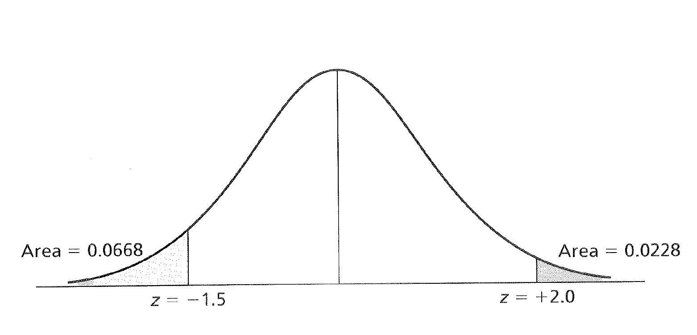

# Descriptive Statistics, z Scores, Central Limit

## Descriptive Statistics and the Normal Distribution

### Organizing Data

Descriptive statistics are traditionally used to summarize data from observed samples. Most often, sample data are organized into distributions of information based on ascending scores.
For example, we might have a table with some SAT-Verbal scores from a few different students.
Before going on to think about this, also take note that the shape of this data (though very minimal) is in the tidy format.
According to Hadley Wickham on the [tidyr CRAN page](https://cran.r-project.org/web/packages/tidyr/vignettes/tidy-data.html) for data to be tidy it must have the following properties:

1. Each variable forms a column.
2. Each observation forms a row.
3. Each type of observational unit forms a table.

This isn't very important right now, but once you get to more complex designs, it will be good to have had thought about this before. 

```{r}
student <- c(1,2,3,4,5,6)
SAT <- c(480,530,560,650,720,760)
satData <- data.frame(student,SAT)
satData
```
### Shape of Data

When visualized, data can take on a variety of shapes.
Below are a few of the shapes you might come across when analyzing data.

The first, and probably least likely distribution you will find is the **uniform** or **rectangular distribution**.
We can create this plot and the others by using the [distribution functions](https://en.wikibooks.org/wiki/R_Programming/Probability_Distributions#Uniform_distribution) from R's functionality.
In each case we are going to take 1,000 samples from 0 to 1. 
We'll plot everything using ```ggplot2``` so we can also get used to using it for our packages.

```{r}
library(ggplot2)
set.seed(666)
uniformData <- runif(n=1000, min=0, max=100)
distributions <- data.frame(uniformData)

# Make variable to remove ggplot elements 
cleanUpPlots <-  theme(axis.title.x=element_blank(),
                  axis.text.x=element_blank(),
                  axis.ticks.x=element_blank(),
                  axis.text.y=element_blank(),
                  axis.ticks.y=element_blank())

ggplot(distributions, aes(distributions$uniformData)) + 
  geom_histogram(binwidth = 5) +
  labs(x = "Independent Variable", y = "Frequency", title = "Uniform Distribution") + cleanUpPlots
```

Try to run the above code with different arguments in the ```binwidth``` argument.
You'll notice that the way you plot the data will actually represent it differntly.

We can also have **positively skewed** and **negatively skewed** distributions.
If a distribution is skewed, it usually means that the **mode** does not equal the **mean**.
We're going to approximate both of these with another one of R's probability functions.

```{r}
positiveSkewData <- rchisq(1000,6) # Chi Square distributions are positively skewed
negativeSkewData <- - positiveSkewData # Flip it!
distributions <- data.frame(uniformData, positiveSkewData, negativeSkewData)
ggplot(distributions, aes(distributions$positiveSkewData)) + 
  geom_histogram(binwidth = 1) +
  labs(x = "Independent Variable", y = "Frequency", title = "Positive Skew Distribution") +    cleanUpPlots
ggplot(distributions, aes(distributions$negativeSkewData)) + 
  geom_histogram(binwidth = 1) +
  labs(x = "Independent Variable", y = "Frequency", title = "Negative Skew Distribution") +   cleanUpPlots
```

The most important distribution in the world of Frequentist statistics is a **normal distribution**.
A normal distribution is defined by THIS HERE. 

```{r}
normalData <- rnorm(n = 1000,mean = 0,sd = 2) # Flip it!
distributions <- data.frame(uniformData, positiveSkewData, negativeSkewData, normalData)
ggplot(distributions, aes(distributions$normalData)) + 
  geom_histogram(binwidth = 1) +
  labs(x = "Independent Variable", y = "Frequency", title = "Normal Distribution") +    cleanUpPlots
```

And the lastly we can have both **leptokurtic** and **platykurtic** distributions. 

```{r}
leptoData <- rnorm(n = 1000,mean = 0,sd = 2) 
platyData <- rnorm(n = 1000,mean = 0,sd = 2)
distributions <- data.frame(uniformData, positiveSkewData, negativeSkewData, normalData,leptoData, platyData)
ggplot(distributions, aes(distributions$leptoData)) + 
  geom_histogram(binwidth = 1) +
  labs(x = "Independent Variable", y = "Frequency", title = "Leptokurtic Distribution, FIX ME") +    cleanUpPlots
ggplot(distributions, aes(distributions$platyData)) + 
  geom_histogram(binwidth = 1) +
  labs(x = "Independent Variable", y = "Frequency", title = "Platykurtic Distribution, FIX ME") +    cleanUpPlots
```
 
 Generally measurses of **central tendency** are used to characterize the most typical score in a distribution.
 
For example we could calculate the **mean** or the **median** of our SAT data.
The mean is calculated by adding up all our numbers, designated with the Greek letter Sigma $\Sigma$ then dividing by the amount of numbers we added up, or $n$.
As an equation it would look like this.

$$\bar{X} = \frac{(\Sigma\ x_i)}{n}$$


Take a second to talk yourself through that so later you will start to feel more comfortable with more complex equational notation.
Some people find it helpful to just try to say the equation in plain English.
In this case it would be the mean, or $\bar{x}$ is defined as or equal to what happens when you add up $\Sigma$ every single value $x$ that you have going up to $i$, then divide all those numbers by the amount of numbers you have, or $n$.

The median is defined by finding the middle number.
If there is a tie because we have an even set of numbers, we take the mean of the middle two numbers. 

We can do both of these in R as well.
Below we can either type in the numbers as you would with a calculator, or use a function in R.
Notice that each step when its typed out is saved into an object.
By starting to think this way, it will pave the way for writing more elegant code later on.

```{r}
# Typing it out 
our.data <- c(480 + 530 + 560 + 650 + 720 + 760)
how.many <- length(our.data)
our.data/how.many

# Inbuilt functions
mean(satData$SAT)
median(satData$SAT)
```

Notice here that for adding up the means by hand I could have done what programmers call hard coded the equation in.
That would have looked like this.

```{r}
our.answer <- c(480 + 530 + 560 + 650 + 720 + 760) / 6
our.answer
```
The problem with this, is that every time you get a new SAT score you have to both enter the score and update how many scores you are dividing by.
Whenever you see a chance to take a shortcut like this, do it! 
It will save you tons of time in the future.

### Important Considerations for Central Tendency

There are three big considerations to think about when choosing numbers to represent your data. 

1. The mode is the most variable from sample to sample; the mean is the least variable
2. The mean is the most sensitive to extreme scores; e.g., skewed distributions
3. The mean is the most frequently used measure because
  *The sum of the deviations around the mean is 0
  *The sum of the squared deviations is the smallest around the mean, rather than the mode or median; this is known as the least squares principle

### Measures of Variability

The **range** is simply the largest score minus the smallest score. 
It is the crudest measure of variability.
In our dataset we would calculate it with the following code.
```{r}
760 - 480
# OR
range(satData$SAT)
max(satData$SAT) - min(satData$SAT)
```

The interquartile rangerepresents the spread between the score at the 75th and 25th percentiles. 
Boxplots are often used to graphically represent inner 50% of the scores.

```{r}
y <- satData$SAT
boxplot.example <- data.frame(
          x = 1,
          y0 = min(y),
          y25 = quantile(y, 0.25),
          y50 = median(y),
          y75 = quantile(y, 0.75),
          y100 = max(y)
)

ggplot(boxplot.example, aes(x)) +
    labs(title = "Example of Boxplot") + geom_boxplot(aes(ymin = y0, lower = y25, middle = y50, upper = y75, ymax = y100),
    stat = "identity")
```

The **variance** is essentially the averaged squared deviation around the mean.
Now there is a very important distinction that we will get to a bit later on, but that is the difference between a **population** value or $\sigma^2$ and a **sample** variance or $s^2$.
In order to do frequentist statistics, we need to assume that there is some sort of True value that the group we are measuring has and it is a fundamental property of the group!
For more on this see CHAPTER 3 and the work of Zoltan Dienes.
Somewhere, maybe written on a golden plate in heaven is the actual value of the average weight of a labrador retriever.
The problem is we will never have access to that information so we need to estimate it by using a sample.
The logic is that if we can truly draw in a random way from our entire population, in this case labrador retrievers, the central limit theroum will give us a good approximation of what that True value will be. 
Since we want to be clear about when we are talking about the Platonic, True value and the actual sample we collected, we use different Greek notation.
The $\sigma^2$ refers to the Platonic value and the $\sigma^2$ is the sample.
They are defined as follows:

$$\sigma^2 = \frac{\Sigma(X_i - \mu)^2}{N}$$

$$s^2 = \frac{\Sigma(X_i - \mu)^2}{n-1}$$

Note here that each of these formulas needs a mean.
In the population equation that is defined as $\mu$ and in samples we used $\bar{X}$.

In our case with the SAT scores, we are wanting to know the True value of the SAT scores of whatever population our six students are theorized to come from.
To do the calulations below we need to know the mean which we calcualted above to be 616.67.

Now since these scores are to serve as a represntive **sample** in hopes of getting at the true population value we need to use the formula reflecting the **sample variance** or $s^2$.

$$s^2 = \frac{(480-616.7)^2 + . . . + (760 - 616.676)^2}{6-1}$$

Doing this by hand we get an $s^2$ value of 12346.67.
Or running it in R, we would use.

```{r}
var(satData$SAT)
```

The **standard deviation** is the square root of the variance of the sample.

$$s = \sqrt\frac{\Sigma(X_i - \mu)^2}{n-1}$$

And since we know $s^2$ from above, we can shorten this to 

$$s = \sqrt{s^2} = \sqrt{12345.67} = 111.12$$

Or run it in R and get

```{r}
sd(satData$SAT)
```

**Standard scores** represent the distance of raw scores form their mean in standard deviation units.

$$z = \frac{x_i - \bar{X}}{s}$$

So if we needed to find the $z$ score or standardized score for someone who got a 560 on their SAT we could compute the following.

$$z_{560} = \frac{560 - 616.67}{111.12} = -0.51$$

Interpreted in-context, this would mean that if you scored a 560 on the SAT, based on our sample (which we think helps us get at the True popuation value), you would be scoring about less than 1 standard deviation (the unit of z) below the average. 

### Properties of z Scores 

Z scores are defined by having having three separte properties:

1. The standardized distribution preserves the shape of the original raw score distribution
2. The mean of the standardized distribution is always 0
3. The variance & standard deviation are always 1

Many of the variables in behavioral sciences are distributed normally. In addition, the basis for parametric inferential statistics is based on the normal distribution.

The normal distribution is unimodal, symmetrical, bell shaped, with a maximum height at the mean.
The normal distribution is continuous and additionallythe normal distribution is asymptotic to the X axis—it never actually touches the X axis and theoretically goes on to infinity.

The normal distribution is really a family of distributions defined by all possible combinations of means $\mu$ and standard deviations $\sigma$.
We can use the standardized normal distribution to find areas of probability under the curve.

With a normal distribution, there is always a fixed area under the curve which we take the reflect the probability of getting a score when sampling from a population.

For example if we go 1 z unit (1 SD) away from the mean we find 34% of the total area of the curve there. 
If you then extend that out to the negative side, you then encapsulate 68% of the distribution. 
This would translate to a scenario where if you were to get a score at random from the distribution, 68% of the time you would get a score between 1 and -1 SD units from your mean. 

This process can be extended as seen in the figure below.


We could also calculate the area between two z scores as shown here.


And we could also look at how much area under the distribution exists beyond two standard deviations beyond the mean.



Or we could pick any z score values and find the area under the mean!


## Practice

We can now start to put this to use. 
Here are some past homework examples.

During tryouts, a sample of ballet dancers were rated on their athletic ability andoverall knowledge of the art. 
Below are the ratings for each dancer (a score above 75 percent means that the dancer will join the troupe

  83, 98, 45, 69, 52, 94, 82, 74, 71, 83, 62, 85, 90, 97, 61, 74, 74, 88

Let's put them into R so we can use answer a few questions about our data. 

```{r}
ballet <- c(83, 98, 45, 69, 52, 94, 82, 74, 71, 83, 62, 85, 90, 97, 61, 74, 74, 88)
```
What is the median percentage?
```{r}
median(ballet)
```

What is the mean percentage?
```{r}
mean(ballet)
```


What is the standard deviation for the sample (assume we don't know any population characteristics)? 

```{r}
sd(ballet)
```


Demonstrate the least squares principle by showing that the sum of squares (SS) around the mean is smaller than the sum of squares around the median (remember to show your work for each).
```{r}
ballet_mean <- mean(ballet)
ballet_median <- median(ballet)
ballet_sd <- sd(ballet)
```

Now we can use these values to do our math! 

```{r}
sum((ballet - ballet_mean)^2)
sum((ballet - ballet_median)^2)
# Then having R do the final work for us
sum((ballet - ballet_mean)^2) > sum((ballet - ballet_median)^2)
```

What are the standardized (z) scores for the raw scores 73, 99, and 66?
If you know the population mean and the sd, you can calulate a z score using the formula 
$$z =  \frac{x_i - \bar{X}}{s}$$

Or in our case
```{r}
(73 - ballet_mean)/ ballet_sd
(99 - ballet_mean)/ ballet_sd
(66 - ballet_mean)/ ballet_sd
```

What proportion of scores exceeds a raw score of 73? 

```{r}
pnorm(q = 73, mean = ballet_mean, sd =  ballet_sd)
```
To get the other side of the probability we can remember that we can treat the line above as an object!
```{r}
1 - pnorm(q = 73, mean = ballet_mean, sd =  ballet_sd)
```

What proportion of scores lies between the raw scores of 75 and 100?
Let's be clever for this one and just put the two equations together for this one.
Or if you want, you could save them into objects.

```{r}
pnorm(q = 100, mean = ballet_mean, sd =  ballet_sd) - pnorm(q = 75, mean = ballet_mean, sd =  ballet_sd)

pnorm(q = 76, mean = ballet_mean, sd =  ballet_sd)
```

What raw score represents the 55thpercentile? 
To find out what raw score represents a percentile we can go back and use the formula from above, just rearranged a bit.

$$z =  \frac{x_i - \bar{X}}{s}$$

or with a bit of basic algerbra

$$x_i = (z * s) + \bar{X}$$

```{r}
(.05 * ballet_sd) + ballet_mean
```

Between what raw scores does the middle 60% of the distribution lie?

Lastly, we then need to find first what z scores map on 30% on either side of the disribution, then 
convert those z scores to raw scores on our data using the z score formula.

First we find the z score associated with what is 30% left and right of the mean (it will be the same number, only negative).
In this case, it is +/-.84.

With that established, we then first solve for x

$$-0.84 = \frac{x - 76.78}{15.02}$$

Giving us a value of 64.1
And we do it again with the positive number.

$$0.84 = \frac{x - 76.78}{15.02}$$
Resulting in 89.547.

