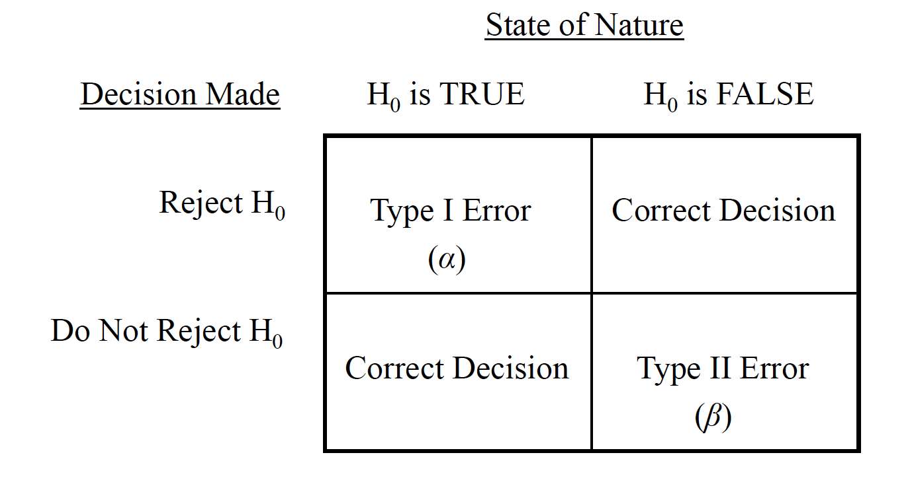
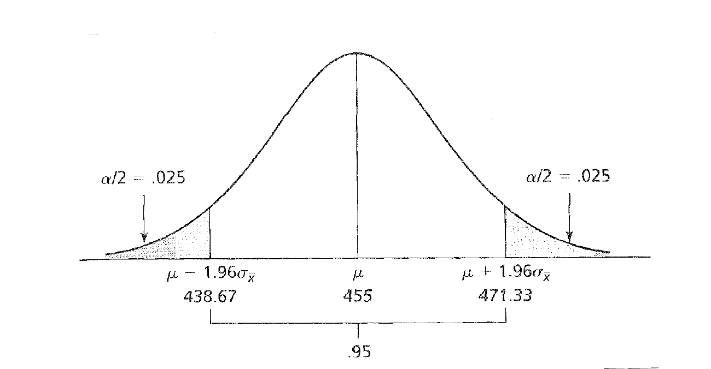
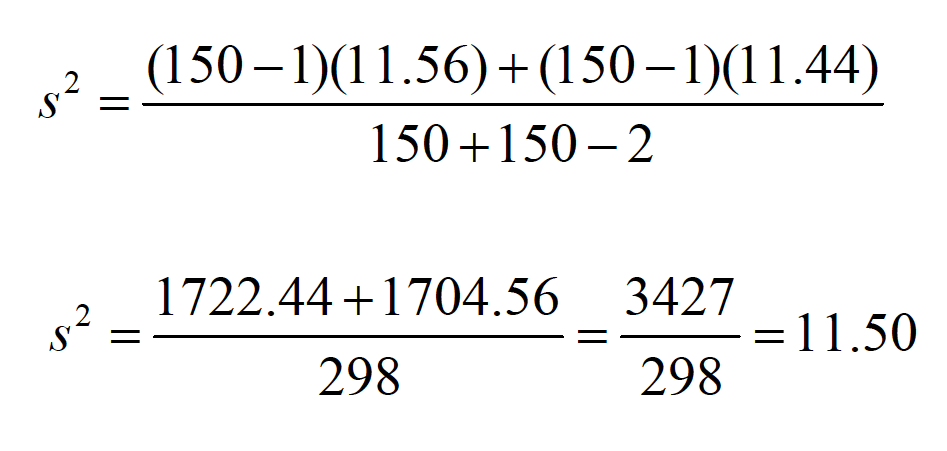
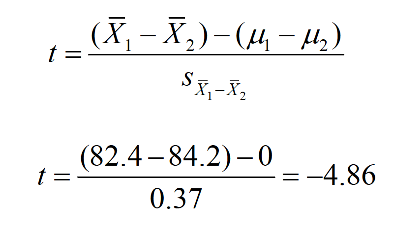

# Hypothesis Testing

The sampling distribution of the mean helps us to make hypotheses about the likelihood that a given sample mean comes from a sampling distribution with a given mean.

Stated differently, a hypothesis test helps us determine whether the observed difference between a sample mean and a hypothetical population mean is either negligible or meaningful.

The Null Hypothesis $H_o : \mu = some value$ 
The alternative Hypothesis $H_o : != \mu = some value$

The Alternative Hypothesis

A sample mean of a given sample size is produced and compared to the hypothetical sampling distribution’s mean to test the null hypothesis

Imagine we know the population (for some reason) and the True value is 455.

The hypothesis test is based on inference (i.e., inductive reasoning), and therefore there is a chance that mistaken inferences will be made.

The 2 ×2 matrix of decision outcomes given the state of nature
and the decision made

A Type I erroris produced when we mistakenly reject the null. It is associated with probability alpha ($\alpha$), or the level of significance.

We conventionally set this level to be .05in psychology, but there are considerations to be made for increasing or decreasing this value (e.g., .01 or .10).

A Type II erroris produced when we mistakenly fail to reject the null. It is associated with probability beta ($\beta$), which is related to, but not the same as, alpha.

The level of significance creates the bounds for the rejection region—the extreme region(s) under the sampling distribution equal to αif the null hypothesis is true.

The directionality of the test should also be considered.

Hypothesis tests differ slightly when population parameters, such as $\sigma^2$, are known versus unknown.

The general formula for a test statistic $Statistic - parameter /SE$

When $\sigma^2$is known, we use the standard error of the normal distribution as the denominator. The result is the ztest.

Z TEST FORMULA 

STANDARD ERROR HERE

When $\sigma^2$ is unknown, we use the t distributionas our sampling distribution, with a standard error that must be estimated from $s^2$ or $s$. The result is the ttest.

T TEST AND STANDARD ERROR FORMULA HERE

Left off on Page 11 in onesampleNHST.png

The concept of degrees of freedom (df)must be considered for the ttest. For each sample drawn, df= n–1.

VARIANCE FORMULSA

## Steps of Hypothesis Testing

On a standardized anagram task, $\mu$= 26 anagrams solved with a $\simga$= 4. A researcher tests whether the arousal from anxiety is distracting and will decrease performance. A sample of $n$= 14 anxiety patients is tested on the task. There average performance is 23.36 anagrams.

Step one: State the null and alternative hypotheses

$H_O = : \mu = 26 $
$H_O = : \mu != 26 $

Consider directionality.

Step two: Set the criterion for rejecting H0. Alpha is usually set to .05, but could be other values depending on the research context. Again, directionality is important to consider.

Step three: Select the sample and collect your data.

Step four: Locate the region of rejection and the critical value(s) of your test statistic. Again, directionality is important to consider.

Step five: Compute the appropriate test statistic. σis known, so we use the ztest.

Step six: Decide whether to reject H0. Is -2.47 more extreme than the critical value?

Step five: Compute the appropriate test statistic. $\sigma$ is unknown, so we use the ttest.

Step six: Decide whether to reject H0. Is -3.00 more extreme than the critical value? df= 13, look up critical value in table C.3 and find ±1.77.

T distribution here

How do we report this result in a typical research article?
“The mean number of anagrams solved by anxiety patients
(M= 23.36) was significantly lower than the mean established by
test norms (M= 26), t(13) = 3.00, p< .05.”
Sometimes you’ll find people report the pvalue lower than .01 if it
passes this criterion as well. For example, t(13) = 3.00, p< .01.
Don’t be confused by the meaning of this, however.

### Other important considerations.

The hypothesis test is a test of the NULL hypothesis, assuming that the null is true. Thus, the test gives you the probability of your sample mean being that different (or more) from the population mean by chance IFFthe null is true.

Statistical significance is not the same as practical significance.

Being able to report the result of a hypothesis test statistically versus being able to describe the result to a lay person. Relate the inference back to the original research question!

## Two Sample

In cases where we wish to compare two sample means, the hypothesis testing logic is essentially the same as with the one-sample tests, with some slight differences in the null hypothesis, in the sampling distribution, and in the computation. When different people (or animals) contributed to the two samples, the comparison distribution that represents the null hypothesis is a sampling distribution of differences between means. The hypothesis test is therefore referred to as an independent-samples test.

When both sample means were produced by the same participants, we conduct what is known as a dependent-samples test. This is a test of the average difference between the scores in one condition and the scores in another condition—thus, the unit of measurement is a difference score.

Nondirectional Null Hypothesis $H_O : \mu_1 - \mu_2 = 0 | H_O : \mu_1 = \mu_2 $
Nondirectional Alternative Hypothesis $H_a : \mu_1 - \mu_2 != 0 | H_a : \mu_1 = \mu_2 $

Directional Null Hypothesis $H_O : \mu_1 > \mu_2  |  \mu_1 < \mu_2 $
Directional Alternative Hypothesis $H_a : \mu_1 < \mu_2  | H_a : \mu_1 > \mu_2 $

This is basically a subtraction of one sampling distribution from another, to produce a distribution of possible differences between sampling distributions.
$ \mu_1 - \mu_2$
* The mean of this sampling distribution is $ \mu_1 - \mu_2$
* The shape of this sampling distribution is approximately normal.
* When \sigma 2is known for each distribution, the standard error of the difference between means is

s2is considered a pooled estimateof the population variance because the individual estimates are literally summed together in the computation:

$s^2 = \frac{SS_1 + SS_2}{n_1 + n_2 -2}$

If you know the individual group variances or standard deviations, then

$s^2 = \frac{(n_1 - 1)s_1^2 + (n_2 - 1)s_2^2}{n_1 + n_2 -2}$

$t = \frac{(\bar{X_1}-\bar{X_2})-(\bar{\mu_1}-\bar{\mu_2})}{s_{\bar{X_1}-\bar{X_2}}}$

Example of the independent samples ttest

The instructor of an introductory psychology course is interested
in knowing if there is a difference in the mean grades on the final exam
between the fall and spring semester classes. Summary data for the two
samples is below:

Are the final exam grades for the two classes equivalent?

Step one: State the null and alternative hypotheses
$H_o:\mu_1 = \mu_2$
$H_a:\mu_1 != \mu_2$

b.Step two: Set the criterion for rejecting H0. Alpha is usually set to .05, but could be other values depending on the research context. Make sure you’ve considered directionality!
c.Step three: Select the sample and collect your data.
d.Step four: Locate your region of rejection and critical values.

Locate your region of rejection and critical values.

$t_{cv,dv=298, \alpha=.05}= +/- 1.96$

Step five: Compute the appropriate statistic. We were never
given $\sigma$ or $\sigma^2$, so we use the t test.

Step six: Decide whether to reject H0. Is -4.86 more extreme than the critical value?

$t_{cv,dv=298, \alpha=.05}= +/- 1.96$

The effect sizerefers to the magnitude of the phenomenon being
tested and is calculated as

This statistic reflects the standardized distance between two
populationmeans. J. Cohen provides guidelines to interpret
the value of d:

“The average final exam score from the fall semester (M= 82.4) was
significantly lower than the average score from the spring semester
(M= 84.2), t(298) = 4.86, p< .05.”

Small: = 0.25Medium: = 0.50Large: = 1.0

“The average final exam score from the fall semester (M= 82.4)
was significantly lower than the average score from the spring
semester (M= 84.2), t(298) = 4.86, p< .05, Cohen’s d= 0.53.”

