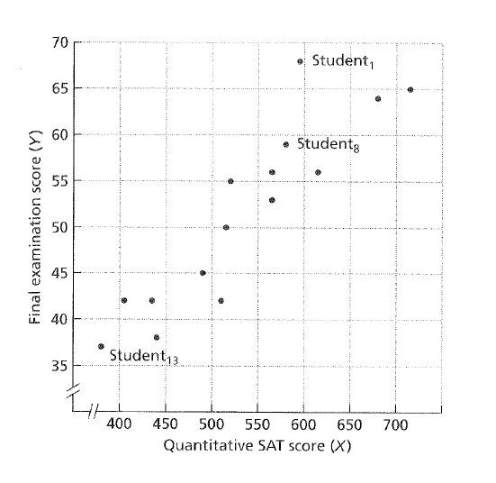
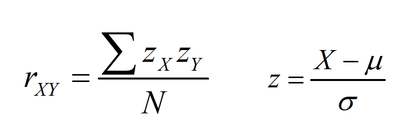
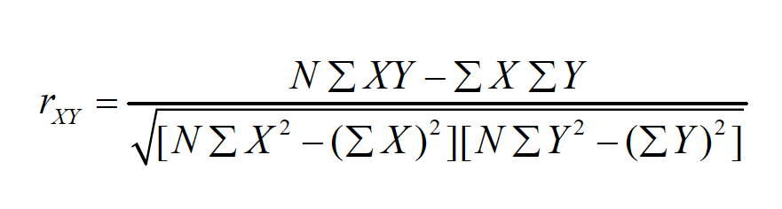
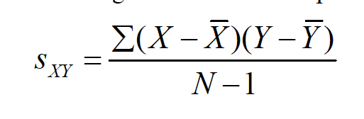
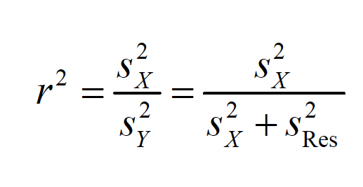
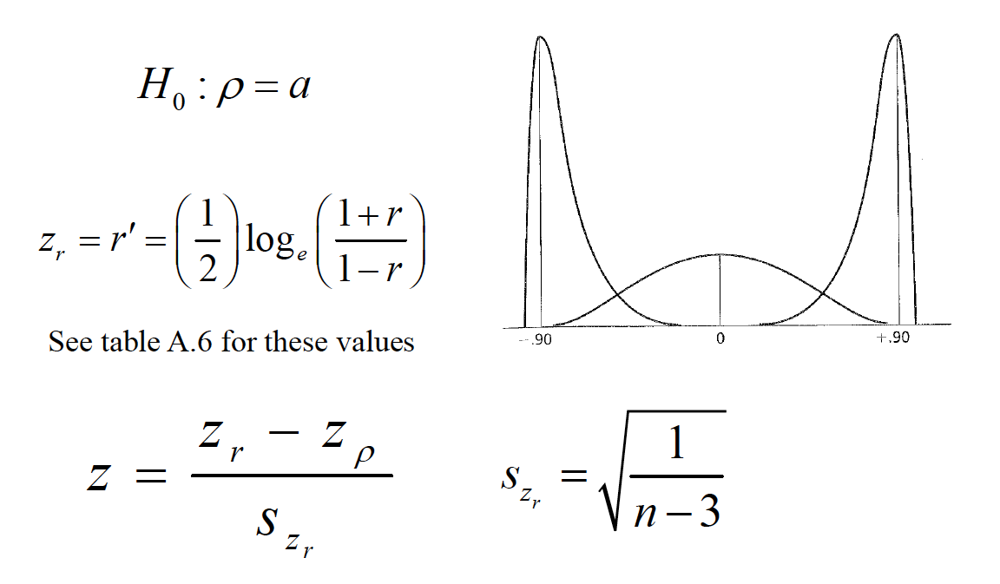
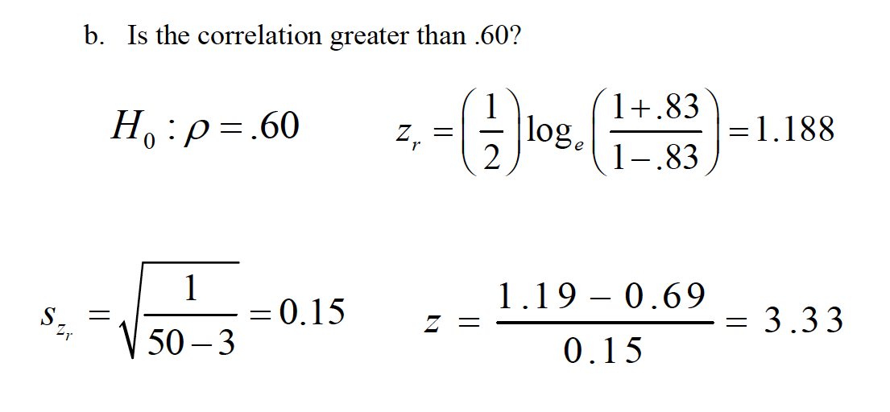

# Correlation and Regression

1.
Statistical correlation simply refers to the notion that two variables are related to one another—when one varies, the other varies in a predictable manner. There are typically two ways to understand the nature of a correlation: visually and numerically.
2.
There are multiple ways to understand and, therefore, calculate the Pearson correlation coefficient.
3.
Relying on Pearson’s rto describe a relationship assumes that certain conditions have been met.
4.
Other factors may impact how one interprets the linear correlation.
5.
Testing the “significance” of the correlation coefficient.
6.
There is a correlation coefficient to deal with ordinal variables, or those measured by ranks.

The variables are represented in the abstract as Xand Y.
b.Scatterplotsare figures that represent a pairof scores for each individual, one score for each measured variable. The pattern of the scatter indicates the nature of the relationship.

The statistical representation of the correlation was developed by Karl Pearson and is called the Pearson product-moment correlation coefficient, or r.

i. r varies from -1 to 1.
ii. The strength, or magnitude, of the relationship increases as
distance from 0 increases.
iii.The sign of the correlation represents the direction, or slopeof
the relationship.

A graduate student samples 50 college professors in social sciences at the same university who have been there for at least 10 years. She measures them on a number of characteristics: average quality of their instruction, average quality of their courses, number of publications, and number of citations by other authors. Is there a relationship between the number of publications and number of citations?

## Calculating Person C

One method is to examine the cross-products, which represent the
multiplication of Xand Y, usually on a standard scores. The result is
the standard score formula:

Note these formulas (e.g., z-score) use population characteristics
This approach is very tedious, and does not make sense unless you
already have the z-scores calculated for some reason.

The deviation score formulais a computational formula that relies on
using deviations from respective means:

There is a raw score, computational formula that bypasses the need to
calculate deviations from each mean:

Finally, we can use the covarianceto compute the correlation.

Covariance is the average sum of the cross-products of deviations:

Dividing this number by the cross-product of the unbiased sample
standard deviations produces:

### Assumptions

a. The scores are pairs—the same set of individuals needs to contribute both scores.
b.Because the mean and variance are used to compute r, the variables need to be measured on an interval or ratio scale.
c.Xand Yare normally distributed.
d.The observations were randomly sampled.
e.The relationship between the variables is linear, rather than curvilinear. Values of rare uninterpretable (and are underestimates) for curvilinear relationships.

If the rangeon one or both variables is restricted(i.e., the group is very homogeneous on Xand/or Y), then the value of rtends to become smaller.
Theoretically, the correlation can get bigger with range restriction, although this is VERY rare with moderate-to-large sample sizes.

The sample size will not affect the value of r(except when N= 2), but will affect its accuracyin terms of statistical significance.
-when N= 2, rALWAYS equals ±1.0
c.The coefficient of determinationrepresents the amount of variance in Ythat can be associated with the variance in X.

Conceptual 

Finally, a measured correlation says nothing about whether Xand Yare causally linked, only that there is an association. There are three generic possible reasons for the association.

Testing the “significance” of the correlation coefficient.
a.Is the correlation different from 0?

Or look up critical values in A5 and compare with r 48df .05 alpha of .273

There is a correlation coefficient to deal with ordinal variables, or those
measured by ranks, called Spearman rho.

d= the difference between paired ranks, rather than paired scores.

