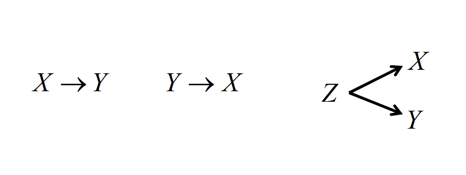

# Correlation

Statistical correlation simply refers to the notion that two variables are related to one another.
The ideas is that when one varies, the other varies in a predictable manner. 
There are typically two ways to understand the nature of a correlation:
  * Visually  
  * Numerically

In order to get a better understanding about correlations, in this chapter we are going to learn how to calculate Pearson's correlation coeffecient.
After calculating Perason's $r$, we'll then talk a bit more about the assumptions correlation, what factors can impact linear correlation, and how to test the "significance" of a correlation coeffecient. 
Lastly we will talk about other types of correlation coefficients that deal with ordinal variables, or those measured by ranks.

Many people have seen a **scatterplot** before like the one shown below.

```{r}
library(ggplot2)
ggplot(iris, aes(x = Sepal.Length, y = Sepal.Width)) + geom_point() +
  labs(title = "Example of a Scatterplot", x = "Sepal Length", y = "Sepal Width")

```
On the horizontal axis (or x axis), one variable is plotted and then each corresponding score on the x axis is plotted against its respective value on the vertical axis (or y axis).
The pattern that the variables show can indicate the nature of the relationship between the two variables.
From the pattern above there appears to be a *positive* relationship between the length of an iris's sepal and its width.
The relationship is positive because one variable increases, so does the other.
If the variables were to share a negative relationship we would see a trend where scores would move from the top left down until the bottom right like this plot below.

```{r}
ggplot(mtcars, aes(x = mpg , y = hp)) + geom_point() +
  labs(title = "Example of Negative Relationship", x = "Miles Per Gallon", y = "Horsepower")

```

[EXAMPLES OF NO RELATIONSHIP, CURVILINEAR?]

We can describe both the strength and direction of each of these relationships by using Karl Pearson's **Pearson's Product-Moment Correlation Coeffecient** or $r$.
$r$ has three main properties
  * $r$ varies from -1 to 1
  * The strength, or magnitude, of the relationship increases as distance from 0 increases.
  * The sign of the correlation represents the direction, or slope of the relationship.

In order to explore how $r$ works, we are going to focus on an example where a graduate student samples 50 college professors in social sciences at the same university who have been there for at least 10 years. 
She measures them on a number of characteristics: average quality of their instruction, average quality of their courses, number of publications, and number of citations by other authors. 
She wants to know if there is there a relationship between the number of publications and number of citations?

Let's enter our data in.

```{r}
# Create Data
yearsTeaching <- c(0,14,1,1,11,3,16,1,13,1,0,7,49)
numberOfPublications <- c(0,90,2,32,53,12,108,4,82,19,0,51,274)
publicationData <- as.data.frame(cbind(yearsTeaching,numberOfPublications))

ggplot(publicationData, aes(x = yearsTeaching, y = numberOfPublications)) + geom_point() +
  labs(main = "Publication Data", x = "Years Teaching", y = "Number of Publications")
  
```

Now on to the calculations!

## Calculating Person's r

Using the data from above, the first way we are going to calculate $r$ is to use the cross products.
The cross producets represent the multiplication of X and Y represented on standardized scores.
We can use the following two formulas:

$$r_{xy} = \frac{\Sigma z_X z_Y}{N}$$

$$z = \frac{X = \mu}{\sigma}$$

Note these formulas (e.g., z-score) use population characteristics and that this approach is very tedious.
It also does not make sense unless you already have the z-scores calculated for some reason.

Since we want to have a better idea of these formulas, let's break it down.
What we are solving for is $r_{XY}$ which is Pearson's $r$.
The little $X$ and $Y$ indicates that the $r$ there is representing the relationship between those two variables.
This might seem obvious, but once you start looking at bigger datasets where you have more than two varaiblse, this notation is nice to keep track of what each $r$ represents.

Now the top part of our equation is $\Sigma z_X z_Y$.
The $\Sigma$ means we need to perform a summation (add them all up!) the products of each set pair of $z$ scores.
So in order to do this, let's first get the z scores from each of our variables.

```{r}
zYearsTeaching <- scale(publicationData$yearsTeaching)
zYearsTeaching
zNoOfPublications <- scale(publicationData$numberOfPublications)
zNoOfPublications
```
Now that we have the $z$ scores of our data, we then need to multiply them by each other.

```{r}
zCorrelationProductSummation <- sum(zYearsTeaching * zNoOfPublications)
```

We've now done the top part of the equation.
All that is left to do is now divide by number of observations we have.
Note here that we **could** hardcode this is in knowing that we only have 13 observations, but if we were get to more data, we wouldn't want to have to update that every time!
In order to get around this problem, let's make R count how many variables we have, then divide by that with the ```nrow()`` function.

```{r}
zCorrelationProductSummation / nrow(publicationData)
```

And then we can then check that what we did is correct with R's ```cor()``` function.

[Add in R correlation function?]

The $r = .91$ in this example!
We have a very strong positive correlation between years teaching and number of publications.

Of course we are not always going to want to convert our scores to z scores and calculate it.
For that, you might want to use the actual raw scores in your calculation.
The deviation score formula is a computational formula that relies on using deviations from respective means:

$$r_{XY} = \frac{\Sigma(X-\bar{X})(Y-\bar{Y})}{\sqrt\Sigma (X-\bar{X})^2\Sigma(Y-\bar{Y})^2} = \frac{\Sigma(X-\bar{X})(Y-\bar{Y})}{\sqrt{SS_{X}SS_{Y}}}$$

Or you could use the formula that uses the raw score, which bypasses the need to calculate the deviations from each mean:

$$r_{XY} = \frac{N\Sigma XY - \Sigma X \Sigma Y}{\sqrt{[ N \Sigma X^2 -(\Sigma X)^2] [N \Sigma Y^2 - (\Sigma Y)^2}] }$$

Finally, we can use the covarianceto compute the correlation.

Covariance is the average sum of the cross-products of deviations:

$s_{XY} = \frac{\Sigma (X - \bar{X})(Y - \bar{Y})}{N - 1}$

Dividing this number by the cross-product of the unbiased sample
standard deviations produces:

$$r_{XY} = \frac{S_{XY}}{S_X S_y}$$


### Assumptions

All correlations require a certain set of assumptions:

1. The scores are pairs—the same set of individuals needs to contribute both scores.
2. Because the mean and variance are used to compute r, the variables need to be measured on an interval or ratio scale.
3. X and Y are normally distributed.
4. The observations were randomly sampled.
5.The relationship between the variables is linear, rather than curvilinear. Values of rare uninterpretable (and are underestimates) for curvilinear relationships.
6. If the range on one or both variables is restricted (i.e., the group is very homogeneous on X and/or Y), then the value of rtends to become smaller.

For example, if you look at the two scatter plots below, both being created with the same dataset, but one truncated, we can see that there is a change in correlation coeffecient.

[PLOT HERE]

There are a couple of other factors that impact how one interprets a linear correlation.
If the range on one or both variables is restricted (i.e., the group is very homogeneous on X and/or Y), then the value of $r$ tends to become smaller.
Theoretically, the correlation can get bigger with range restriction, although this is VERY rare with moderate-to-large sample sizes.

It's also worth mentioning that sample size will not affect the value of r (unless N = 2), but it will affect its accuracy in terms of statistical significance.
If you do run a correlation with two points you are always going to get a perfect correlation!

In addition to $r$, there is $r^2$ which is referred to as the coeffecient of determination that represents the amount of variance in Y that can be associated with the variance in X.

We can calculate $r^2$ with the following formula.
$$r^2 = \frac{s^2_X}{s^2_Y} = \frac{S^2_X}{s^2_X + s^2_{Res}}$$

In the formula above, $r^2$ is the coeffecient of determination, $s^2$ is the ??variation?? in $s^2_X$, and $s^2_Y$ is the ??variation?? in Y.
The formula on the far right also notes you can have $r^2$ values that account for other types of variation.
For example if know residuals of other variables...

And we can see conceptual representations of $r^2$ below.


Finally, a measured correlation says nothing about whether X and Y are *causally* linked, only that there is an association. 
There are three generic possible reasons for the association.

1. X could be driving the relationship with Y
2. Y could be driving the relationship with X
3. A third, unaccounted variable Z, could be driving both relationships! 



## Testing the significance of the correlation coefficient.

It's important to note here that just like all tests of significance, you are only testing whether or not the correlation is different from 0! 
Represented numerically, our null hypothesis for testing the significance of the correlation coeffecient is that $H_0 : \rho = 0$.
We then use a $t$ statistic to find our critical value.

$$t = r\sqrt{\frac{n-2}{1-r^2}}= \frac{r - \rho_0}{\sqrt{\frac{1-r^2}{N-2}}}$$

Walking through the above formula, we are multiplying our correlation coeffecient ($r$) by the square root of our sample size $n$ subtract 2, divided by $1$ subtract our coeffecient of determination.
We find our degrees of freedom by subtracting 2 from our sample size. 

Using our data from above, it would look like:

$$t = .83\sqrt{\frac{50-2}{1-.82^2}}=10.31$$

With an $\alpha$ of .05 and $50 - 2 = 48$ degrees of freedom, using a two tailed test, we get a crticial value of about 2.01. 
Or since there is a table of [critical values associated with correlations] in your textbook in Table A5, we can compare....

We can then also test...
[[Add text here to these formulas]]

$$H_0 : \rho = \alpha$$
$$z_r = r' = \frac{1}{2}log_e\frac{1+r}{1-r}$$

See table A.6.

$$z = \frac{z_r-z_p}{S_{z_r}}$$
$$s_{z_r}= \sqrt{\frac{1}{n-3}}$$

Is the correlation greter than .60?

$$H_0: \rho = .60$$
$$z_r = \frac{1}{2}log_e\frac{1+.83}{1-.83}=1.88$$
$$s_{z_r}=\sqrt{\frac{1}{50-3}}=0.15$$
$$z= \frac{1.19-0.69}{0.15}=3.33$$

## Spearman's Rho

There is a correlation coefficient to deal with ordinal variables, or those
measured by ranks, called Spearman rho.

$$\rho = 1 - \frac{6\Sigma d^2}{n(n^2-1)}$$

Where d is equal to the difference between paired ranks, rather than paired scores.

So using this formula and some new data, we can then calculate Spearman's $\rho$!
First thing we need to do is load in some new data

```{r}
rhoX <- c(595,520,715,405,680,490,565,580,615,435,440,515,380,510,565)
rhoY <- c(68,55,65,42,64,45,56,59,56,42,38,50,37,42,53)
rhoData <- data.frame(rhoX, rhoY)
```

The first thing we need to do is transform both of our variables into rank order data with the highest number getting the lowest value.
To do that we can use R's ```rank()``` function.
Note that R normally has the rank order with the lowest the highest number, so if we just negate our vector, we get what we want. 

```{r}
rhoXRanked <- rank(-rhoX,ties.method = "average")
rhoYRanked <- rank(-rhoY, ties.method = "average")
```
With these ranks, we can then subtract our Y ranks *from * our X ranks.
After subtracting, we will then square them.
```{r}
rhoDifference <- rhoXRanked - rhoYRanked
rhoDifferenceSquared <- rhoDifference^2
sum(rhoDifferenceSquared)
```
We then take these $d^2$ values, and plug them into our formula from above.

$$\rho = 1 - \frac{6\Sigma d^2}{n(n^2-1)}= 1 - \frac{6 * 36.5}{15(15^2-1)} = 1 -.065=.935$$

Which we can then check wiht R's ```cor()``` function.

```{r}
cor(rhoX, rhoY, method = "spearman")
```
Note that if we run this same data with $r$ or Pearson's we get a smaller value!
```{r}
cor(rhoX, rhoY, method = "pearson")
```
It's worth mentioning that there is one more method called [Kendall's Tau](https://en.wikipedia.org/wiki/Kendall_rank_correlation_coefficient) ($\tau$) which is a type of correlation you can also use with Rank order where you need to count the number of concordant and or discordant pairs and then divide accordintly.
In the Andy Field book, he notes that Kendall's Tau is often used for small sample sizes (CITE).

