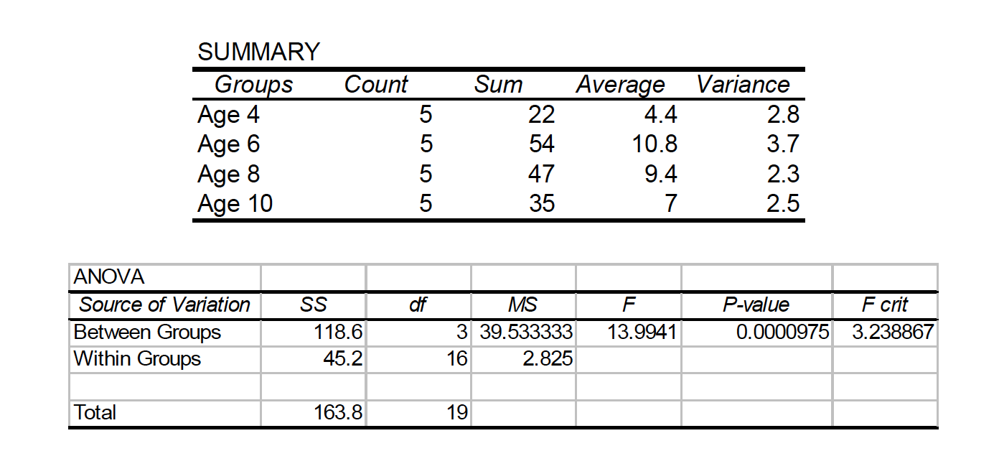
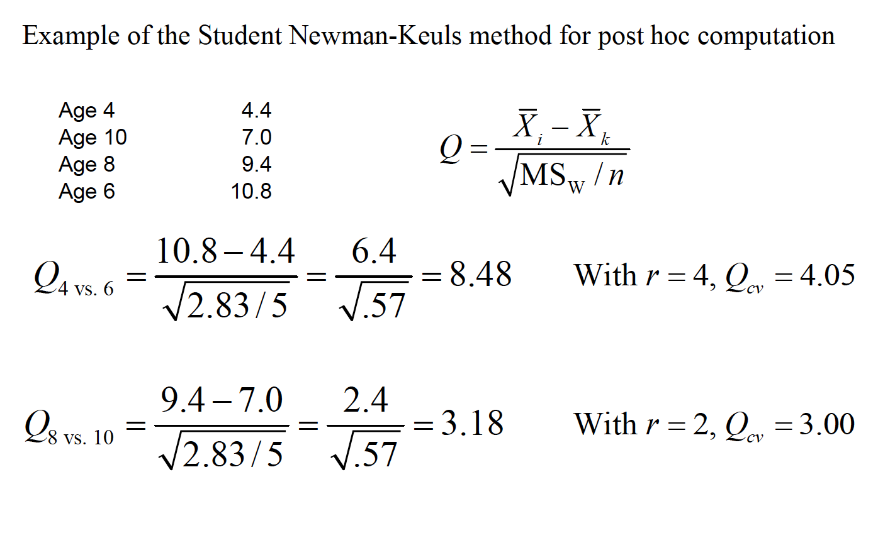
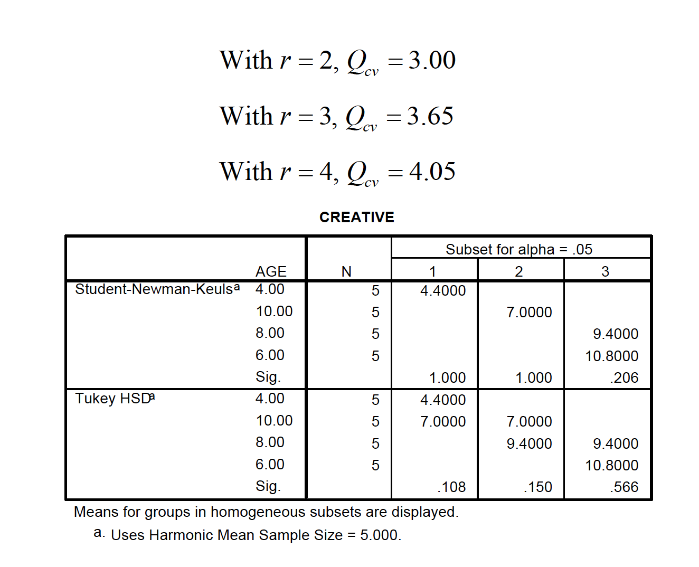
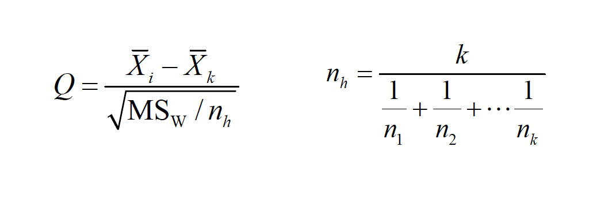
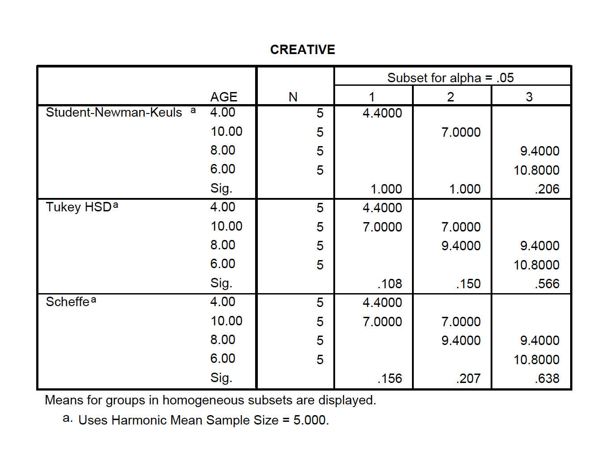
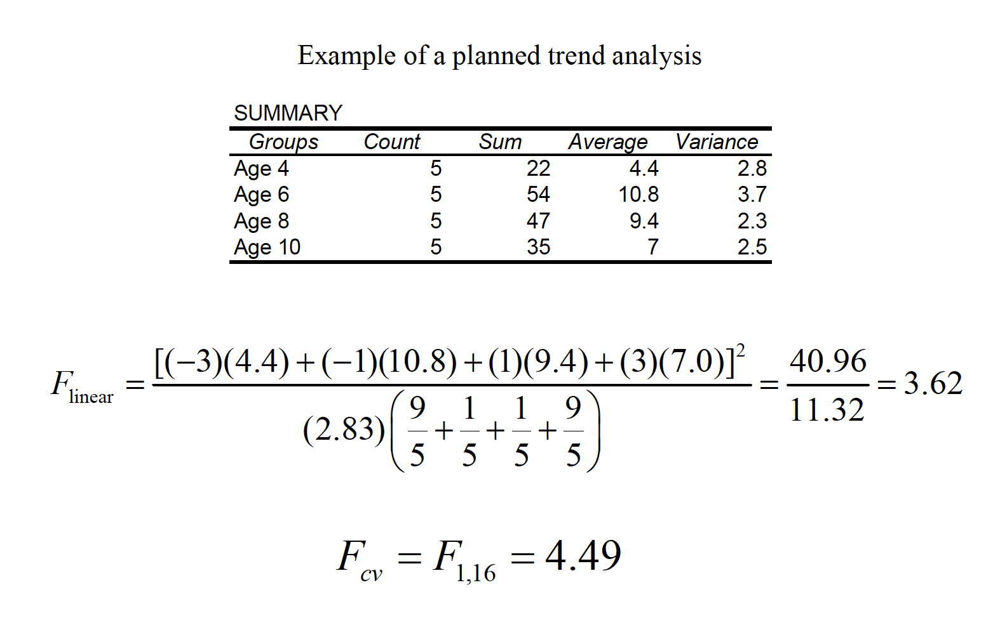
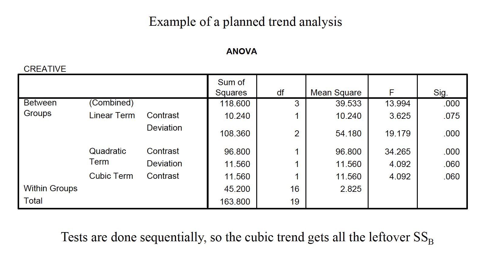

# Multiple Comparisons 

In past lectures we have discussed the problem with the familywise (or
what your text calls “experimentwise”) Type I error rate.

There are different methods for holding the familywise error rate at no
more than .05. This methodology is most commonly used in post hoc tests
designed to test specific contrasts among conditions following a significant
ANOVA.

In addition to comparisons done post hoc, others can be done a priori,
commonly known as planned comparisons. Because such comparisons are
usually done with a particular theoretical outcome in mind, they are not as
conservative as post hoc comparisons.

a. Familywise Type I error rate = , where j = number of
independent t tests to be conducted.
b. When comparisons are not independent, the familywise rate can be
approximated by the formula .
c. The comparisonwise error rate is the Type I error rate per comparison.
d. Comparisons are orthogonal if the outcome of one test is not
redundant with the outcome of another. There are (k – 1) orthogonal
comparisons in a data set, which will be discussed in more detail.

There are different methods for holding the familywise error rate at no
more than .05. This methodology is most commonly used in post hoc tests
designed to test specific contrasts among conditions following a significant
ANOVA.

The simplest, and most powerful test, is called the Fisher Least Significant
Difference test (LSD). It is sometimes called the “protected t” test, and the
formula is:

You then use the df from the overall error term for finding the critical value
of t. This test should be used only following a significant F test, and for no
more than 3 groups. If homogeneity of variance is not tenable, then use the
individual variances from the groups being tested, as the case for a
traditional separate variances t test with df = N - 2.

How does the Fisher LSD protect against Type I error inflation with only 3 groups?

Complete null is true

$H_0 : \mu_1 = \mu_2 = \mu_3$

In this case, if the overall
F is significant, you have
already committed a Type I
error and any more of them
don’t contribute further to
αFW (i.e., you are just going
to commit the ‘same’ error
in a particular pairwise
comparison.
This is the case no matter
how many groups are in the
experiment.

Partial null is true

$H_0 : \mu_1 = \mu_2 != \mu_3$

With 3 groups, if the overall
F is significant, it was not
a Type I error; there is only
one real chance of a Type I
error—that being when the
partial null is true. Here
αFW was never in danger of
being more than .05.
But with more than 3 groups,
and when more than one partial
null is true, you have the chance
of committing multiple errors.

Another common method is to use the studentized range (Q)
sampling distribution as the source of critical values for minimum
differences needed to declare population means significantly
different.

The Tukey method computes the minimum difference needed
for any pair of means to be significantly different. We use alpha,
the number of means being compared (r), and the df associated
with MSW to find a critical Q value.

With this method, you are protecting yourself against the most
extreme possible Type I error (i.e., between the largest and smallest
means), and therefore all other comparisons are likewise protected.

Scenario: A researcher gives a test of creativity to four groups of children.
The age difference between each group is 2 years (range 4-10 years). Do the
children demonstrate significantly different levels of creativity?

The Student Newman-Keuls method is similar to the Tukey,
except that the critical value is determined by the number of
steps separating each pair of means (r): range = i – k + 1

Problem: we do lose some control over αEW, as it actually goes over
.05

The Tukey/Kramer method is used when sample sizes are unequal.
We calculate the harmonic mean of the sample sizes to achieve
the appropriate number in the denominator:

The Ryan (or REGWQ) test is a modification of the SNK to
achieve increased power but also keeps αEW no greater than .05.
It is preferred over Tukey to get better power and over SNK to
keep αEW ≤ .05. This means it uses fractional values of alpha
that are not easy to tabulate—but SPSS and other packages
offer it as an option so it’s easy to use.

Another conservative method, the Scheffeaccent test, uses the F distribution,
but can also be used to test complex comparisons involving combined
groups, called linear contrasts.

The critical value of F sets the experimentwise error rate against all
possible linear contrasts, not just pairwise contrasts.

In addition to comparisons done post hoc, others can be done a priori,
commonly known as planned comparisons. Because such comparisons are
usually done with a particular theoretical outcome in mind, they are
typically not as conservative as post hoc comparisons.

The linear contrast described earlier is generally used to complete planned
comparisons. There are two primary differences as compared to the post
hoc version of the test.
If multiple contrasts are to be done, then it’s best if they are orthogonal, or
independent. There are K – 1 orthogonal comparisons available in any one
set of contrasts. Most (e.g., your text author) argue that you can keep each
contrast at α = .05 when the set is orthogonal.

The linear contrast method described earlier is also used to complete
planned comparisons. There are two primary differences as compared to
the post hoc Scheffé test.
Because of the orthogonality principle, the critical value for each
comparison allows for more power (i.e., it is more liberal than the post hoc
version Scheffé developed):

$F_{cv}=F_{1,N-K}$

A very conservative, but simple, method is to figure the
comparisonwise error rate is to divide the familywise error rate
by the number of comparisons one wishes to make. This is known
as the Bonferroni test or the Dunn test.

$\alpha_{pc}= \alpha_{EW}/J$

For example, with 3 comparisons, α = .05/3 = .0167.
You don’t set the modified alpha based on all possible comparisons,
just based on the number you wish to conduct.

## Trend analysis 

A statistical procedure called trend analysis can be done to examine the
functional relationship between a quantitative IV and the DV (e.g., linear,
quadratic, cubic).

The same linear contrast comparison method is used as with regular
contrasts, and the trend contrast coefficients are a special set of orthogonal
comparisons based on K.

A statistical procedure called trend analysis can be done to examine the
functional relationship between a quantitative IV and the DV (e.g., linear,
quadratic, cubic).
Trend analysis works only when the IV is a quantitative variable (e.g., drug
dosage).
More than one trend may be significant, and therefore inspecting a graph of
the means in tandem with the analysis is highly recommended.

