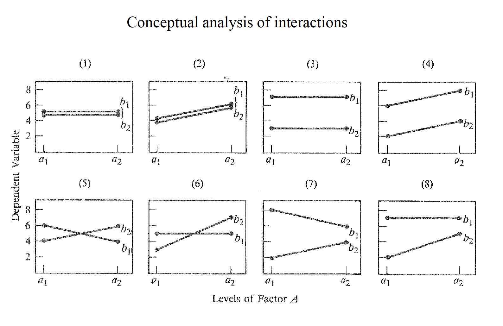
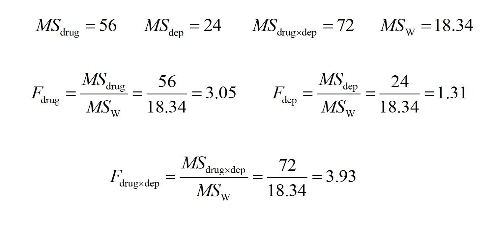
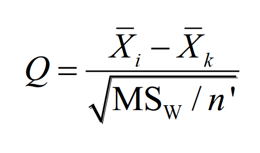
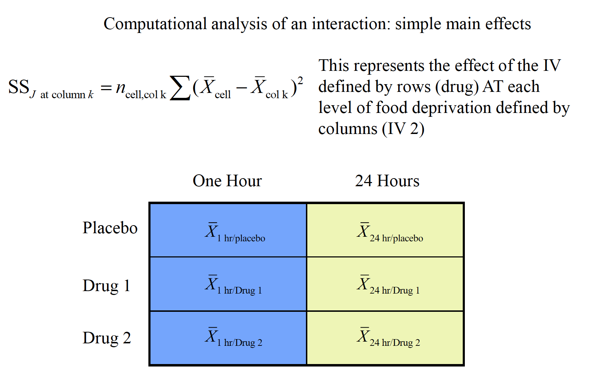
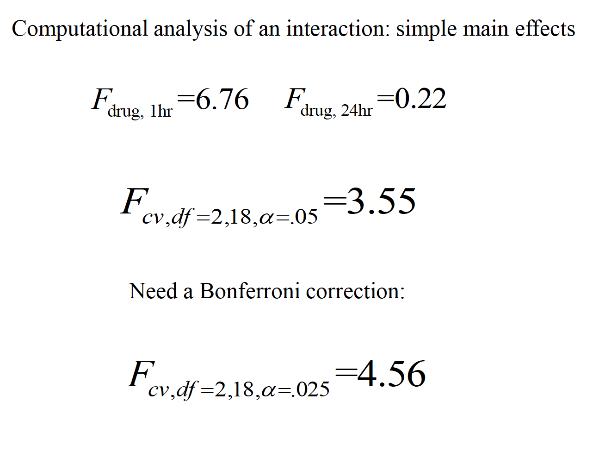
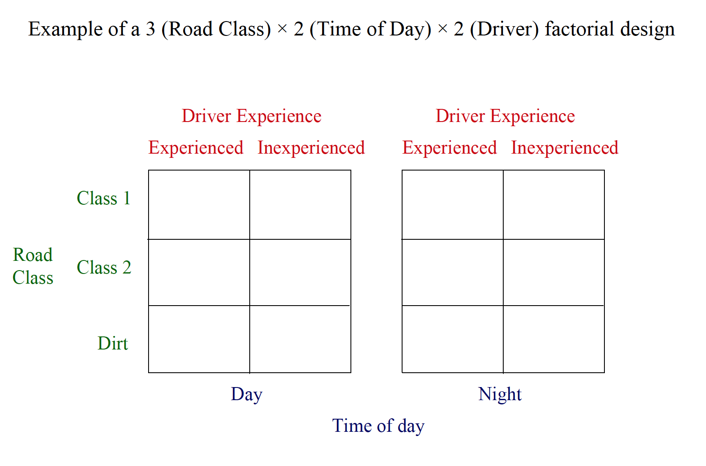
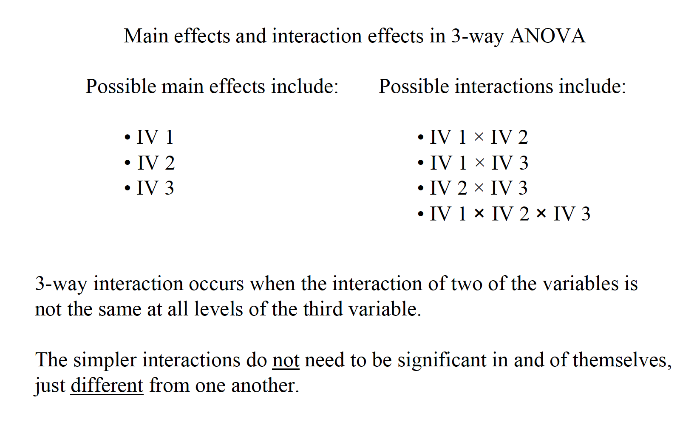
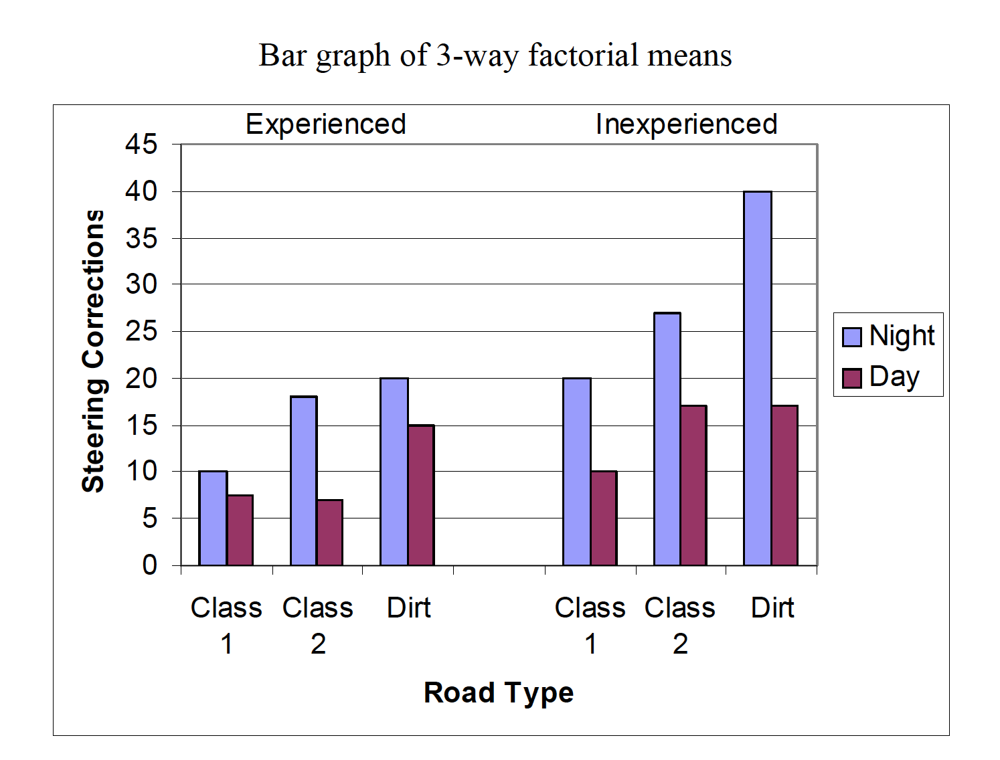
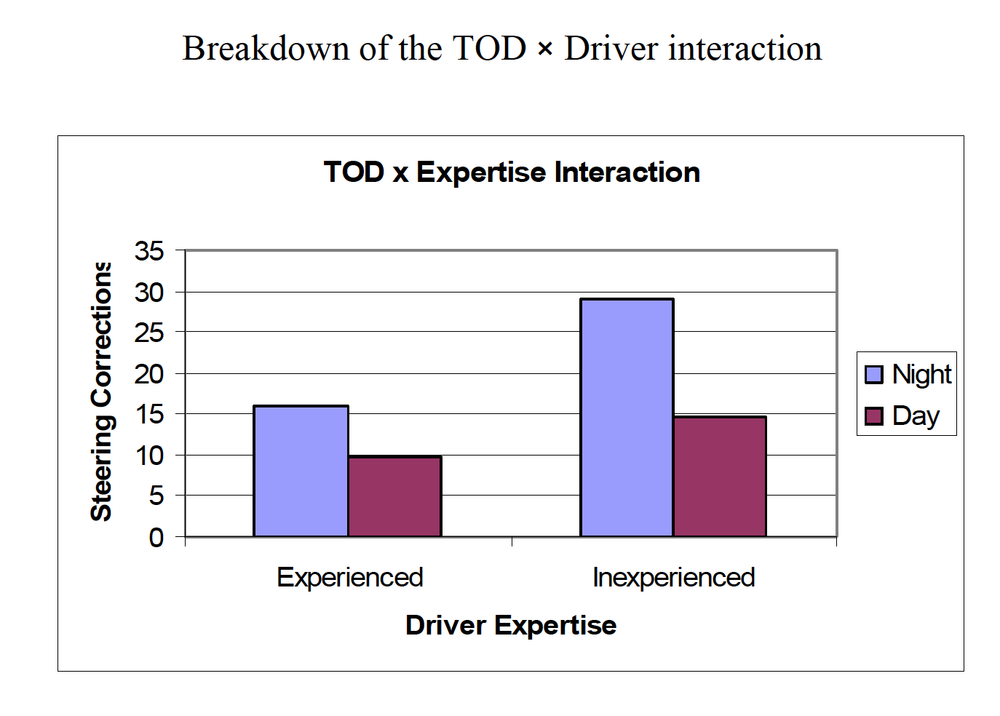

# Factorial Anova

Hypothesis Testing with Multiple Samples: The Factorial ANOVA
1.In cases where multiple IVs are crossed with one another in the same design, the factorial ANOVAis used to partition the variance.
2.There are multiple null hypotheses tested simultaneously in a factorial ANOVA, making the design and analysis somewhat more complicated than one-factor designs.
3.The assumptions in the factorial ANOVA are the same as in the one-way ANOVA.
4.Other considerations in factorial ANOVA

Such designs incorporate multiple IVs to examine the simultaneous effect these variables have on behavior—this adds efficiency to the design.
a.Incorporating more than one IV allows researchers to control for the impact of a second variable by explicitly including it in the design. Controlling for a second factor allows for a reduction in the error term of the ANOVA.
b.The unique benefit of the factorial design is the investigation of interactions—the possibility that the combined influence of multiple factors influences behavior in a way unpredictable from knowing the influence of individual variables in isolation

2.There are multiple null hypotheses tested simultaneously in a factorial ANOVA, making the design and analysis somewhat more complicated than one-factor designs.
a.Factorial designs are typically represented in arrays with rows for the levels of one IV and columns as levels of the other IV. Each combination of levels from IV 1 and IV 2 is called a cell, or condition.
Scenario: A researcher is interested in the role of “drive” level and certain drugs on learning in monkeys. The monkeys are given 20 “oddity” problems in which they are given 3 objects, one of which is new, and they are reinforced for picking the novel item. One IV is “drive” level, either 1 hour of food deprivation or 24 hours of food deprivation before the oddity task is undertaken. The other IV is drug condition, with 3 levels. One is a placebo, and the other two compare two different drugs believed to affect motivation.

There are multiple null hypotheses tested simultaneously in a factorial ANOVA, making the design and analysis somewhat more complicated than one-factor designs.
a.Factorial designs are typically represented in arrays with rows for the levels of one IV and columns as levels of the other IV. Each combination of levels from IV 1 and IV 2 is called a cell, or condition.
i. Main effects refer to the influence of any one IV regardlessof the
other IV(s) in the design.

Simple effects (or simple main effects) refer to the effect of one IV
at a particular level of another IV (e.g., the effect of columns at
row 1).

Interaction effects refer to the combined influence of the IVs.
Interactions can be defined many ways, but one useful generic
definition is that an interaction occurs when the simple effect of
one IV is inconsistent, or not the same, at each level of another IV

An interaction is present when the simple (main) effects of one IV are not
the same at all levels of another IV
An interaction is present when the main effect of an IV is not representative
of the individual simple (main) effects of that IV
An interaction is present when the effect of one IV is conditionally related
to the levels of the other IV
An interaction is present when one IV does not have a constant effect at all
levels of another IV

In designs with two IVs, the variance between conditions is
partitioned into 3 components: the overall influence of IV 1 ( ), the
overall influence of IV 2 ( ), and the combined influence of IVs 1
and 2 ( ). The fourth component is the variance within conditions,
or within cells, ( ).

“A two-way between-subjects ANOVA generated a significant interaction
between drug condition and level of food deprivation, F(2, 18) = 3.93,
p < .05. The main effect of food deprivation, F(1, 18) = 1.31, p > .05, was
not significant. The main effect of drug condition was just short of
conventional significance, F(2, 18) = 3.06, p = .07.”

## Assumptions of ANOVA

The samples are independent, random samples from the populations.
b.The scores on the DV are normally distributed in the population.
c.The population variances in all cells (conditions) of the factorial design are equal—homogeneity of variance.

An appropriate measure of variance explained (or association) is
omega squared

Multiple comparisons for main effects (i.e., marginal means) can be
accomplished with the standard methods, such as the Tukey method:

Multiple comparisons for main effects (i.e., marginal means) can be accomplished with the standard methods, such as the Tukeymethod.

Simple effect (or simple main effect) comparisons are essentially a series of one-factor ANOVAs to help illuminate the nature of an interaction, but using the overall MSWas the error term.

n prime is SUM of the n from each individual
cell in the comparison (marginal n)

Simple comparisons involve individual comparisons of cells within a simple main effect. In this case, standard post hoc tests (e.g., Tukey) could be used. Again, the overall MSWis used as the error term in these comparisons.

“A two-way between-subjects ANOVA generated a significant interaction
between drug condition and level of food deprivation, F(2, 18) = 3.93,
p< .05. The main effect of food deprivation, F(1, 18) = 1.31, p> .05, was
not significant. The main effect of drug condition was just shy of
conventional significance,F(2, 18) = 3.06, p= .07. To reveal the nature of
the interaction, simple main effects were conducted on drug condition at each
level of food deprivation, with a Bonferroni adjustment for multiple comparisons
applied. At 1 hour of food deprivation, the effect of drug was significant,
F(2, 18) = 6.76, p< .05, whereas the effect of drug was not significant at 24
hours of food deprivation, F(2, 18) = 0.22, p> .05. A Tukey test among drug
conditions at 1 hour of food deprivation revealed that the placebo and drug 2
differed significantly, whereas the other two pairwise comparisons were not
significant.”

## Power and Sample Size Estimatoin

### Three Way Factorial 

Example research scenario: A researcher tests driving ability based on three
factors:
Experience of driver (inexperienced vs. experienced)
Road class (class 1, class 2, or dirt)
Time of day (daytime vs. nighttime)
2 × 3 × 2 factorial design
DV is the number of steering corrections made during a 1-mile section of
roadway

