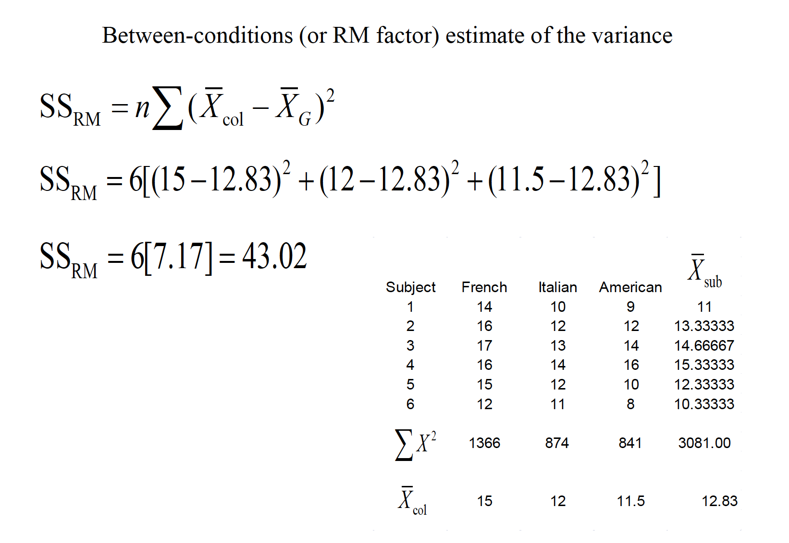
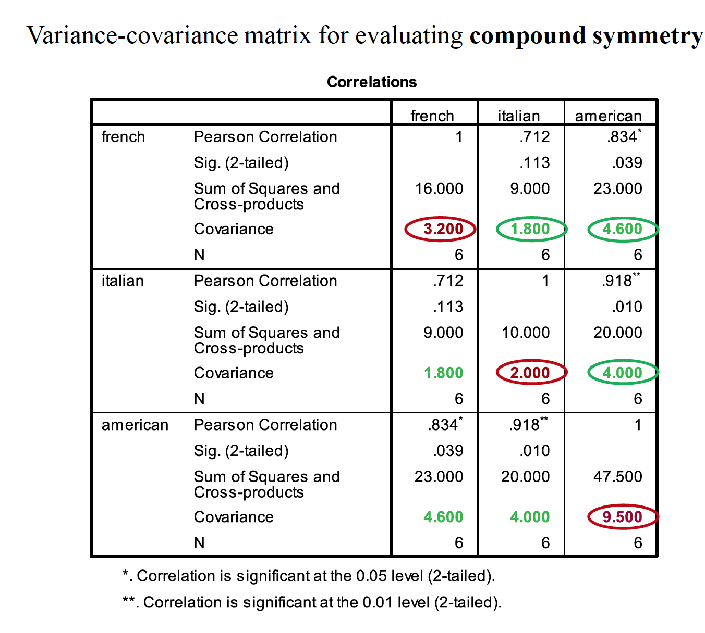
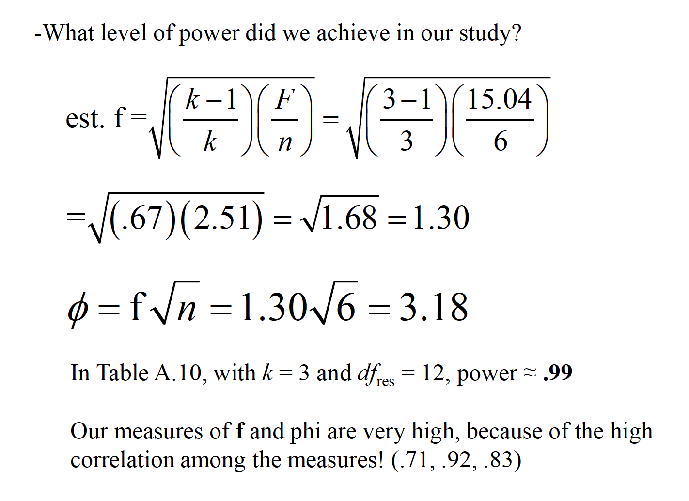

# Repeated Measures ANOVA:

1. Repeated measures designs are those in which subjects are tested in each level of the independent variable.
2.The conceptual difference is that repeated measures designs allow for the separate estimation of the influence of individual differences from participant to participant, whereas between subject designs do not.
3.The repeated measures design is more economical and contains
more statistical power as compared to its counterpart.
4.The assumptions of the repeated measures ANOVA
5.Power and effect size

The linear model includes two more components, the source of an individual’s performance across the entire study and how an individual interacts with the treatment levels:


This ability to isolate the source of individual differences allows us to further reduce the error variance (i.e., the denominator of the F ratio).

$F = \frac{MR_{RM}}{MS_{sub x RM}}$

Variability due to subjects is taken into account, but then ignored
in the computation of F.


A consumer psychologist is interested in the effect of label information on the
perceived quality of wine. Six individuals are asked to rate 3 different wines
a scale of 1 to 20, with higher scores being a better quality. The wines were
labeled as French, Italian, or American, but the wine was identical across the
conditions. The results are shown below:





## Assumptions of RMANOVA

1.
Sample randomly selected from the population
2.
The DV is normally distributed in the population
3. Sphericity: the variances of difference scores from all possible pairs
of conditions are equal





If sphericityis violated, there are several avenues to correct for it that involve
applying a correction for the Epsilon value (ε)
In SPSS, you’ll see the following in the within-subject ANOVA output:
Lower bound correction—this is a change to the critical Fvalue from
df= K–1, (n–1)(K–1) to df= 1, n–1. This severelyincreases the
critical Fvalue to 6.61 in our case.
Huynh & Feldtand Geisser-Greenhouse are corrections to the dfbased
on the degree of violation to sphericity, and create more modest
corrections to the critical Fvalue. The non-corrected dfare multiplied
by the epsilon values for each respective procedure.

If none of the Fs is significant, don’t worry about these corrections—fail to
reject the null.
If all of the Fs are significant, then reject the null.
If one/some of the “corrected” Fs is significant but others are not, then most
advocate the Huynh & Feldtcorrection (it’s not as conservative as the lower
bound).
Field text advocates averaging the G-G and H&F estimates—for a rule of
thumb, average the significance values of these estimates

## Effect Size

An effect size measure, f, is used to represent the population SD between
groups from the grand mean, versus population SD within a group





## DB Notes 

Just like regular ANOVA, but now have the assumption of spherecity.

Compound symmetery -- variances across conditions are equal and covariances between pairs of conditions are equal. 
Don't need this as much in RMANOVA.
Spherecity is differences in variation.
You do this with Mauchley's test of sphereicity.

If you violate spherecity, come back here.
Can do Greehouse Geisser correction or the Huynh-Feldt corection.

### AF Example

```{r}
participant <- c("P1","P2","P3","P4","P5","P6","P7","P8")
stick_insect <- c(8,9,6,5,8,7,10,12)
kangaroo_testicle <- c(7,5,2,3,4,5,2,6)
fish_eye <- c(1,2,3,1,5,6,7,8)
witch_grub <- c(6,5,8,9,8,7,2,1)
bush <- as.data.frame(cbind(participant, stick_insect, kangaroo_testicle, fish_eye, witch_grub))
```

Though needs to be long for RMANOVA

```{r}
library(reshape)
longBush <- melt(bush,   id = "participant", measured = c("stick_insect", "kangaroo_testicle","fish_eye","witch_grub"))
names(longBush) <- c("Participant","Animal","Retch")

longBush$Animal <- factor(longBush$Animal, labels = c("Stick Insect","Kangaroo","Fish Eye", "Witch"))
longBush
```

```{r}

PartsVWhole <- c(1,-1,-1,1)
TestVEye <- c(0,-1,1,0)
SticVGrub <- c(-1,0,0,1)
contrasts(longBush$Animal)<-cbind(PartsVWhole,TestVEye,SticVGrub)
longBush$Animal
```

Running It 

THIS IS BROKEN

```{r}
library(ez)
str(longBush)
#bushModel <- ezANOVA(data = longBush, dv = .(Retch), wid = .(Participant), within = .(Animal), detailed = TRUE, type = 3)

```
