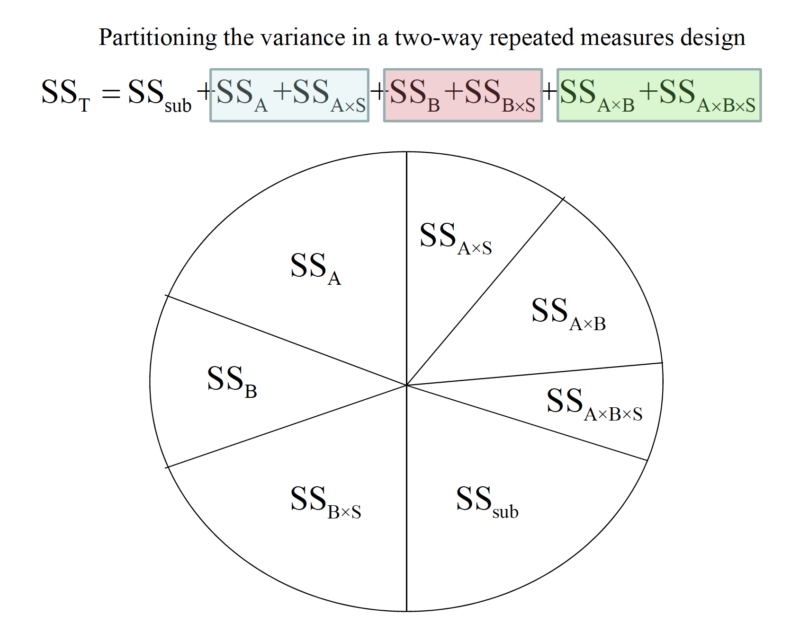
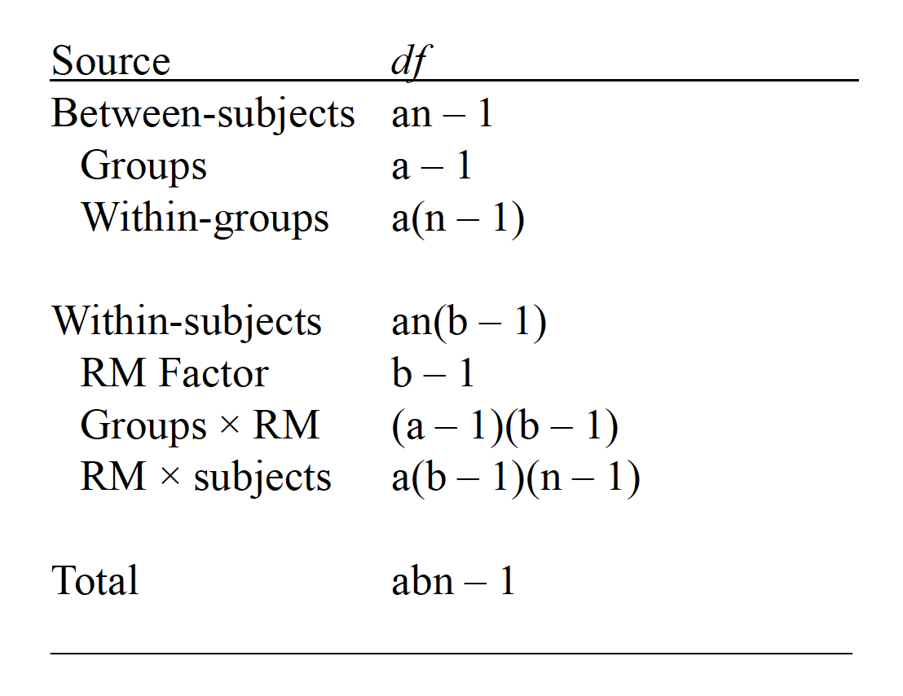
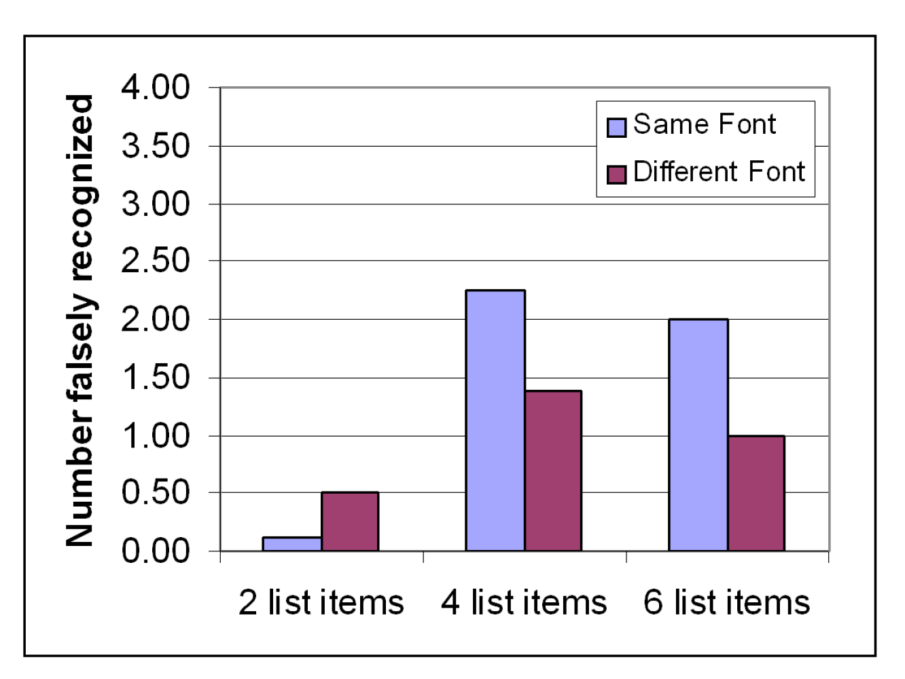

# Factorial Designs with Repeated Measures 

1. The partitioning of variance when all factors are repeated measures
includes multiple subject × treatment interactions.
2. A full computational example of a mixed design with one repeated
measures factor and one between-subjects factor.
3. The assumptions of designs with repeated measures

In cases where both (or more) factors are repeated measures, each main effect and interaction is generated as usual, but each error term consists of some type of interaction with subjects.

In cases where at least one factors us repeated measures and at least one other is between subjects, we have a mixed design. The sources of variation in a two-way mixed design are below:

A memory psychologist is interested in how false memories are affected by
changes in context. Three groups of people were asked to learn lists of
words connected to a missing theme. For example, the words BED, REST,
PILLOW, BLANKET, NIGHT, & SLUMBERare all related to SLEEP. Group 1 studied
many lists like these, with only the first two items for each list (e.g., only BED
and REST). Group 2 studied the same lists, but including the first 4 items per
list. Group 3 studied the same lists, but including all 6 items in each. Each list
had a very distinctive font, as I used above.
Each group then got a memory test. Included on this memory test were the
“missing” theme items, such as SLEEP. Sometimes the theme items were
in the same font as their list mates (e.g., SLEEP). Other times, these items were
presented in a different font (e.g., SLEEP). There were 4 items in each of these
test conditions. The data presented on the next slide represent how many, out
of 4, of these missing theme items were called “old” on the memory test. These
are, therefore, false memories. The question is whether the factors of list length
and font style at test affect how many of these occur.

In cases where at least one factors us repeated measures and at least one other is between subjects, we have a mixed design. The sources of variation in a two-way mixed design are below:

## Assumptions of Mixed ANOVA

1.
Sample randomly selected from the population
2.
The DV is normally distributed in the population
3. The variances of difference scores from all possible pairs of conditions
are equal and the covariances(or correlations) between pairs of
conditions are equal (sphericityor circularity).
4.These covariance structures, or matrices, are equal across the between-
subject groups in the study (i.e., for each list length condition).

### Equal Variance 

-- Run Leven's Test and Box's 

Yuck! We don’t have equal variances for
the ‘same font’ scores among our conditions.
Nor do we have equal covariance structures
across our 3 list length conditions (Box’s test).

Basically, then, we shouldn’tuse a pooled error
term for any post-hoc comparisons. One plan could be to run two separate
one-way ANOVAs across condition to assess simple main effects, and
checking the Welch’s and Brown-Forsythe ANOVA options for each.
We should apply a Bonferronicorrection for any of these post-hoc comparisons.

### Simple Main Effects

Even with a Bonferronicorrection (.05/2), there are group differences
for same font condition, but not for the different font condition.
We could then perform a Tukeytest for the pairwisedifferences for the same
font condition (i.e., simple comparison).

