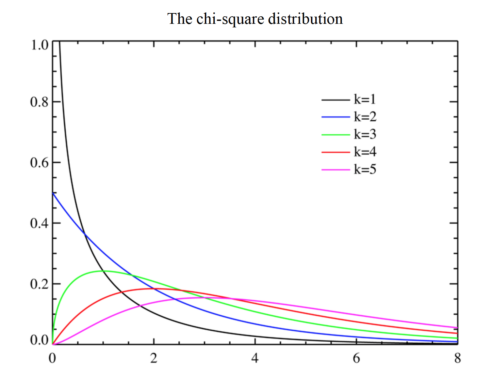
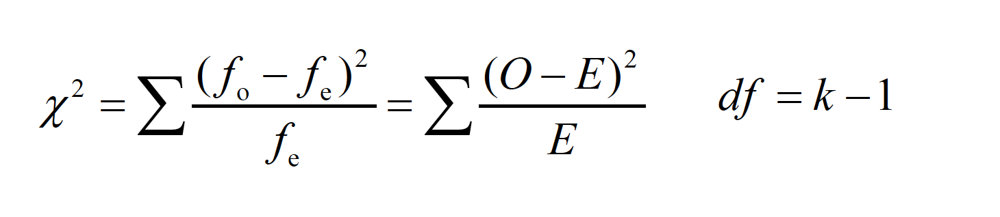
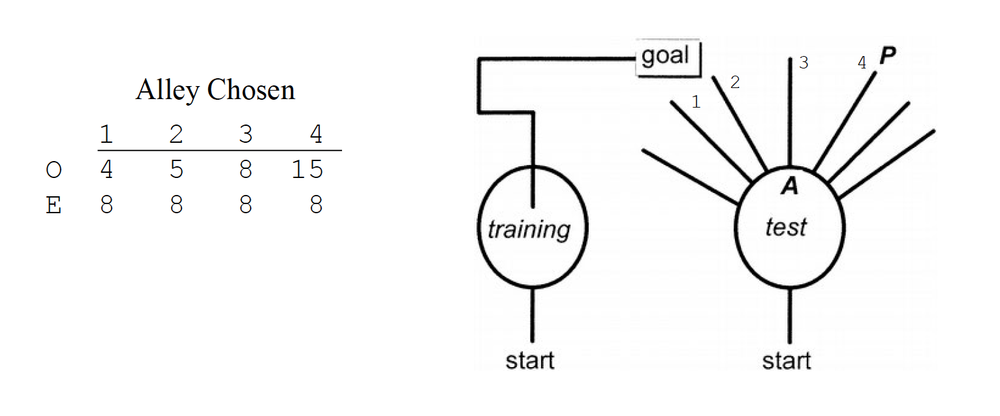
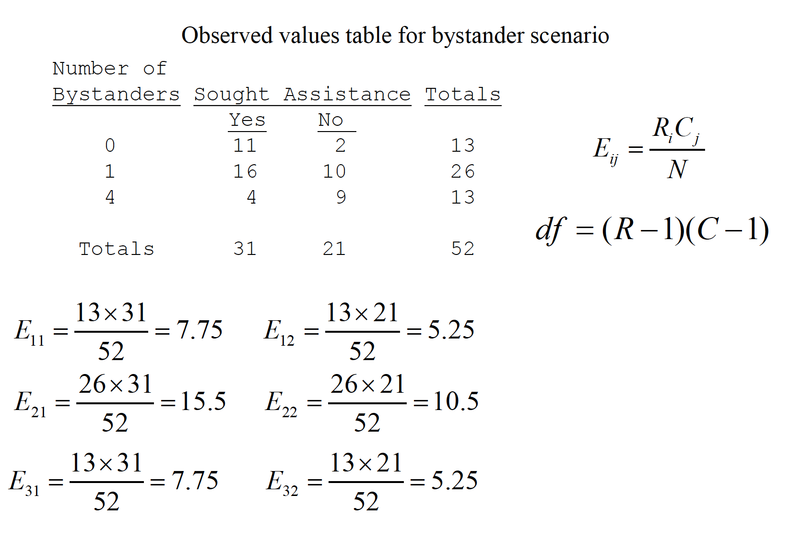
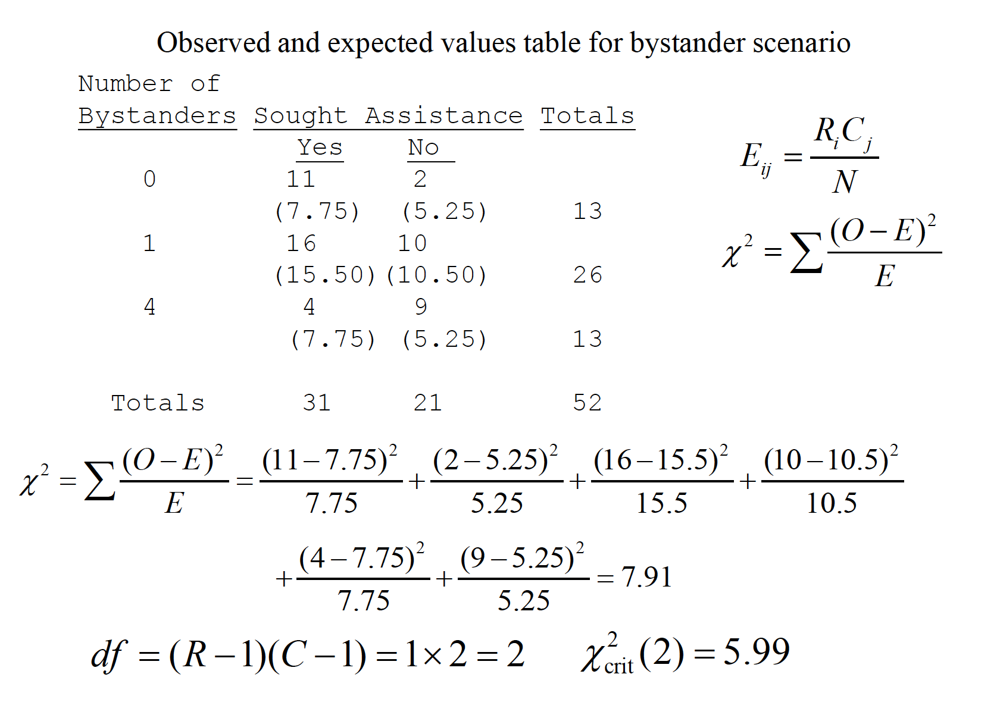

# Chi-Square

1.
There is a chi-square distribution and an hypothesis test commonly called the “chi-square” test. This test was developed by Karl Pearson.
2.
The one-way chi-square is commonly called a “goodness-of-fit” test.
3.
The two-way chi-square is called a test of independence (or association) and relies on the use of contingency tables.
4.
Like other statistical tests, the assumptions of chi-square need to be considered.

-The distribution varies as a function of the df, and actually changes shape
noticeably as the df increase; the distribution is skewed positively except
for very large df
-The chi-square distribution is an approximation to the multinomial
distribution (multinomial = more than 2 variables)
-The chi-square test was developed to ascertain the discrepancy between
observedfrequencies of multinomial categories and the expected
frequencies from those categories

The one-way chi-square is commonly called a “goodness-of-fit” test.

Like other statistical tests, the chi-square test compares the outcome of a
formula to what would be expected by some null hypothesis
-With one factor and many categories in that factor, the test is often called
a “goodness-of-fit” test. In other words, do the observed frequencies “fit”
the expectation?

-How one determines what is ‘expected’ depends on the scenario—often
this is determined by some expectation of a random observation

Tolman, Ritchie, and Kalish (1946) performed one of the most famous experiments in
animal learning. Rats were first taught how to run down a particular alley to reach a
goal box (rewarded by food). After training, the original alley was blocked halfway
down and other alleys were provided as choices. The data below are a simplification of
the full set of choices (see figure below for full set). There were 32 rats used, and each
was tested in the new maze after learning the original route. If rats were choosing alleys
at random, then an equal number would choose each of the 4 (8 rats each).

With df = 3, we look up the chi-square critical value in Table A.14, with α= .05
That critical value is 7.81. Thus, the rats are choosing alleys nonrandomly.
Note that this is an omnibus test like the ANOVA; it only detects a discrepancy.
You could perform similar chi-square tests on smaller portions of the categories,
or perform a binomial test for a single category (e.g., is 15 out of 32 different from
what would be expected by chance—25%)?

The two-way chi-square is called a test of independence (or association).

With two variables, one sets up a contingency table to see if the
frequencies of one factor are contingent (i.e., depend) on the other
Scenario: Another famous experiment by Darley and Latané (1968). Subjects participate in a discussion over intercom with an experimenter. Subjects thought that either 0, 1, or 4 others were also in the conversation. Partway through, the experimenter feigned illness and asked for help. The table shows how many subjects in each group sought out the experimenter.

Like other statistical tests, the assumptions of chi-square need to be considered.
a. The categories are mutually exclusive and exhaustive
-no observation can be in more than one category
-every possible category must be measured
-sometimes researchers fail to consider ‘nonoccurrences’
or ‘no’ responses as a separate category
b. The observations must be independent
-only one response per subject!
c. Normality
-small expected frequencies (< 5) often create a problem for normality

