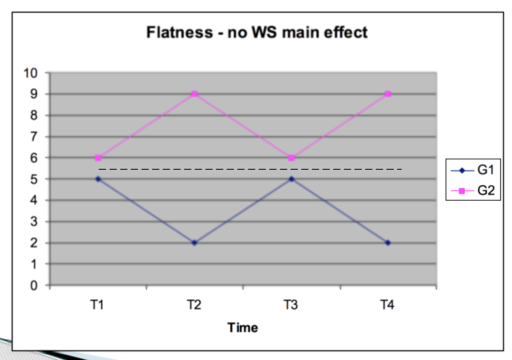
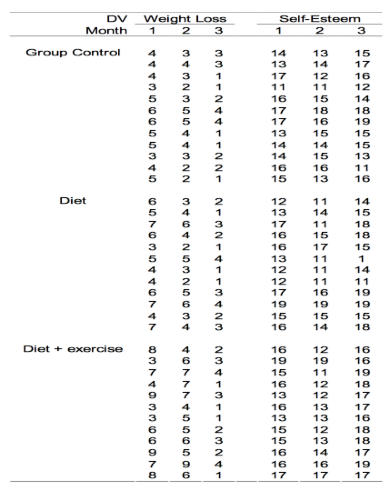
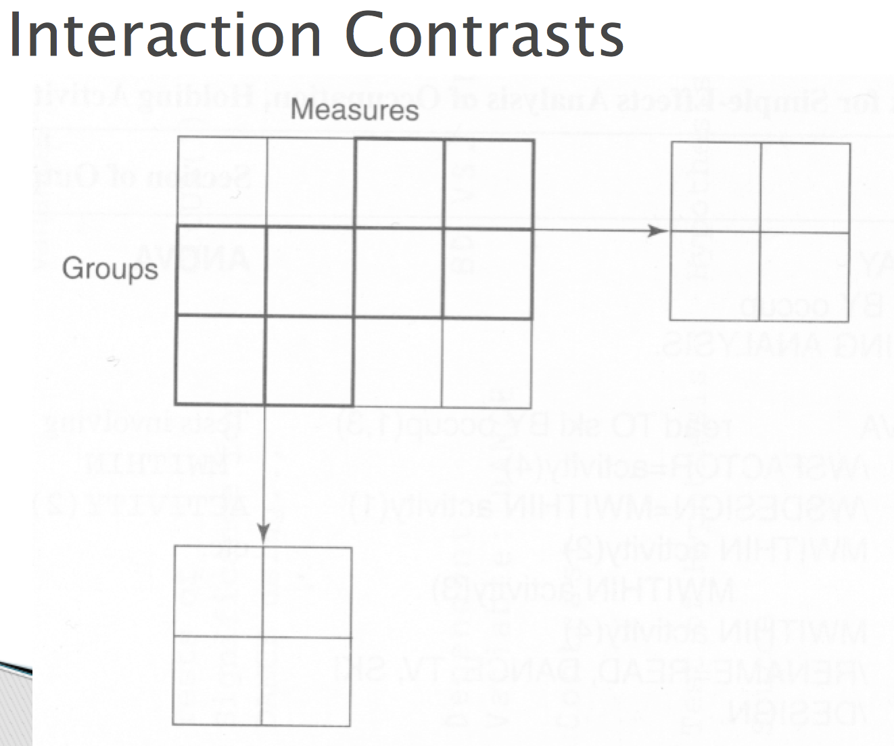

# Repeated Measures ANOVA

Profile analysis is the repeated measures extension of MANOVA where a set of DVs are commensurate (on the same scale).

The common use is where a set of DVs represent the same DV measured at multiple time points

used in this way it is the multivariate alternative to repeated measures or mixed ANOVA

The choice often depends on the number of subjects, power and whether the assumptions associated with within subjects ANOVA can be met (e.g. sphericity)

The less common use is to compare groups on multiple DVs that are commensurate (e.g. subscales of the same inventory)

Current stat packages can be used to perform more complex analyses where there are multiple factorial between subjects effects

Questions asked by profile analysis 

There is one major question asked by profile analysis; Do groups have similar profiles on a set of DVs? profile -- sets of scores.
profile is really a line, differences scores get put into vectors, then analyze if line is equal to zero or not (see last quote).

Segments – difference scores (or other linear combinations) between adjacent DV scores that are used in two of the major tests of profile analysis

### Null Hypothesis 

Parallelism (Interaction) (multivariate) – Parallel Profiles

Are the profiles for the two groups the same?
This is a test for the interaction in repeated measures ANOVA
This is usually the main test of interest in profile analysis
An interaction occurs when the profiles are not parallel

Equal Levels (Between Subjects) (univariate) 

On average does one group score higher than the other
Averaging across DVs are the groups different
This would be the between-groups main effect in mixed ANOVA

Flatness (Within Subjects) (multivariate) – 

This is equivalent to the within subjects main effect in repeated measures ANOVA
In profile analysis terms this is a test for the flatness of the profiles
“Do all DVs elicit the same average response?”

If any of the hypotheses tested by profile analysis are significant, they can be followed by contrasts.
Contrasts (on the main effects, with no interaction)
Simple effects
Simple contrasts
Interaction contrasts (done when the interaction and both main effects are significant)

Interpretation

Usually done through plots of the actual profiles
If the flatness hypothesis is rejected than you would plot the average DV scores averaged across groups

If equal levels hypothesis is rejected than you would plot the groups scores averaged across DVs

And if the parallel profiles hypothesis is rejected you would plot the mean of each group on each DV

### Strength of association
Calculated in the same way
i.e. Eta squared and Partial Eta squared

### Limitation

Data must be on the same scale

This means that any alterations done to one variables need to be applied to the rest
This is why it is used often with repeated measures since it is the same variable multiple times

Data can be converted to Z-scores first and profile analysis can be applied 
Done by using the pooled within-subjects standard deviation to standardize all scores
Factor scores can also be used (more later)
Dangerous since it is based on sample estimates of population standard deviation

Causality is limited to manipulated group variables
Generalizability is limited to population used

Assumptions should be tested on combined DVs but often difficult so screening on original DVs is used

Sample size needs to be large enough; more subjects in the smallest cell than number of DVs
This affects power and the test for homogeneity of covariance matrices
Data can be imputed

Power is also determined on whether the univariate assumptions were met or not; profile analysis has more power than univariate tests adjusted for sphericity violations

Multivariate normality
If there are more subjects in the smallest cell than number of DVs and relatively equal n than PA is robust violations of multivariate normality
If very small samples and unequal n than look at the DVs to see if any are particularly skewed

All DVs should be checked for univariate and multivariate outliers

Homogeneity of Variance-Covariance matrices

If you have equal n than skip it
If there are unequal n across cells interpret Box’s M at alpha equals .001.

Linearity
It is assumed that the DVs are linearly related to one another
inspection of bivariate plots of the DVs is used to assess this
If symmetric DVs (normal) and large sample this can also be ignored

### Doubly Repeated MANOVA

Doubly manova is a generalization of MANOVA and Profile analysis taken together in one set of data

The basic design is multiple DVs taken at multiple time points, but the multiple DVs do not have to be commensurate.

For example, students at different schools (private vs. public) are measured on basic math, reading, athleticism and IQ in grades 7 through 12.

This can be treated as a between-within (groups by time) singly multivariate design but the time effect has to meet the sphericity assumption

Sphericity can be circumvented by using both the DVs and Time in a multivariate design.

Called Doubly MANOVA because linear combinations of DVs (at each time) are linearly combined across time.

Within subjects and interaction effects are doubly multivariate while the between groups effects is singly multivariate.

This can be performed using the repeated measures ANOVA function in SPSS (now with two within subjects IVs) and just interpreting the multivariate tests

### Post Tests

EQUAL LEVELS

If the equal levels or flatness hypotheses are rejected and there are more than levels you need to break down the effect to see where the differences lie.

For a significant equal levels test simply use the compute function in SPSS to create averages over all of the DVs.

Use this new variable as a DV in a univariate ANOVA where you can use post hoc tests or implement planned comparisons using syntax.

FLATNESS

If the multivariate test for flatness is rejected than you turn to interpreting comparisons in a univariate within subjects ANOVA.

You can rerun the analysis removing the between subjects variables and implement post hoc tests on the within subjects variable or use syntax to use planned comparisons.

### Testing interactions - Simple Effects, Simple Comparisons and Interaction Contrasts

Whenever the parallelism hypothesis is rejected you need to pull apart the data to try and pinpoint what parts of the profile are causing the interaction

Parallelism and Flatness significant, equal levels not significant

Simple effects would be used to compare the groups while holding each of the DVs constant

Parallelism and Flatness significant, equal levels not significant
This is the same as doing a separate ANOVA between groups for each DV 
A Scheffe adjustment is recommended if doing this post hoc
Fs=(k – 1)F(k – 1), k(n – 1)
K is number of groups and n is number of subjects

Parallelism and Flatness significant, equal levels not significant
If any simple effect is significant than it should be followed by simple contrasts that can be implemented through syntax if planned or by post hoc adjustment

Parallelism and Equal levels significant, flatness not significant
This happens “rarely because if parallelism and levels are significant, flatness is nonsignificant only if profiles for different groups are mirror images that cancel each other out”.

Parallelism and Equal levels significant, flatness not significant
This is done by doing a series of one-way within subjects ANOVAs for each group separately.

Parallelism and Equal levels significant, flatness not significant
A Scheffe adjustment is recommended if doing this post hoc
Fs=(p – 1)F(p – 1), k(p – 1)(n – 1)
P is number of repeated measures, n is number of subjects
If any are significant, follow up with simple contrasts on the within subjects variable.

If all effects are significant

Perform interaction contrasts by separating the data into smaller two by two interactions

If all effects are significant

This can be done by using the select cases function in SPSS, selecting two groups and doing a mixed ANOVA with just two of the DVs; this will break down the interaction into smaller interactions that are easier to interpret.

It can also be done by averaging over groups (form comparisons on the BG variable) and averaging over DVs (form comparisons on the WG variable) and taking the interaction between them.

