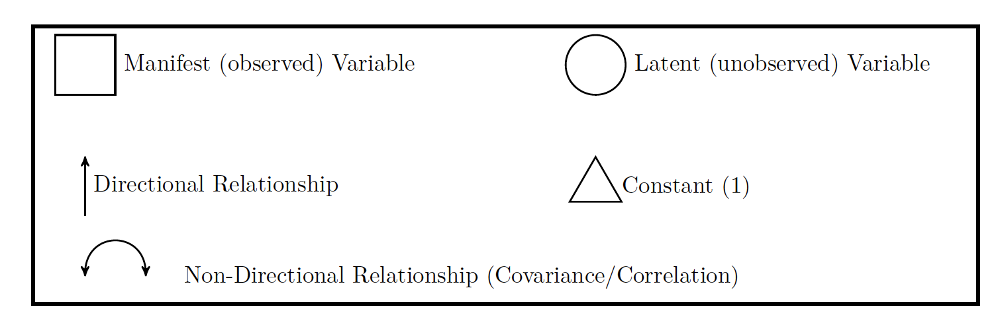
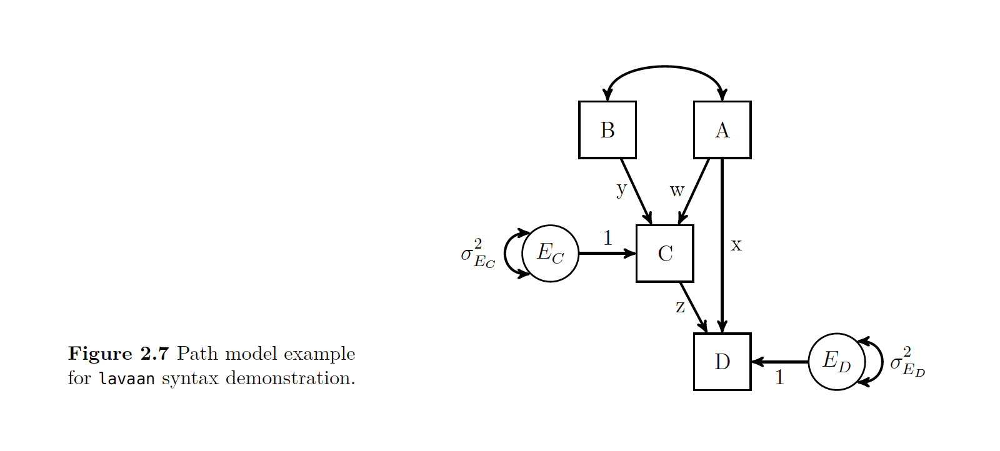
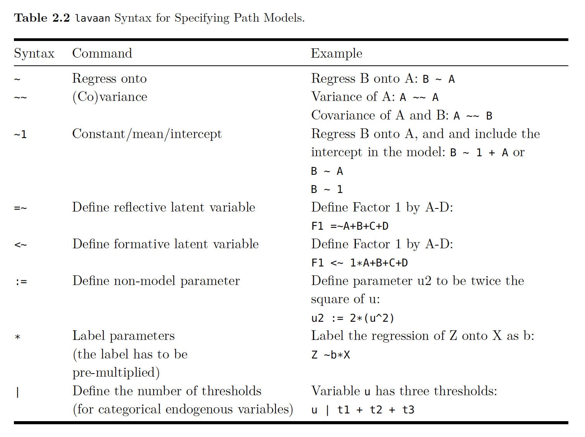
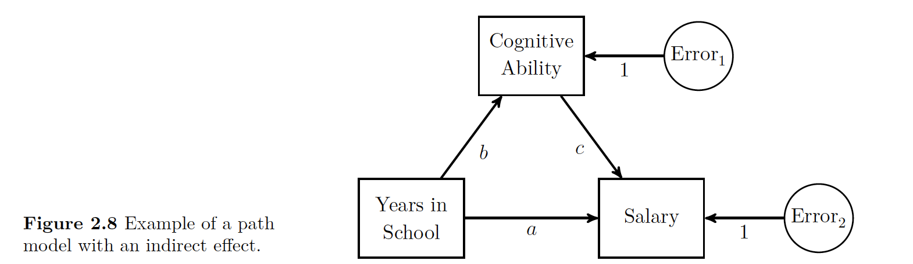
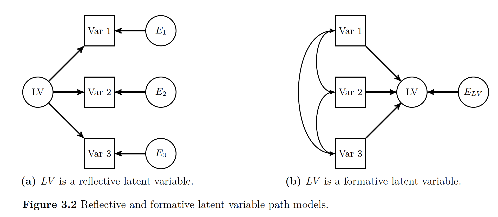
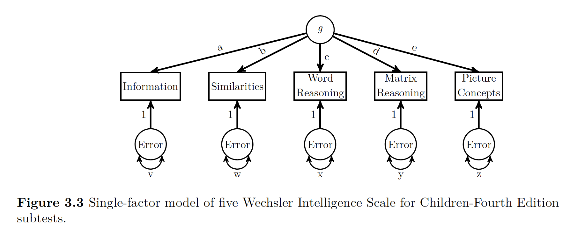
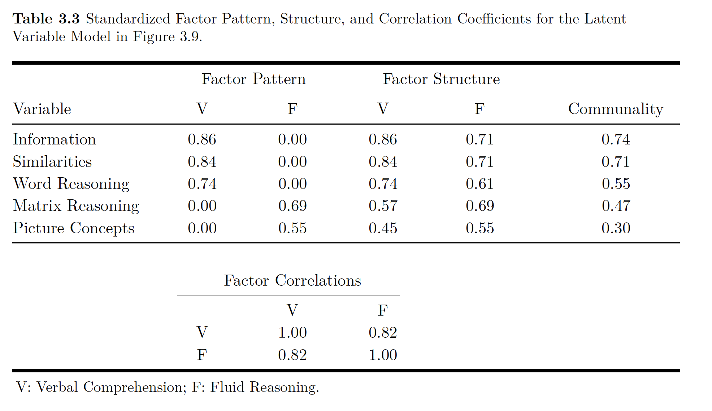
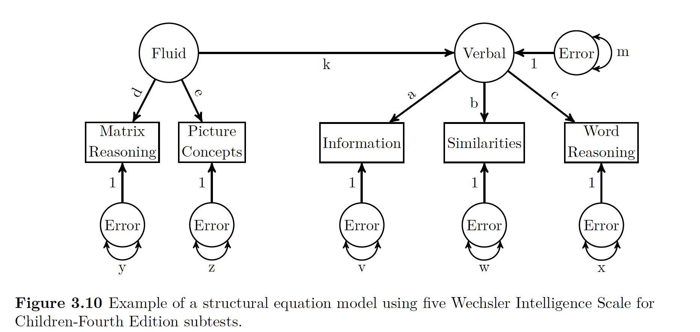

# Latent Variable Modeling -- Path, SEM, CFA

Material in this chapter is directly lifted from [Latent Variable Modeling Using R](https://books.google.com/books/about/Latent_Variable_Modeling_Using_R.html?id=7hmLAwAAQBAJ&printsec=frontcover&source=kp_read_button#v=onepage&q&f=false).

## Path Analysis 

### Background 

#### Basic Representation



A **path** model is a graphic representation of what we are trying to model.
In a path model, there are two types of variables 

* Exogenous : without direct cause AKA IVs
* Endogenous: with direct cause AKA DVs

In the figure below, the Xs are exogenous and the Ys are endogenous 


If a an arrow has a single head, it means it is causing a relationship.
If there is a double headed arrow, it means that the relationship is a correlation and there is some sort of covariance. 

All important relationships are assumed to be present in a path model.
If you do not show the relationship, it is assumed not to exist. 

Our predicted value, or endogenous variable, or Y, always has an error term with it.
Just like you would imagine with any other type of model. 

Note that your error terms with the predicted or endogenous variables are never connected to bi-directional arrows. 
Their error terms on the other hand, can be!
This is important because sometimes your error terms will share a certain amount of co-variation.
This is indicated by having the double arrow on either side of the errors.
The author shows that in a figure like the one below.



As seen above, we use the coefficient *c* to talk bout the relationship between two variables (in this case, X and Y) after removing the effect of W. 

What we are doing now as we depart from things like regression analysis, is look at things beyond **manifest** variables (things you can see like height or age and get a good number on) and move towards looking at **latent** variables. 
We can't directly observe latent variables, but we assume for them to be there.

You will sometimes seen path diagrams displayed differently, but as far as this book is concerned, all relationships will be made explicit in the path diagram. 

#### Tracing Rules 

Sewall **Wright** was a genetecist who came up with the rules on how to derive our values for path analysis.
**What we are doing is estimating the coovariance between two variables by summing the appropriate connecting paths**.
If you have a basic model (no means ELABORATE HERE LATER WHEN YOU GET IT!), there are only a few rules 

* Trace all paths between two variables (or a variable back to itself), multiplying all the coeffecients along a given path
* You can start by going backwards along a single (directional!) arrow head, but once you start going forward along these arrows you can no longer go backwards. 
* No loops! You can not go through the same variable once for a given path.
* At maximum, there can be one double sided arrow in a path.
* After tracing all paths for a given relationship, sum all the paths

The basic idea with these rules is that you need to look at each variable and try to get from your exogenous (IV) to your endogenous (DV) every way you can, without breaking the rules. 
So to get from your first X1 to Y, you can either go 

* Directly there via **a**
* Jump over via **e**, then through X3 to C to Y1
* Jump over via **d**, then through **b**
* This results in saying from $X1$ to $Y$, notated 0_1Y = **a** + **ec** + **db**
* You then do this for the other exogenous variables

Note that we also have to consider the covariance of Y with itself. 
Since we can go backwards on a one directional arrow, we can go back to X1 via **a**, but then have to go back (Why?!) and the same for **z**, our residual.
Then if we add all three up, we get the amount of our endogenous variable's variance explained by in X1, X2, X3 (the $R^2$) and **z** is what is left over.
IS THIS KIND OF LIKE A SUM OF SQUARES TOTAL VARIANCE?!

### Getting Numeric 

So now we know how these things work, what we then want to do is see what happens when we look at putting numbers inside of them.
* Step 1: Look at the correlations (double headed arrows) that we know from our correlation matrix
* Step 2: Do clever algebra knowing you have three values and three related equations to derive your missing values. SO FUCKING COOL!
* Step 3: Now you know all the path values, you just need to figure out the residual.
* Step 4: See the book for the exact math of it

#### Path Coeffecients 

So the values with the double arrow heads we know are correlation coeffecients. 
But those are not the same as single arrow heads!
These single headed arrow values are standardized partial regression coeffecients or **path coeffecients**.
Note the two important parts of this definitions: standardized and partial.
Standardized means it refers to values on *z* scores.
Partial means they are values for after the effects of other variables have been controlled for. 

Note that this is *just like regression standard vs unstandardized* in that you can convert standardized to non.
The same benefits apply (intra model comparision vs interpretability).

### Doing It in R 

To do path modeling in R, this book will use the ```lavaan``` package.
Note lavaan means ''LAtenent VAriable ANalysis''.
To make a latent variable model in R, you need to specify two things
* Specify the path model 
* Analyze!

Take a second and look at the given R syntax and the path model that it is showing.
The author walks us through this...

Note the top line is the model definition and you have to put it as a string see the ' !
We then put C and D as outcomes with their associated paths.


```{r}
 library(lavaan)
 example.model <- '
 C ~ y*B + w*A
 D ~ z*C + x*A
 #Optional Label of Residual Variance
 C~~C_Resid*C
 #Optional Label of Residual Variance
 D~~D_Resid*D
 ' 
```
Once you set this model, then you can do either a cfa() or sem() call to the model.

Below is a cheat sheet for lavaan's syntax:



#### More Syntax

You can enter either the raw data, or the covariance matrix in R with lavaan.

* Raw data = data argument
* Covariance Matrix = sample.cov, with this you also get option for input a mean vector with sample.mean()

```
example.fit <- sem(example.model, data=example.data)
example.fit <- sem(example.model, sample.cov = example.cov, sample.nobs =500)
```

The default option with lavaan is normal-theory maximum likelihood. 

Once you designate a model using either the syntax 


Then you just (like everything in R) need to call the summary function on it. 
With the summary() function you get 

* Note if parameter estimations converged
* Sample Size
* Estimator
* fit statistic with df and p value
* Unstandardized parameter values 
* The parameter estimates' standard error
* The ratio of parameter estimates and their standard errors (Wald statistic) 
* P value for Wald statistic 

You can change the arguments if you want to get other types of values for the model.

### An Example In R 
```{r}
#--------------------------------------------------
## Make Data
regression.cor <- lav_matrix_lower2full(c(1,.2,1,.24,.3,1,.7,.8,.3,1))
colnames(regression.cor) <- row.names(regression.cor) <- c("X1","X2","X3","Y")
regression.cor

## Specifiy Path Model 
regression.model <- '
#Structural Model for Y
Y ~ a*X1 + b*X2 + c*X3
#Label Residual Variance for Y 
Y ~~ z*Y
'

## Estimate Parameters with sem() and n = 1000

regression.fit <- sem(regression.model, sample.cov = regression.cor, sample.nobs = 1000)
summary(regression.fit, rsquare=TRUE)
#--------------------------------------------------
```

### Indirect Effects 

The examples above are concerned with one variables direct effect on another.
An an indirect effect is an effect a variable has on another variable when going through one other variable.

Here we have an example of an indirect effect.
The figure show that years in school directly affects salary as shown with the direct arrow path ''a''.
The model also supposes that cognitive ability can indirectly affect salary, but cognitive ability is affected by number of years in school.
The indirect influence is a compound effect.
You can use the tracing rules to see that it's possible to go via ''b'' and ''c'' to get to salary.

#### Example with Indirect Effects

The data to estimate this model are given here with the parameter values and the covariances.



All of this data is put together and analyzed in the code below.


```{r}
# Indirect Model 

# Make Data
beaujean.cov <- lav_matrix_lower2full(c(648.07,30.05,8.64,140.18,25.57,233.21))
colnames(beaujean.cov) <- row.names(beaujean.cov) <- c("salary","school","iq")
beaujean.cov
# Specifiy Path Model 

beaujean.model <- '
salary ~ a*school + c*iq
school ~ b*iq
ind:= b*c
'

# Estimate Parameters 

beaujean.fit <- sem(beaujean.model, sample.cov = beaujean.cov, sample.nobs = 300)

summary(beaujean.fit)

## Reporting results
library(xtable)
xtable(parameterEstimates(regression.fit, standardized = TRUE)[,c(1:3,5:6,12)], caption="Example Table Using \\texttt{xtable()} Function.")
```
## Basic Latent Variable Models , SEM
 
### Background

The big umbrella term for the statistical models that use a **structural model** and a **latent variable** model are **structural equation models**'' or **SEM**s.

Reiterating for my own sake, we have two main parts
* The Structural Model: Regression-like relationship between variables
* The Latent Variable Model: Creates the latent variable structure

If there is latent variable model is analyzed without a structural model it is often called **Confirmatory Factor Analysis** or **CFA**.
If you don't even have a hypothesized latent variable structure, then you have **Exploratory Factor Analysis**''' or **EFA**.
Note that when we say factor in factor analysis, that is synonymous with the idea of latent variable.
The way in which all of the variables relate to one another can be seen in the chart below.


### Latent Variable Models



There are two types of latent variables 
* Reflective: Thought to cause other variables to covary 
* Formative: Are result of other variables' covariation (like regression)

This book/wiki will focus primarily on reflective (variables cause others to covary).
The point of using a reflective model is to understand the structure that caused the manifest variables to act like they do.
These manifest variables that have an effect on the latent variables are also called **indicator variables**.
The idea behind the whole thing is that there is a variable latent (badumch) driving the way that each indicator variable acts.

In the chapter before we had a latent variable, but it was the error term.
In the whole mess of numbers the LV was an unobserved value that had a significant amount of influence one of the observed variables. 
But since it was an error term, it was technically measured differently than how we normally go about measuring LVs.

The big idea behind LVM is that behind the one big thing you are measuring, there are a few small LVs that you can observe at an individual level. 
First have a peek at the idea behind **g**, or intelligence.  
We see the big thing *g* at the top of it, and five MV (manifest variables) or indicator variables. 
Based on how the indicator variables interact, we can have an idea of what is going on with *g*.



**So the idea with LV modeling is that a way to identify or confirm the number of LVs that are producing the manifest variables to act the way they are*.**

One measure of influence that the latent variable has on the manifest variables is the **factor loading**.
You can think of these factor loadings like regression or path coefficients.
There is another term called **structure coefficient**''.
A structure coefficient is the **correlation** between the model's MV and the LV.
Now if you only have one LV,  like the figure above, these are the same things.
If you have more than one LV, these are different (unless somehow all your values are not correlated with each other).

If you look above again at the figure all *a*, *b*,*c*, *d*, and *e* are factor loadings.
They show the relationship between the LV and the MV.

Now being super clever again, you can get something kind of like an $R^2$ value for for each MV using the path rules described in the previous chapter. 
That R^2-y value is the **communality** of the variable.
The opposite of communality is uniqueness.
**Uniqueness** is the amount of of variance in the MV not accounted for by the LV.

A good example to demonstrate this is by looking at the Information manifest variable above.
Since you are intersted in that variable, you can go up the path to *g* via *a*, then since you can't go anywhere else (no double headed arrows), then you can slide back down *a*, follow the rules that you have to multiple your paths, and then that value of *a* x *a* is the amount of variance in *g* explained in information.

#### Identification of Latent Variable Models

LV modeling questions come down to one big question:
> Is there enough **non-redundant** information in the data to be able to estimate the required parameters **uniquely**?

This is not a problem with regression models because the number of parameters to estimate exactly equals the amount of non-redundant information. 
If that is confusing (it was to me the first time), then just think that the amount of non-redundant information in the data as the number of non-redudant variances/covariances in the dataset. 

We run into a bit of a problem with LVM because models can be 
1. Just identified
2. Underidentified: more parameter to estimate than non-redudant information, creates error messages with lavaan
3.  Overidentified: More MVs than you need to get at the LVs that are there, does create model fit 

Degrees of freedom in LVM are the number of non-redundant pieces of information in the data subtract the amount of parameters to estimate. 

The following is a list of rules of thumbs to get you to a good model, since hitting it right on the head is really hard.

##### Number of Indicator Variables 

The big goal is to have at least 4 indicator variables for each latent variable in the model, hoping desperately that none of their error variance covary.

Even if you don't have that, you can hope for at least 4 conditions as long as you get **one** of these.

1. At least 3 indicator variables with no error covariance
2. The LV has at least 2 indicators with non-covarying error variances and the indicator's variables' loadings are set equal to each other
3. The LV has one indicator, the directional paths are set to one, and the error variance is fixed to some value
  * The fixed value is either 0.0 meaning indicator variables has perfect reliability OR 
  * Something about reliability and variances <--- DON'T GET THIS!!

##### Latent Variable Scales

Since LVs are not observable, they are measured an abstract scale.
Because of this, the numbers we use to measure things is constrained by setting one of the parameter estimates.
Normally we set one of these parameter values one of three ways 
1. Standardized Latent Variable: Put LV's variance to 1, if you then standardize indicator variables, interpret all like regression
2. Marker Variable: Single Factor loading for each LV constrained to arbitrary value , the one that is set to 1 is the **marker variable**
3. Effects Coding: Estimates all loadings, constrains number of loadings for given LV to 1 

##### Other Conditions

1. If you have more than one LV in model... for each PAIR of the LVs 
  * Each LV needs one indicator variable that has no error co-variance with other LVs (solely responsible for variance in LV?)
  * Covariance of Pairs of LVs is constrained to a specific value
2.For every indicator variable, there is at least one other indicator variable (same or different LV) to whom the error variances DO NOT covary.

##### Empirical Underidentification 

You get underidentificaiton if one of the parameters is not equal to 0. 
If the error is greater than 0 you have too much information with too little of parameters.
Now if one of the errors equals 0, then what happens is that the model then requires estimating  two separate LVs.


==Doing it With One Latent Variable in R==

Data: 


```{r}
library(lavaan)
#convert vector of correlations into matrix
wisc4.cor <- lav_matrix_lower2full(c(1,.72,1,.64,.63,1,.51,.48,.37,1,.37,.38,.38,.38,1))
colnames(wisc4.cor) <- rownames(wisc4.cor) <- c(
  "Information",
  "Similarities",
  "Word.Reasoning",
  "Matrix.Reasoning",
  "Picture.Concepts")
#Enter SDs 
wisc4.sd <- c(3.01, 3.03,2.99,2.89,2.98)
names(wisc4.sd) <- c(
  "Information",
  "Similarities",
  "Word.Reasoning",
  "Matrix.Reasoning",
  "Picture.Concepts") 
## Make correlations CVs via info from SD
wisc4.cov <- cor2cov(wisc4.cor,wisc4.sd)
#Designate Model 
wisc4.model <- '
g =~ a*Information + b*Similarities + c*Word.Reasoning + d*Matrix.Reasoning + e*Picture.Concepts
'
wisc4.fit <- cfa(model = wisc4.model,sample.cov = wisc4.cov,sample.nobs = 550, std.lv=FALSE)
# First two above are model and data 
# Second says how big is your sample size
# Standard with lavaan is use first LV as indicator, which is redundant with std.lv=FALSE
# If you put it as TRUE it scales ''g'' by standardizing it, estimate all loadings w SD of LV = 1
summary(wisc4.fit, standardized=TRUE)
# If you put standardized=TRUE it gives BOTH standardized and unstandardized values
# Estimate column is the raw scores with marker variable to scale LV 
# NOTE THERE ARE TWO TYPES OF STANDARDIZED SCORES
# 1. Std.lv Standardizes LV, but leaves MV in RAW
# 2. Std.all Standardizes both LV and MV!!
parameterEstimates(wisc4.fit, standardized = TRUE, ci =FALSE)
```

Note above that we define the LV of *g* using all five subsets of the WISC subtests. 
Now we estimate the parameters with the ```cfa()``` function, as seen above.


Note the top part  of the summary output lets you know if you put your model in correctly.


Note that lavaan does not produce communality estimates. 
Though you can calculate them using the trace rules. 
You could figure out communality for the Information variable 

$$ a x 1 x a = a^2 = 0.86^2 = 0.74$$

Thus uniqueness is 

$$ 1- a^2 = 1 - 0.86^2 = 0.26$$

In addition to communality, you can use tracing rules and standardized parameter estimates to calculated the correlations implied by the model's parameter estimates which you can then compare to the actual correlations you used in the original model. 
For example you could look at the relationship between Information and Similarities. 
If you go way up to Figure 3.3 you can see the only way you can get from one to the other is going through ''*a*' to ''*b*'', so you multiply your ''*ab*'' loadings $(0.86)(0.84) = 0.72$.
This number almost exactly matches our correlation from the raw data! 

You can then use the ```fitted()``` function in lavaan to to get all the model implied-covariances. 
Taken from the book...

```{r}
#Model-Implied Covariances 
fitted(wisc4.fit)

#Transform Model Implied Covarianes to correlations
wisc4Fit.cov <- fitted(wisc4.fit)$cov
wisc4Fit.cor <- cov2cor(wisc4.cov)

#Original Correlations 
wisc4.cor

#Residual Correlations 
residuals(wisc4.fit, type = "cor")
fitMeasures(wisc4.fit)
modificationIndices(wisc4.fit) #see how to improve!   
```

#### Alternative Latent Variable Scaling

So before we fit our model with lavaan's default marker variable method.
We can also do it with the standardized LV and the effects-coding method of LV scaling.

See the code below on how to do this!
```{r}
# Marker Variable 
wisc4.model.Std <- '
g =~ NA*Information + a*Information + b*Similarities + c*Word.Reasoning + d*Matrix.Reasoning + e*Picture.Concepts

# constrain LV Variance to 1 
g~~1*g
'
wisc4.fit.Std <- cfa(wisc4.model.Std, sample.cov = wisc4.cov, sample.nobs = 550)

# AND 

wisc4.model.effects <- '
g =~ NA*Information + a*Information + b*Similarities + c*Word.Reasoning + d*Matrix.Reasoning + e*Picture.Concepts

#Constrain Loadings Sums To One 
a + b + c + d + e == 5
' 
wisc4.fit.effects <- cfa(wisc4.model.effects,sample.cov = wisc4.cov, sample.nobs = 550)
```

### Doing it With Two Latent Variables in R 


Let's say we wanted to split our theorized *g* into two different LVs representing Verbal Comprehension and Fluid Reasoning. 

```{r}
wisc4.model2 <- '
V =~ a*Information + b*Similarities + c*Word.Reasoning
F =~ d*Matrix.Reasoning + e*Picture.Concepts
V~~f*F
'

wisc4.fit2 <- cfa(wisc4.model2,sample.cov = wisc4.cov, sample.nobs = 550)
```

Data R Code is Modeling :




### Doing SEM in R

SEM = LVM + Path Analysis.
Here we think Fluid Reasoning has a direct influence on Verbal Comprehension LV.

To use ```sem()``` in R, we need to use both LV operators (=~) and regression operators ( ~).
```{r}
##SEM 
wisc4.SEM.model <- '
#Define Latent Variables, just like above!
V =~ a*Information + b*Similarities + c*Word.Reasoning
F =~ d*Matrix.Reasoning + e*Picture.Concepts
# Define Structural Relations
V~k*F
' 

wisc4.SEM.fit <- sem(wisc4.SEM.model, sample.cov = wisc4.cov, sample.nobs = 550)
summary(wisc4.SEM.fit, standardized=TRUE)
```

Note that in the output we have both a latent and a regression section.
If you look at the picture below of what we are modeling, note that Verbal Comprehension in Endogenous (aka not measureable directly!), it's reported variance is the error variance! 
AKA the variance not explained by Fluid Reasoning.



### Reporting Results 

Should include 

1. A theoretical and empirical justification for the hypothesized model
2. Complete descriptions of how LVMs were specified 
3. Description of Sample
4. Type of Data used with descriptive stats
5. Tests of Assumptions 
6. How Missing data was handled 
7. Software used 
8. Measured and criteria used to fit model 
9. Alteration made to the model 

Tables should have 
* Parameter estimates
* Standard Errors
* Standardized versions of the final model 
* Other significant models that were fit 
* Path Model
