--- 
title: "R for Psych Handbook"
author: "David John Baker"
date: "`r Sys.Date()`"
site: bookdown::bookdown_site
output: bookdown::gitbook
documentclass: book
bibliography: [book.bib, packages.bib]
biblio-style: apalike
link-citations: yes
github-repo: rstudio/bookdown-demo
description: "A handbook for psychologists at LSU to get started with R and Statistics."
---

# Preface

Welcome to the **R For Psychologists Handbook!**.
This book serves as a collection of resources used in the Department of Psychology at Louisiana State University (LSU) for the statistics classes required of all Graduate Student.
The book is **not** meant to serve as a comprehensive statistics textbook, for that please check out either [Explaining Psychological Statistics](https://www.wiley.com/en-us/Explaining+Psychological+Statistics%2C+4th+Edition-p-9781118436608) or Andy Field's [Discovering Statistics with R](https://us.sagepub.com/en-us/nam/discovering-statistics-using-r/book236067).
The book **is** meant to be a reference manual that gives a brief overview of a concept, then the code needed to run that analysis in R.

I try to add in references in each of the chapters in order for anyone to explore the concepts at length, but the material in this handbook should be enough to get any psychologist through the 4111 Intermediate Statistics and 7111 Multivariate Statistics courses.

The majority of the content comes from having taken and then TA'ed for both of these courses and collecting a lot of material on my own.
The content was generated by both Jason Hicks and Jason Harman, I just provided R as the glue to hold it all together.
The idea behind the book is that anyone going through the LSU stats rotation would be able to put in the extra work and learn R while they are doing the assignments in SPSS.

As noted in next chapter, it's hard to learn R, but worth doing it.
Personally found that R has opened up more opportunities than anything else I have invested in.
You don't need any programming experience to start and if you feel like you can't do this, know that reason I started R is I knew so little about computers during my Masters that my adviser had to show me how to do an ```IFELSE()```statement in Excel. 
At that point figured if I was going to learn, might as well be frustrated and get something good out of it.

One thing to learn a lot by running these examples, though the best way forward is to find your own dataset and start to set up project with it.

The book is still under construction and if you would like to help out with it, please get in touch!

Let's get cooking.

<!--chapter:end:index.Rmd-->

# Introduction to R {#intro}

Before starting out, it's worth mentioning that R has a steep learning curve compared to other statistical softwares. 
While there are tons of blog posts as to why you should learn R, I will keep my list quick so if you get discouraged at any point, you can come back to this list and get re-inspired before R starts paying you back.

1. The R community is fantastic, check out [#rstats](https://twitter.com/search?q=%23rstats&src=typd) on Twitter as well as everyone affiliated with the [TidyVerse](https://www.tidyverse.org/)
2. R will always be free because the people behind it believe in [open source](https://en.wikipedia.org/wiki/Open-source_software) principles.
3. Time spent learning R is time spent learning how computers work. If you learn about R, you are also learning computer programming. Time spent in something like SPSS or SAS does not easily transfer to other programs.
4. On [r-jobs.com](https://www.r-users.com/#open) the way they decide to split jobs is jobs that make above and below $100,000.
5. R is your ticket out of academia, if you need it. It's also insane to think people would learn so much about statistics, the hardest part about becoming a data scientist, without learning the software to get you in the door. 
6. When you make analyses and graphs in R they are very easy to reproduce. You just press 'Run' again.
7. If you do your data cleaning in R, then each step is documented. There is less chance for human error.
8. It makes [gorgeous graphs](http://r-statistics.co/Top50-Ggplot2-Visualizations-MasterList-R-Code.html).
9. There are a lot of ways that R integrates into other software. This book is written in [bookdown](https://bookdown.org/home/), [my website](http://davidjohnbaker.rbind.io/) is written in [blogdown](https://github.com/rstudio/blogdown), you can also make [interactive data applications](https://shiny.rstudio.com/).
10. It's kind of fun. 


## Getting Started

Since this book is about statistics and R, the introduction to all things R is a bit shorter than other guides.
If you need help, find a friend (or email the author of this book) and they will get you started.
The first things you need to do is download [R from CRAN](https://cran.r-project.org/), then get the latest version of [RStudio](https://www.rstudio.com/).
RStudio is an [IDE](https://en.wikipedia.org/wiki/Integrated_development_environment) that makes working in R a lot easier.
If you use R without RStudio, you are basically a masochist. 

Once you have that, you can start to play around with this.

## A Note on Setting the Working Directory

At the end a long writing session you normally have to find a place to save that journal article you are working on. 
You do this by clicking 'Save As' then finding where to stick it and what to call it.
If you are programming you need to do this entire act of picking where you are working right away by saving your script (the what) and setting your working directory (the where).
After running a couple of "teach yourself R" sessions, I have found that this concept is one of the most tedious parts of starting to learn R, but once you are over this hump, the others will not feel as bad. 
While these instructions below are meant to be comprehensive, it's much easier to learn this part of the process with someone walking you through the steps.

When you first open R, it's good to get in the habit of seeing where your working directory is set to.
If RStudio is set on it's default settings, there should be a little line right above the console just like the image below.


This whole book exists in a folder that lives in the projects folder on my Desktop.
If you're not familiar with how your computer is set up, it's worth checking out an explanation or having someone walk you through the hierarchy your computer's directories.

Once you have an basic understanding of this, you can find where you are in R by using the ```getwd()``` function.
If you need to change your working directory at any point, the function is ```setwd()```.
While it might seem a bit tedious to have to think about things like this right away, by setting up analysis projects in a clean, and organized way you are going to be saving yourself hours in the future. 

So with that, open up a new R script, and for your first line set your working directory to a folder where you are going to want to work out of. 

## The Basics

With this script set up, we can now start to play around with R!
This chapter covers a few basic things:

* The rationale behind to writing scripts and code
* R as Calculator
* Data Structures
* Manipulating Data
* Tons of functions
* Whirlwind tour of R for psychologists

The goals of this chapter are to:

* Learn Basics of R and RStudio
* Practice concepts with simple examples
* Familiarize with vast array of functions
* Have vocabulary and "R" way to think about problem solving

## R as Calculator

The Console of R is where all the action happens. 
You can use it just like you would use a calculator. 
Try to do some basic math operations in it.

```{r}
2 + 2
5 - 2
10 / 4
9 * 200
sqrt(81)
10 > 4
2 < -1
```

You don't always want to print your output and retype it in. 
Idea is to be very lazy (efficient).

Save some math to an object with the <- operator, then manipulate that.

```{r}
foo <- 2 * 3
foo * 6
```


Notice what has popped up in your environment in RStudio!

Let's get more efficient.

```{r}
yearsInGradSchool <- c(2,1,4,5,6,7,3,2,4,5,3)
```

talk about the ```c()``` function.

```{r}
yearsInGradSchool * 3
```

Or this 

```{r}
yearsInGradSchool - 2
```

```{r}
yearsInGradSchool < 2
```


```{r}
mean(yearsInGradSchool)
sd(yearsInGradSchool)
```

```{r}
hist(yearsInGradSchool)
scale(yearsInGradSchool)
range(yearsInGradSchool)
min(yearsInGradSchool)
class(yearsInGradSchool)
str(yearsInGradSchool)
summary(yearsInGradSchool)
```


```{r}
yearsInGradSchool <- c(2,1,4,5,6,7,3,2,4,5,3)
classesTaken <- c(5,2,5,7,9,9,2,8,4,7,2)
gradData <- data.frame(yearsInGradSchool,classesTaken)
```

```{r}
cor(yearsInGradSchool,classesTaken)
```

Basic plots, arguments. ggplot and libraries

```{r}
plot(yearsInGradSchool,classesTaken, 
     data = gradData, 
     main = "My Plot", 
     xlab = "Years in Grad School", 
     ylab = "Classes Taken")
```

## Data Exploration

```{r}
str(iris)
class(iris)
summary(iris)
```

Accessing individual 'columns' is done with the ```$``` operator

```{r}
iris$Sepal.Length
```

Can you use this to plot the different numeric values against each other?

What would the follow commands do?

```{r}
hist(scale(iris$Sepal.Length))

iris$Sepal.Length.scale <- scale(iris$Sepal.Length)
```

## Indexing

Let's combine logical indexing with creating new objects.

What do the follow commands do? Why?

```{r}
iris[1,1]
iris[2,]
iris[,5]
iris[iris$Sepal.Length < 5,]
iris[,c(1:4)]
iris[c(1,2,3,4,5,6,8),c(1:3,5)]
Setosas <- iris[iris$Species == "setosa",]
```
This could be an entire lecture by itself!!!

## Whirlwind Tour of R


R's power comes in the fact that you download packages to put on top of base R

* Turning Data tables into already formatted APA Latex Tables (stargazer, xtable)
* Creating Publication Quality Graphs (ggplot2)
* Text manipulation (stringr)
* Exploring data and not making chart after chart after chart (psych)
* Every statistical test you could want (psych, cars, ezanova, lavaan)
* Software to plot not so normal output (SEMplots)
* Making Websites in R
* These slides were written in R
* Quickly processing huge datasets (data.table, dplyr)
* Tons of Machine Learning


```{r}

library(ggplot2)
ggplot(iris, aes(x = Sepal.Length, y = Sepal.Width, 
                 color = Species), 
       xlab = "Sepal Length",
       ylab = "Sepal Width",
       main = "My Plot") + geom_point()
```


Or stuff for data exploration

```{r}
library(psych)
pairs.panels(iris)
```

## Functions for Psychologists

* ```nlme()``` and ```lme4()``` for Multilevel Modeling
* ```lavaan()``` for Latent Variable Analysis
* ```ezAnova()``` for ANOVA based testing; the anova() function does model comparisons
* profileR for Repeated Measures MANOVA
* ```glm()``` and ```lm()``` for linear models
* ```caret()``` for Machine Learning

## Resources

* swirl
* [stackoverflow.com](www.stackoverflow.com)
* Twitter
* Your peers
* R Community

### Template Stuff
You can label chapter and section titles using `{#label}` after them, e.g., we can reference Chapter \@ref(intro). If you do not manually label them, there will be automatic labels anyway, e.g., Chapter \@ref(methods).

Figures and tables with captions will be placed in `figure` and `table` environments, respectively.

```{r nice-fig, fig.cap='Here is a nice figure!', out.width='80%', fig.asp=.75, fig.align='center'}
par(mar = c(4, 4, .1, .1))
plot(pressure, type = 'b', pch = 19)
```

Reference a figure by its code chunk label with the `fig:` prefix, e.g., see Figure \@ref(fig:nice-fig). Similarly, you can reference tables generated from `knitr::kable()`, e.g., see Table \@ref(tab:nice-tab).

```{r nice-tab, tidy=FALSE}
knitr::kable(
  head(iris, 20), caption = 'Here is a nice table!',
  booktabs = TRUE
)
```

You can write citations, too. For example, we are using the **bookdown** package [@R-bookdown] in this sample book, which was built on top of R Markdown and **knitr** [@xie2015].

<!--chapter:end:01-introductionToR.Rmd-->

# Data Manipulation in R

This chapter will take you through a brief walk through of cleaning some data in R.
When starting out with R, it's not important that you memorize every command and learn every line, but rather that you start to think about how a computer programmer would solve a question (you!) rather than get an undergrad RA to fix it by hand.

The first thing that you want to do to any script is to put a header on it.
It should cover a few things such as 

* A Title
* Who wrote the script? 
* When did you edit it last?
* What does it do?
* How does it work?
* Does it take anything in specific?

The more information you can provide, the better.
Remember that 6-Month-From-You now is going to be either your best or worst collaborator.

Each script in R out to follow a general pattern.
First list out some information about it, then load in your libraries, and then set your working directory and load your data.

```{r}
 # Import Libraries 
 library(stringr)
 library(data.table)
 library(psych)
```

Next thing you would do is set your working directory and load in your data.
Note here that you need to tell R exactly where to look!

```{r}
# Make sure to load in both datasets as we will want them both in our analysis.
# We also want to make sure to clean both datasets as we are going. 
experiment.data <- read.csv("datasets/Demographic_Data.csv")
item.level.data <- read.csv("datasets/ItemLevelData.csv")
```

You can also import data using RStudio's 'Import Data' function in the top right corner.


If you do do that, make sure to add in any of the libraries and code in your script that is printed out below in RStudio's consle!

Next you should familiarize yourself with what your data looks like.
Not only do you have to be cautious of the shape of your data (wide vs. long), but there are a few different types of data that R uses in its functionality.

Looking at the dataset from this experiment, we see lots of different types of data listed.
R did its best to guess what 'kind' of data each one is, but sometimes you have to change data types.

```{r}
str(experiment.data) # Check to see if R guessed correctly on data types
```

Using ```read.csv()``` with its default setting, R had a couple of bad guesses on variables we might need.
We will have to reassign the variable types or else we'll run into trouble later.
In R we use factor for grouping and analysis, best practice is to not set it as that
until you are OK with the format. 
It's easist to manipulate a character or string.
There are much more elegant ways to do this, but just to make a point, I've gone through and fixed each one manually.

Notice how the output of ```str()``` has changed.

```{r}
experiment.data$inst <- as.character(experiment.data$inst)
experiment.data$Gender <- as.character(experiment.data$Gender)
experiment.data$Major <- as.character(experiment.data$Major)
experiment.data$Minor <- as.character(experiment.data$Minor)
experiment.data$BeginTrain <- as.character(experiment.data$BeginTrain)
experiment.data$AbsPitch <- as.character(experiment.data$AbsPitch)
experiment.data$Live12Mo <- as.numeric(experiment.data$Live12Mo)
experiment.data$ActListenMin <- as.character(experiment.data$ActListenMin)

str(experiment.data) # Notice how that our character columns now have " " around them.

```

The next thing we'd want to check in our data cleaning is for any sort of import errors.
We can use combinations of the functions ```names()```,```table()```, ```is.na()```, and ```complete.cases()``` to get a brief summary of what is missing.
You could also use R's plotting funcitonality to see if there are any participants with weird subject numbers or maybe negative values where there should not be. 
If you find any problems, code in the solution in R!
Resist the urge to fix it in the Excel file!

```{r}
# Check for Import Errors 
table(complete.cases(experiment.data)) # Not all observations have everything! 
complete.cases(experiment.data)
table(is.na(experiment.data))
# Gotta decide what to do about it!!
```

Later we'll cover how to change individual cases, but as I will note, you will want to avoid hard coding in any fixes if you can.
Let's first look at how we might fix a messy gender problem.

## Cleaning Response Data

In your data cleaning before you might have noticed that participants were able to freely respond  with whatever gender they wanted. 
Most data look to fall within the normal binary, but the computer needs things to be exactly the same before making an easy split? 
What would be the laziest, most effecient way to fix the gender column? 
What format does the variable have to be in order to make the changes that you need? 
When you have it figured out, make sure to run the code from top to bottom to make sure things go in the right order!!! 
As we are not dealing with huge amounts of data, the table() function will help out.

Let's now take a look at some of these problem ones
Why, for example is Begin Training not working? Print the variable to see.


```{r}
experiment.data$BeginTrain
```

Some people didn't respond, one person decided to tell us what grade they started.
There are 2 ways to go about fixing this. We could "hardcode" the problem if this 
is the only time we will do this analysis on this dataset or we could try to write a
line of code that doesn't care what exact position the error is.
On line 250 in this object is the thing that needs swapping out.
We can access it with R's indexing. Counting from index we see it's in line 250.

```{r}
experiment.data$BeginTrain[250]
```

Quick, ask yourself why we don't use the comma here?! 
If you were set on using the comma, what would you change? 
Ok, now let's swap in the value we want with <-
Remember we are putting a value into a character operator so it has to have "" 

```{r}
experiment.data$BeginTrain[250] <- "12"
experiment.data$BeginTrain 
```
Nice, no more text data, but what if it's not always in 250?
For example, what do we do with all these blank spaces?
Let's use R's inbuilt ifelse() function to go through this vector and swap
out what we want! 

```{r}
ifelse(experiment.data$BeginTrain == "","0",experiment.data$BeginTrain)
```

This works by going through each entry and doing the conditional on the value!
Let's now write over our old column and in the same step make everything a number.
```{r}
experiment.data$BeginTrain <- as.numeric(ifelse(experiment.data$BeginTrain == "","0",experiment.data$BeginTrain))
```

And Alas!

```{r}
experiment.data$BeginTrain
```

Let's now clean up the Gender column, first let's look at it

```{r}
experiment.data$Gender # Are there any common trends?
table(experiment.data$Gender)
```

### Cleaning Up Gender

Pretty much two answers, how do we make them all say one thing?
Let's use the stringr package for this. Import it up top.

```{r}
experiment.data$Gender <- str_to_lower(experiment.data$Gender)
experiment.data$Gender <- str_replace(experiment.data$Gender,"^.*f.*$","Female")
experiment.data$Gender <- str_replace(experiment.data$Gender,"^m.*$","Male")
experiment.data$Gender <- str_replace(experiment.data$Gender,"^country$","No Response")

experiment.data$Gender[30] <- "No Response" #Something Might Be Up w this datapoint?
experiment.data$Gender[63] <- "No Response" #Something Might Be Up w this datapoint?

experiment.data$Gender <- as.factor(experiment.data$Gender)
table(experiment.data$Gender)

#--------------------------------------------------
# Can we do same thing for AP?
experiment.data$AbsPitch
experiment.data$AbsPitch <- str_to_lower(experiment.data$AbsPitch)
experiment.data$AbsPitch <- str_replace(experiment.data$AbsPitch,"^.*n.*$","no")
experiment.data$AbsPitch[30] <- "no"
experiment.data$AbsPitch <- as.factor(experiment.data$AbsPitch)
table(experiment.data$AbsPitch)
```

## Merging Data

Often we will have data from other spreadsheets we want to attach such as demographic data 
to behavioral responses. 
Using the ```data.table``` functionality, let's merge our two csv files together so that we have every variable accessible to us for this analysis. 
Note I like to work with the ```data.table``` package, though there are other ways to do this!

In order to do this, we need 1 shared column between the two datasets.
For most psychology cases, this is probably going to be a participant ID number.
Note that for this to work, you need the columns to have an exact match of name!
First let's check that they are the same!!

```{r}
names(experiment.data)
names(item.level.data)
```

First off our subject ID columns are not the same. Let's swap that.

```{r}
names(item.level.data)
names(experiment.data)
setnames(item.level.data,"tmp.dat.subject.1.","SubjectNo")
setnames(experiment.data,"Sub","SubjectNo") # Make this clearer!!! 
```

If you need to do more than 1, use the c() operator! 
Now if we look at this column, it's all messe up. 
The code below fixes it, if you want to learn more about regex, check it out
if not, just skip below.

```{r}
 
item.level.data$SubjectNo <- str_replace_all(string = item.level.data$SubjectNo, pattern = ".csv", replacement = "")
item.level.data$SubjectNo <- str_replace_all(string = item.level.data$SubjectNo, pattern = "C", replacement = "")
item.level.data$SubjectNo <- str_replace_all(string = item.level.data$SubjectNo, pattern = "M", replacement = "")
item.level.data$SubjectNo <- str_replace_all(string = item.level.data$SubjectNo, pattern = "CM", replacement = "")
item.level.data$SubjectNo <- as.numeric(item.level.data$SubjectNo)

```

Let's just quickly check to see if all the subject numbers make sense

```{r}
hist(experiment.data$SubjectNo) # Cause for alarm! Negative values and placeholders!
```

Notice that the variable of ```SubjectNo``` has negative values and placeholders!
We can use R's indexing function to find these entries.

```{r}
# Drop those 
experiment.data <- experiment.data[experiment.data$SubjectNo > 0 & experiment.data$SubjectNo < 1000,]
```

Note this works because the SubjectNo variable is numeric 

```{r}
hist(experiment.data$SubjectNo)
hist(item.level.data$SubjectNo)
```

Ok, finally we merge our datasets. 
What we are doing here is called an "inner join"
Here we will keep all of the ROWS of the dataset in the middle of the command 
Note we need to swap over our key to be a character value.

```{r}
item.level.data <- data.table(item.level.data)
experiment.data <- data.table(experiment.data)

item.level.data

exp.data <- item.level.data[experiment.data, on="SubjectNo"]

exp.data
```

Let's reorganize our columns so individual stuff is at the back
We could do this with data.table, but it's a different syntax so let's swap back
Normally you try to stick to minimal switching, but we're just taking 
a big tour du R right now and learning to think 


```{r}
exp.data <- data.frame(exp.data)
exp.data <- exp.data[,c(1,40:100,2:39)]
```

## Checking for Univariate Outliers

For this example, let's imagine a univariate outlier is one with a zscore
greater than 3. While we could write a bit of code to look for this, let's use 
the pairs.panels() function in the psych pacakge to just get used to looking at our data
The function is not the biggest fan of huge datasets, so let's index our 
dataset to only grab what we need. Try to change the values and look 
at variables of interest. 

```{r}
pairs.panels(exp.data[,2:7], lm = TRUE)
```

But of course we need to look at numbers in terms of their zscores!
Let's first standardize our entire dataset using the apply function
Note we only can do this on numeric values! 

The apply function takes 3 argument
The first is what you want to manipulate, the second is if it's rows 1 or columns 2
(remeber this because it's always rows then columns!), and the function.
You can even write your own (though we'll get to functions later)

```{r}

gmsi.z.scores <- apply(exp.data[2:7],2,scale)

exp.data.with.z <- cbind(exp.data, gmsi.z.scores)

#Now we can index this to find values above whatever theshold we want!

table(gmsi.z.scores > 2)
gmsi.z.indexer <- gmsi.z.scores > 2
gmsi.z.scores[gmsi.z.indexer] # See what they are, find them , decide to get rid of
```

### Checking for Multivariate Outliers

A bit tricker, I leanred how to do this off a blog post.

```{r}
gmsi.responses <- exp.data[,c(63:100)]

mahal <- mahalanobis(gmsi.responses,
                     colMeans(gmsi.responses, na.rm = TRUE), 
                     cov(gmsi.responses, 
                         use = "pairwise.complete.obs"))                    ## Create Distance Measures

cutoff <- qchisq(.999, ncol(gmsi.responses))                                ## Create cutoff object .001 signifiance and DF = obs
summary(mahal < cutoff)                                                     ## 11 Subjects greater than 70 cutoff 

# Add On Variables 
exp.data$mahal <- mahal
exp.data <- data.table(exp.data) # To use easier indexer, needs data.table 
exp.data[exp.data$mahal < cutoff]
```

### Checking for Skew and Kurtosis 

```{r}
apply(gmsi.responses, 2, skew)
apply(gmsi.responses, 2 , kurtosi)

```


### Exporting Data

It's best practice to separate your cleaning and your analysis into separate scripts.
Export the dataset you have into a new csv file into a directory that would make sense to 
someone who has never seen your project before. 
```{r}
write.csv(exp.data,"datasets/My_Experiment_Data.csv")
```


<!--chapter:end:02-dataCleaningManipulation.Rmd-->

#Epistemology of Statistics

We describe our methods in this chapter.

<!--chapter:end:03-epistomologyStatistics.Rmd-->

# Descriptive Statistics, z Scores, Central Limit

## Descriptive Statistics and the Normal Distribution

### Organizing Data

Descriptive statistics are traditionally used to summarize data from observed samples. Most often, sample data are organized into distributions of information based on ascending scores.
For example, we might have a table with some SAT-Verbal scores from a few different students.
Before going on to think about this, also take note that the shape of this data (though very minimal) is in the tidy format.
According to Hadley Wickham on the [tidyr CRAN page](https://cran.r-project.org/web/packages/tidyr/vignettes/tidy-data.html) for data to be tidy it must have the following properties:

1. Each variable forms a column.
2. Each observation forms a row.
3. Each type of observational unit forms a table.

This isn't very important right now, but once you get to more complex designs, it will be good to have had thought about this before. 

```{r}
student <- c(1,2,3,4,5,6)
SAT <- c(480,530,560,650,720,760)
satData <- data.frame(student,SAT)
satData
```
### Shape of Data

When visualized, data can take on a variety of shapes.
Below are a few of the shapes you might come across when analyzing data.

The first, and probably least likely distribution you will find is the **uniform** or **rectangular distribution**.
We can create this plot and the others by using the [distribution functions](https://en.wikibooks.org/wiki/R_Programming/Probability_Distributions#Uniform_distribution) from R's functionality.
In each case we are going to take 1,000 samples from 0 to 1. 
We'll plot everything using ```ggplot2``` so we can also get used to using it for our packages.

```{r}
library(ggplot2)
set.seed(666)
uniformData <- runif(n=1000, min=0, max=100)
distributions <- data.frame(uniformData)

# Make variable to remove ggplot elements 
cleanUpPlots <-  theme(axis.title.x=element_blank(),
                  axis.text.x=element_blank(),
                  axis.ticks.x=element_blank(),
                  axis.text.y=element_blank(),
                  axis.ticks.y=element_blank())

ggplot(distributions, aes(distributions$uniformData)) + 
  geom_histogram(binwidth = 5) +
  labs(x = "Independent Variable", y = "Frequency", title = "Uniform Distribution") + cleanUpPlots
```

Try to run the above code with different arguments in the ```binwidth``` argument.
You'll notice that the way you plot the data will actually represent it differntly.

We can also have **positively skewed** and **negatively skewed** distributions.
If a distribution is skewed, it usually means that the **mode** does not equal the **mean**.
We're going to approximate both of these with another one of R's probability functions.

```{r}
positiveSkewData <- rchisq(1000,6) # Chi Square distributions are positively skewed
negativeSkewData <- - positiveSkewData # Flip it!
distributions <- data.frame(uniformData, positiveSkewData, negativeSkewData)
ggplot(distributions, aes(distributions$positiveSkewData)) + 
  geom_histogram(binwidth = 1) +
  labs(x = "Independent Variable", y = "Frequency", title = "Positive Skew Distribution") +    cleanUpPlots
ggplot(distributions, aes(distributions$negativeSkewData)) + 
  geom_histogram(binwidth = 1) +
  labs(x = "Independent Variable", y = "Frequency", title = "Negative Skew Distribution") +   cleanUpPlots
```

The most important distribution in the world of Frequentist statistics is a **normal distribution**.
A normal distribution is defined by THIS HERE. 

```{r}
normalData <- rnorm(n = 1000,mean = 0,sd = 2) # Flip it!
distributions <- data.frame(uniformData, positiveSkewData, negativeSkewData, normalData)
ggplot(distributions, aes(distributions$normalData)) + 
  geom_histogram(binwidth = 1) +
  labs(x = "Independent Variable", y = "Frequency", title = "Normal Distribution") +    cleanUpPlots
```

And the lastly we can have both **leptokurtic** and **platykurtic** distributions. 

```{r}
leptoData <- rnorm(n = 1000,mean = 0,sd = 2) 
platyData <- rnorm(n = 1000,mean = 0,sd = 2)
distributions <- data.frame(uniformData, positiveSkewData, negativeSkewData, normalData,leptoData, platyData)
ggplot(distributions, aes(distributions$leptoData)) + 
  geom_histogram(binwidth = 1) +
  labs(x = "Independent Variable", y = "Frequency", title = "Leptokurtic Distribution, FIX ME") +    cleanUpPlots
ggplot(distributions, aes(distributions$platyData)) + 
  geom_histogram(binwidth = 1) +
  labs(x = "Independent Variable", y = "Frequency", title = "Platykurtic Distribution, FIX ME") +    cleanUpPlots
```
 
 Generally measurses of **central tendency** are used to characterize the most typical score in a distribution.
 
For example we could calculate the **mean** or the **median** of our SAT data.
The mean is calculated by adding up all our numbers, designated with the Greek letter Sigma $\Sigma$ then dividing by the amount of numbers we added up, or $n$.
As an equation it would look like this.

$$\bar{X} = \frac{(\Sigma\ x_i)}{n}$$


Take a second to talk yourself through that so later you will start to feel more comfortable with more complex equational notation.
Some people find it helpful to just try to say the equation in plain English.
In this case it would be the mean, or $\bar{x}$ is defined as or equal to what happens when you add up $\Sigma$ every single value $x$ that you have going up to $i$, then divide all those numbers by the amount of numbers you have, or $n$.

The median is defined by finding the middle number.
If there is a tie because we have an even set of numbers, we take the mean of the middle two numbers. 

We can do both of these in R as well.
Below we can either type in the numbers as you would with a calculator, or use a function in R.
Notice that each step when its typed out is saved into an object.
By starting to think this way, it will pave the way for writing more elegant code later on.

```{r}
# Typing it out 
our.data <- c(480 + 530 + 560 + 650 + 720 + 760)
how.many <- length(our.data)
our.data/how.many

# Inbuilt functions
mean(satData$SAT)
median(satData$SAT)
```

Notice here that for adding up the means by hand I could have done what programmers call hard coded the equation in.
That would have looked like this.

```{r}
our.answer <- c(480 + 530 + 560 + 650 + 720 + 760) / 6
our.answer
```
The problem with this, is that every time you get a new SAT score you have to both enter the score and update how many scores you are dividing by.
Whenever you see a chance to take a shortcut like this, do it! 
It will save you tons of time in the future.

### Important Considerations for Central Tendency

There are three big considerations to think about when choosing numbers to represent your data. 

1. The mode is the most variable from sample to sample; the mean is the least variable
2. The mean is the most sensitive to extreme scores; e.g., skewed distributions
3. The mean is the most frequently used measure because
  *The sum of the deviations around the mean is 0
  *The sum of the squared deviations is the smallest around the mean, rather than the mode or median; this is known as the least squares principle

### Measures of Variability

The **range** is simply the largest score minus the smallest score. 
It is the crudest measure of variability.
In our dataset we would calculate it with the following code.
```{r}
760 - 480
# OR
range(satData$SAT)
max(satData$SAT) - min(satData$SAT)
```

The interquartile rangerepresents the spread between the score at the 75th and 25th percentiles. 
Boxplots are often used to graphically represent inner 50% of the scores.

```{r}
y <- satData$SAT
boxplot.example <- data.frame(
          x = 1,
          y0 = min(y),
          y25 = quantile(y, 0.25),
          y50 = median(y),
          y75 = quantile(y, 0.75),
          y100 = max(y)
)

ggplot(boxplot.example, aes(x)) +
    labs(title = "Example of Boxplot") + geom_boxplot(aes(ymin = y0, lower = y25, middle = y50, upper = y75, ymax = y100),
    stat = "identity")
```

The **variance** is essentially the averaged squared deviation around the mean.
Now there is a very important distinction that we will get to a bit later on, but that is the difference between a **population** value or $\sigma^2$ and a **sample** variance or $s^2$.
In order to do frequentist statistics, we need to assume that there is some sort of True value that the group we are measuring has and it is a fundamental property of the group!
For more on this see CHAPTER 3 and the work of Zoltan Dienes.
Somewhere, maybe written on a golden plate in heaven is the actual value of the average weight of a labrador retriever.
The problem is we will never have access to that information so we need to estimate it by using a sample.
The logic is that if we can truly draw in a random way from our entire population, in this case labrador retrievers, the central limit theroum will give us a good approximation of what that True value will be. 
Since we want to be clear about when we are talking about the Platonic, True value and the actual sample we collected, we use different Greek notation.
The $\sigma^2$ refers to the Platonic value and the $\sigma^2$ is the sample.
They are defined as follows:

$$\sigma^2 = \frac{\Sigma(X_i - \mu)^2}{N}$$

$$s^2 = \frac{\Sigma(X_i - \mu)^2}{n-1}$$

Note here that each of these formulas needs a mean.
In the population equation that is defined as $\mu$ and in samples we used $\bar{X}$.

In our case with the SAT scores, we are wanting to know the True value of the SAT scores of whatever population our six students are theorized to come from.
To do the calulations below we need to know the mean which we calcualted above to be 616.67.

Now since these scores are to serve as a represntive **sample** in hopes of getting at the true population value we need to use the formula reflecting the **sample variance** or $s^2$.

$$s^2 = \frac{(480-616.7)^2 + . . . + (760 - 616.676)^2}{6-1}$$

Doing this by hand we get an $s^2$ value of 12346.67.
Or running it in R, we would use.

```{r}
var(satData$SAT)
```

The **standard deviation** is the square root of the variance of the sample.

$$s = \sqrt\frac{\Sigma(X_i - \mu)^2}{n-1}$$

And since we know $s^2$ from above, we can shorten this to 

$$s = \sqrt{s^2} = \sqrt{12345.67} = 111.12$$

Or run it in R and get

```{r}
sd(satData$SAT)
```

**Standard scores** represent the distance of raw scores form their mean in standard deviation units.

$$z = \frac{x_i - \bar{X}}{s}$$

So if we needed to find the $z$ score or standardized score for someone who got a 560 on their SAT we could compute the following.

$$z_{560} = \frac{560 - 616.67}{111.12} = -0.51$$

Interpreted in-context, this would mean that if you scored a 560 on the SAT, based on our sample (which we think helps us get at the True popuation value), you would be scoring about less than 1 standard deviation (the unit of z) below the average. 

### Properties of z Scores 

Z scores are defined by having having three separte properties:

1. The standardized distribution preserves the shape of the original raw score distribution
2. The mean of the standardized distribution is always 0
3. The variance & standard deviation are always 1

Many of the variables in behavioral sciences are distributed normally. In addition, the basis for parametric inferential statistics is based on the normal distribution.

The normal distribution is unimodal, symmetrical, bell shaped, with a maximum height at the mean.
The normal distribution is continuous and additionallythe normal distribution is asymptotic to the X axis—it never actually touches the X axis and theoretically goes on to infinity.

The normal distribution is really a family of distributions defined by all possible combinations of means $\mu$ and standard deviations $\sigma$.
We can use the standardized normal distribution to find areas of probability under the curve.

With a normal distribution, there is always a fixed area under the curve which we take the reflect the probability of getting a score when sampling from a population.

For example if we go 1 z unit (1 SD) away from the mean we find 34% of the total area of the curve there. 
If you then extend that out to the negative side, you then encapsulate 68% of the distribution. 
This would translate to a scenario where if you were to get a score at random from the distribution, 68% of the time you would get a score between 1 and -1 SD units from your mean. 

This process can be extended as seen in the figure below.


We could also calculate the area between two z scores as shown here.


And we could also look at how much area under the distribution exists beyond two standard deviations beyond the mean.


Or we could pick any z score values and find the area under the mean!


## Practice

We can now start to put this to use. 
Here are some past homework examples.

During tryouts, a sample of ballet dancers were rated on their athletic ability andoverall knowledge of the art. 
Below are the ratings for each dancer (a score above 75 percent means that the dancer will join the troupe

  83, 98, 45, 69, 52, 94, 82, 74, 71, 83, 62, 85, 90, 97, 61, 74, 74, 88

Let's put them into R so we can use answer a few questions about our data. 

```{r}
ballet <- c(83, 98, 45, 69, 52, 94, 82, 74, 71, 83, 62, 85, 90, 97, 61, 74, 74, 88)
```
What is the median percentage?
```{r}
median(ballet)
```

What is the mean percentage?
```{r}
mean(ballet)
```


What is the standard deviation for the sample (assume we don't know any population characteristics)? 

```{r}
sd(ballet)
```


Demonstrate the least squares principle by showing that the sum of squares (SS) around the mean is smaller than the sum of squares around the median (remember to show your work for each).
```{r}
ballet_mean <- mean(ballet)
ballet_median <- median(ballet)
ballet_sd <- sd(ballet)
```

Now we can use these values to do our math! 

```{r}
sum((ballet - ballet_mean)^2)
sum((ballet - ballet_median)^2)
# Then having R do the final work for us
sum((ballet - ballet_mean)^2) > sum((ballet - ballet_median)^2)
```

What are the standardized (z) scores for the raw scores 73, 99, and 66?
If you know the population mean and the sd, you can calulate a z score using the formula 
$$z =  \frac{x_i - \bar{X}}{s}$$

Or in our case
```{r}
(73 - ballet_mean)/ ballet_sd
(99 - ballet_mean)/ ballet_sd
(66 - ballet_mean)/ ballet_sd
```

What proportion of scores exceeds a raw score of 73? 

```{r}
pnorm(q = 73, mean = ballet_mean, sd =  ballet_sd)
```
To get the other side of the probability we can remember that we can treat the line above as an object!
```{r}
1 - pnorm(q = 73, mean = ballet_mean, sd =  ballet_sd)
```

What proportion of scores lies between the raw scores of 75 and 100?
Let's be clever for this one and just put the two equations together for this one.
Or if you want, you could save them into objects.

```{r}
pnorm(q = 100, mean = ballet_mean, sd =  ballet_sd) - pnorm(q = 75, mean = ballet_mean, sd =  ballet_sd)

pnorm(q = 76, mean = ballet_mean, sd =  ballet_sd)
```

What raw score represents the 55thpercentile? 
To find out what raw score represents a percentile we can go back and use the formula from above, just rearranged a bit.

$$z =  \frac{x_i - \bar{X}}{s}$$

or with a bit of basic algerbra

$$x_i = (z * s) + \bar{X}$$

```{r}
(.05 * ballet_sd) + ballet_mean
```

Between what raw scores does the middle 60% of the distribution lie?

Lastly, we then need to find first what z scores map on 30% on either side of the disribution, then 
convert those z scores to raw scores on our data using the z score formula.

First we find the z score associated with what is 30% left and right of the mean (it will be the same number, only negative).
In this case, it is +/-.84.

With that established, we then first solve for x

$$-0.84 = \frac{x - 76.78}{15.02}$$

Giving us a value of 64.1
And we do it again with the positive number.

$$0.84 = \frac{x - 76.78}{15.02}$$
Resulting in 89.547.


<!--chapter:end:04-descriptiveZscoresCentral.Rmd-->

# Sampling Distributions

In this chapter, we'll cover three ideas/questions.

1. What are inferential statistics and the logic behind them
2. What the underlying distribution of all hypothetical sample estimates is known as the sampling distribution, and it constitutes the third of the three important distributions.
3. Several important implications follow from an understanding of the sampling distribution as a normal distribution and from the central limit theorem

Spoken about a bit before in the other chapter, we have both sample statistics like $\bar{X}$ and population parameters $\mu$.

The idea of how frequentist inferential statistics is as follows.
Samples must be selected _randomly_ in order to make appropopriate inferences about the parent population.
Sample estimates must be compared to an underlying distributionof estimates of all other hypothetical samples of that same sizefrom the parent population.
Based on this comparison and the associated probability of obtaining certain outcomes, inferences can be made about population parameters.

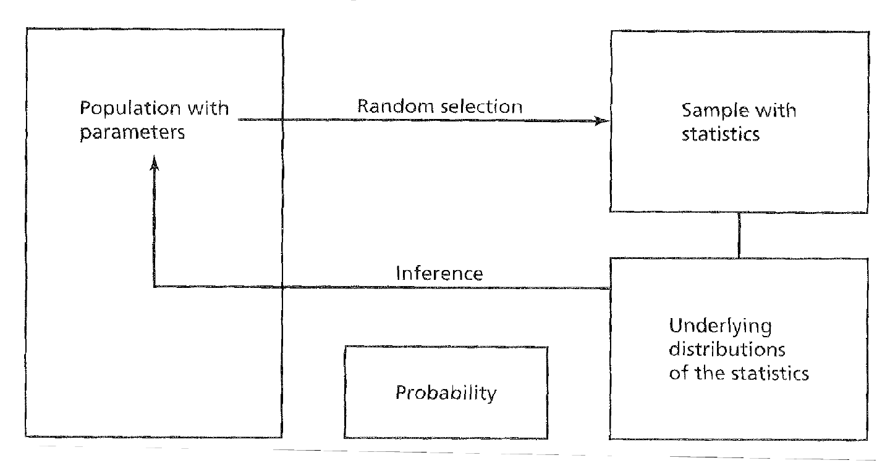

It's important to note that there are three different distributions that we typically talk about.
Two you should be familiar with -- the populatation and the sample. 
The third is the **sampling distribution** which is a **distribution of sample means**.
The sampling distribution of the mean is generated by considering all
possible sample means of a given sample size.

As is demonstratd from the image below, in A we can see there is some sort of distribution, then with one sample (notice the $\bar{X}$), we now have one wide sample.
As we increase that to $N = 16$, the sampling distribution becomes more narrow.
This narrowing is reflective of the idea we are coming in on the true value of the population via our random sampling.
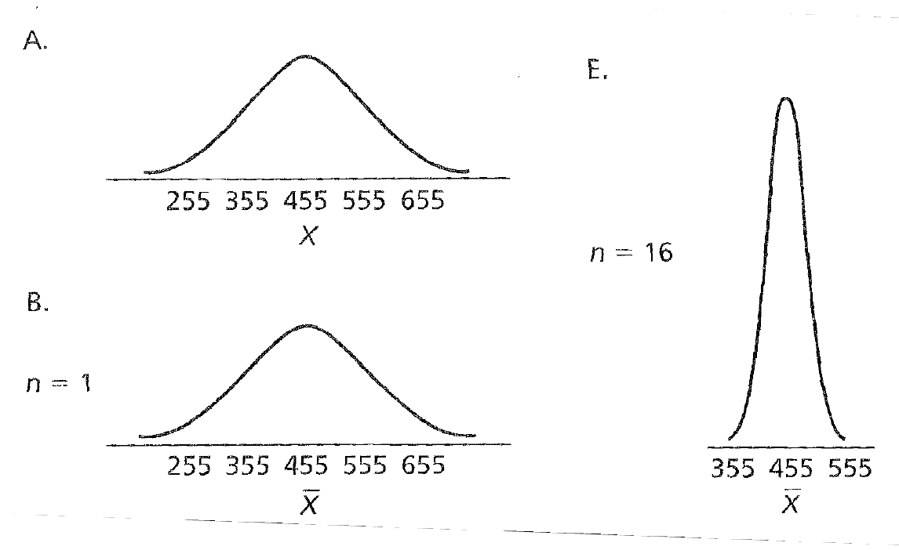

The central limit theorem states that as the sample size $n$ increases, the sampling distribution of the mean for simple random samples of $n$ cases, taken from a population with a mean equal to $\mu$ and a finite variance equal to $\sigma^2$, approximates a normal distribution.
From this, three points follow:

1.The shape of the sampling distribution is normal
2. The mean of the sampling distribution is $\mu$
3. The standard deviation of the sampling distribution, or standard error of the mean, is
$$\frac{\sigma}{\sqrt{n}}= \sigma_\bar{X}$$

Several important implications follow from an understanding of the sampling distribution as a normal distribution and from the central limit theorem.

Because we know the mean and standard error, we can calculate the probability of selecting a random sample mean that is at or more extreme than a particular value on the distribution.

$$z = \frac{\bar{X}-\mu}{\sigma_\bar{X}}$$

We can appeal to the table of z scores on the standard normal distribution
to find the probability.

For example, consider a sampling distribution of SAT scores with a mean of 455 and a standard error of 8.33. This standard error was generated with $n$= 144 and $\sigma$= 100.

So if you wanted to find the liklihood of finding as ample mean equal to or more than extreme of 480, we would plug it into the follow equation.
$$z = \frac{480 - 455}{8.33} = 3.00$$
And if we look that up a table of z distributions, we got a probability of $p=.0013$.

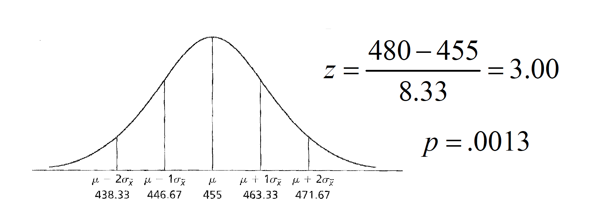

Because we know the mean and standard error, we can calculate the probability of selecting a random sample mean that is at or more extreme than a particular value on the distribution.

As sample size ($n$) increases, the variability of the sampling distribution ($\sigma_\bar{X}$) decreases.

Even when the parent population is not normally distributed, the
sampling distribution becomes normal as sample size (n) increases.

You can see this demonstrated in THIS LINK. 

<!--chapter:end:041-samplingDistributions.Rmd-->

# Hypothesis Testing

The sampling distribution of the mean helps us to make hypotheses about the likelihood that a given sample mean comes from a sampling distribution with a given mean.

Stated differently, a hypothesis test helps us determine whether the observed difference between a sample mean and a hypothetical population mean is either negligible or meaningful.

The Null Hypothesis $H_o : \mu = some value$ 
The alternative Hypothesis $H_o : != \mu = some value$

The Alternative Hypothesis

A sample mean of a given sample size is produced and compared to the hypothetical sampling distribution’s mean to test the null hypothesis

Imagine we know the population (for some reason) and the True value is 455.


The hypothesis test is based on inference (i.e., inductive reasoning), and therefore there is a chance that mistaken inferences will be made.

The 2 ×2 matrix of decision outcomes given the state of nature
and the decision made


A Type I erroris produced when we mistakenly reject the null. It is associated with probability alpha ($\alpha$), or the level of significance.

We conventionally set this level to be .05in psychology, but there are considerations to be made for increasing or decreasing this value (e.g., .01 or .10).

A Type II erroris produced when we mistakenly fail to reject the null. It is associated with probability beta ($\beta$), which is related to, but not the same as, alpha.

The level of significance creates the bounds for the rejection region—the extreme region(s) under the sampling distribution equal to αif the null hypothesis is true.


The directionality of the test should also be considered.


Hypothesis tests differ slightly when population parameters, such as $\sigma^2$, are known versus unknown.

The general formula for a test statistic $Statistic - parameter /SE$

When $\sigma^2$is known, we use the standard error of the normal distribution as the denominator. The result is the ztest.

Z TEST FORMULA 

STANDARD ERROR HERE

When $\sigma^2$ is unknown, we use the t distributionas our sampling distribution, with a standard error that must be estimated from $s^2$ or $s$. The result is the ttest.

T TEST AND STANDARD ERROR FORMULA HERE

Left off on Page 11 in onesampleNHST.png

The concept of degrees of freedom (df)must be considered for the ttest. For each sample drawn, df= n–1.

VARIANCE FORMULSA


## Steps of Hypothesis Testing

On a standardized anagram task, $\mu$= 26 anagrams solved with a $\simga$= 4. A researcher tests whether the arousal from anxiety is distracting and will decrease performance. A sample of $n$= 14 anxiety patients is tested on the task. There average performance is 23.36 anagrams.

Step one: State the null and alternative hypotheses

$H_O = : \mu = 26 $
$H_O = : \mu != 26 $

Consider directionality.

Step two: Set the criterion for rejecting H0. Alpha is usually set to .05, but could be other values depending on the research context. Again, directionality is important to consider.

Step three: Select the sample and collect your data.

Step four: Locate the region of rejection and the critical value(s) of your test statistic. Again, directionality is important to consider.

Step five: Compute the appropriate test statistic. σis known, so we use the ztest.


Step six: Decide whether to reject H0. Is -2.47 more extreme than the critical value?

Step five: Compute the appropriate test statistic. $\sigma$ is unknown, so we use the ttest.

Step six: Decide whether to reject H0. Is -3.00 more extreme than the critical value? df= 13, look up critical value in table C.3 and find ±1.77.

T distribution here

How do we report this result in a typical research article?
“The mean number of anagrams solved by anxiety patients
(M= 23.36) was significantly lower than the mean established by
test norms (M= 26), t(13) = 3.00, p< .05.”
Sometimes you’ll find people report the pvalue lower than .01 if it
passes this criterion as well. For example, t(13) = 3.00, p< .01.
Don’t be confused by the meaning of this, however.

### Other important considerations.

The hypothesis test is a test of the NULL hypothesis, assuming that the null is true. Thus, the test gives you the probability of your sample mean being that different (or more) from the population mean by chance IFFthe null is true.

Statistical significance is not the same as practical significance.

Being able to report the result of a hypothesis test statistically versus being able to describe the result to a lay person. Relate the inference back to the original research question!

## Two Sample

In cases where we wish to compare two sample means, the hypothesis testing logic is essentially the same as with the one-sample tests, with some slight differences in the null hypothesis, in the sampling distribution, and in the computation. When different people (or animals) contributed to the two samples, the comparison distribution that represents the null hypothesis is a sampling distribution of differences between means. The hypothesis test is therefore referred to as an independent-samples test.

When both sample means were produced by the same participants, we conduct what is known as a dependent-samples test. This is a test of the average difference between the scores in one condition and the scores in another condition—thus, the unit of measurement is a difference score.

Nondirectional Null Hypothesis $H_O : \mu_1 - \mu_2 = 0 | H_O : \mu_1 = \mu_2 $
Nondirectional Alternative Hypothesis $H_a : \mu_1 - \mu_2 != 0 | H_a : \mu_1 = \mu_2 $


Directional Null Hypothesis $H_O : \mu_1 > \mu_2  |  \mu_1 < \mu_2 $
Directional Alternative Hypothesis $H_a : \mu_1 < \mu_2  | H_a : \mu_1 > \mu_2 $


This is basically a subtraction of one sampling distribution from another, to produce a distribution of possible differences between sampling distributions.
$ \mu_1 - \mu_2$
* The mean of this sampling distribution is $ \mu_1 - \mu_2$
* The shape of this sampling distribution is approximately normal.
* When \sigma 2is known for each distribution, the standard error of the difference between means is

s2is considered a pooled estimateof the population variance because the individual estimates are literally summed together in the computation:

$s^2 = \frac{SS_1 + SS_2}{n_1 + n_2 -2}$

If you know the individual group variances or standard deviations, then

$s^2 = \frac{(n_1 - 1)s_1^2 + (n_2 - 1)s_2^2}{n_1 + n_2 -2}$


$t = \frac{(\bar{X_1}-\bar{X_2})-(\bar{\mu_1}-\bar{\mu_2})}{s_{\bar{X_1}-\bar{X_2}}}$

Example of the independent samples ttest

The instructor of an introductory psychology course is interested
in knowing if there is a difference in the mean grades on the final exam
between the fall and spring semester classes. Summary data for the two
samples is below:


Are the final exam grades for the two classes equivalent?

Step one: State the null and alternative hypotheses
$H_o:\mu_1 = \mu_2$
$H_a:\mu_1 != \mu_2$

b.Step two: Set the criterion for rejecting H0. Alpha is usually set to .05, but could be other values depending on the research context. Make sure you’ve considered directionality!
c.Step three: Select the sample and collect your data.
d.Step four: Locate your region of rejection and critical values.

Locate your region of rejection and critical values.

$t_{cv,dv=298, \alpha=.05}= +/- 1.96$

Step five: Compute the appropriate statistic. We were never
given $\sigma$ or $\sigma^2$, so we use the t test.


Step six: Decide whether to reject H0. Is -4.86 more extreme than the critical value?

$t_{cv,dv=298, \alpha=.05}= +/- 1.96$

The effect sizerefers to the magnitude of the phenomenon being
tested and is calculated as


This statistic reflects the standardized distance between two
populationmeans. J. Cohen provides guidelines to interpret
the value of d:

“The average final exam score from the fall semester (M= 82.4) was
significantly lower than the average score from the spring semester
(M= 84.2), t(298) = 4.86, p< .05.”

Small: = 0.25Medium: = 0.50Large: = 1.0

“The average final exam score from the fall semester (M= 82.4)
was significantly lower than the average score from the spring
semester (M= 84.2), t(298) = 4.86, p< .05, Cohen’s d= 0.53.”


<!--chapter:end:05-hypothesisTesting.Rmd-->

# Power, Confidence Intervals, Effect Size Measures

## Power 

We have discussed the fact that the conclusions drawn from hypothesis tests are essentially inferences about population parameters, based on sample information. But we have thus far neglected a discussion of what statistical factors should be considered in planning and assessing research-based hypothesis tests.

By minimizing the probability of a Type II error (β), we are at the same time increasing the amount of powerof our hypothesis test (1-β). Power is defined as the probability of rejecting the null hypothesis when it is false (i.e., should be rejected). Four important factors affect the power of a statistical test.

Knowing any three of these factors mathematically fixes the fourth. Thus, one can use these factors in determining the appropriate design for a particular study. Sample size is most often the targeted factor in formulating such a plan.


Careful planning of research involves minimizing Type I andType II errors. One rule of thumb is that $\beta$ should be no more than .20 (e.g., if $\alpha$ = .05, $\beta$ = .20).
c.For the t test, if the null hypothesis distribution is centered on a
t value of 0, then the noncentralt distribution represents the alternative hypothesis distribution, centered on $\delta$.
-This represents the average t value one would expect for a
given effect size and sample size


### Test Equations

One Sample tests

$ \delta = d\sqrt{n}$
$d = \frac{\bar{X}-\mu}{\sigma}$
$g = \frac{\bar{X}-\mu}{s}$

Two sample tests

$\delta = d\sqrt{\frac{n}{2}}$
$d = \frac{\mu_1-\mu_2}{\sigma}$
$g = \frac{\bar{X_1}=\bar{X_2}}{s_p}$

For unequal n

$n_n = \frac{2n_2n_2}{n_1 + n_2}$
$g = t\sqrt{\frac{n_1 + n_2}{n_1n_2}}$


Effect size (ES) or standardized effect size (e.g., d).
i.
The difference between population means (e.g., $\mu1-\mu2$).
ii.
The population standard deviation ($\sigma$).


### Factors of Power

1. Effect size (ES) or standardized effect size (e.g., d).
  *The difference between population means (e.g., $\mu_1-\mu_2$).
  *The population standard deviation ($\sigma$).
2. Sample size ($n$).
3. Significance level ($\alpha$).
4. Directionality of the hypothesis test (one-tailed vs. two-tailed).

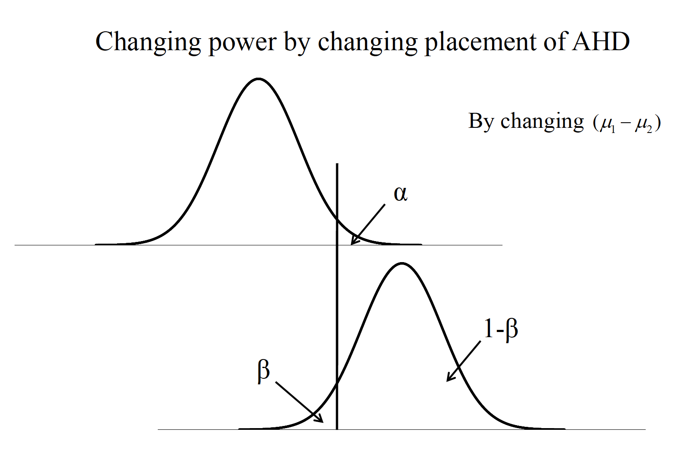


One sample case

$\delta = d\sqrt{n}$
$n = (\frac{\delta}{d})^2$

two sample case 

$delta = d\sqrt{\frac{n}{2}}$
$n = 2(\frac{\delta}{d})^2$


A clinical psychologist wants to test the hypothesis that people who seek treatment for psychological problems have higher IQs than the general population. To test her hypothesis, she wants to use the IQ values from 25 randomly selected clients and also to calculate the power to find a 5-point difference in IQ. The mean of the population would be 100 and, therefore, the mean of her clients a 105. The population SD for IQ is 15. (This scenario is from Howell’s 2002 text “Statistical Methods for Psychology”)

Known: $\mu_{client}=105$
$\mu_{pop}$
$\sigma_{pop} = 15$

Calculate it with

$d = \frac{105-100}{15} = 0.33$

$\delta = d\sqrt{n} = 0.33\sqrt{25}=1.65$

Given this information and an expected alpha (two-tailed) of .05, we can
find in Table A.4 in the Cohen text that the power is between .25 and .50,
and more exactly about halfway in between (around .38).
What does this value of .38 mean?

If power should be at or above .80, what does the clinician do?
Increase alpha?
Decrease the population SD?
Increase the difference between population means?
Increase sample size? For a power level of .80, δneeds to be 2.80,
from Table A.4

$n = (\frac{\delta}{d})^2=(\frac{2.80}{0.33}^2 = 8.48^2 = 71.91$


## Confidence Ientervals 

1. Sample measures of central tendency, such as the mean, are considered point estimates of population parameters. Confidence intervals are considered a type of interval estimation for population parameters.


2. Computation of confidence intervals.

3. Capture percentage, prediction, and replication

Over repeated sampling from a known distribution, the confidence interval represents the percentage of such intervals that contain the population mean.
Can be set at any percentage: 90%, 95%, 99%
Based on characteristics of the sampling distribution (zor t) and therefore highly related to the manner in which sampling distributions are used for NHST

But CIs and pvalues from NHST are not the same thing!!!

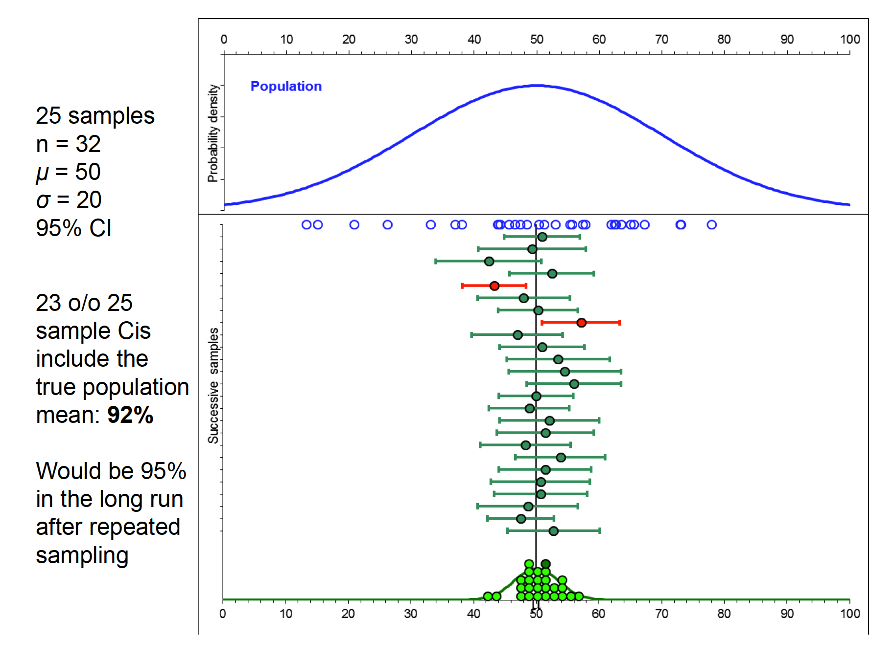


Confidence Interval for single sample mean

$\bar{X} = +- (t_{cv})s_{\bar{X}}$ 

Confidence interval for a mean difference scores (dependent samples)

$\bar{D} +- (t_{cv})s_{\bar{D}$

Confidence interval for a difference between sample means
(independent samples)

$(\bar{X_1}-\bar{X_2}) +- (t_{cv})(s_{\bar{X_1}-\bar{X_2}})$

The instructor of an introductory psychology course is interested
in knowing if there is a difference in the mean grades on the final exam
between the fall and spring semester classes. Summary data for the two
samples is below:

What are the 95% confidence intervals around each sample mean, and around
the difference between the sample means?

```{r}
fall <- c(82.4,150,11.56)
spring <- c(84.2,150,11.44)
stat <- c("Mean","N","s2")
grades <- data.frame(stat,fall, spring)
grades
```
What are the 95% confidence intervals around each sample mean, and around
the difference between the sample means?

Confidence Interval for single sample mean

$\bar{X} = +- (t_{cv})s_{\bar{X}}$ 

This has critical value of 1.97 +-.

First need to find the standard error with each one.

$s_\bar{X} = \frac{s}{\sqrt{n}} = \frac{\sqrt{11.56}}{\sqrt{150}} = \frac{3.4}{12.25}= 0.28 $

$s_\bar{X} = \frac{s}{\sqrt{n}} = \frac{\sqrt{11.44}}{\sqrt{150}} = \frac{3.4}{12.25}= 0.28 $

Now do CI for both 

$\bar{X} = +- (t_{cv})s_{\bar{X}}$ 

$82.4 +- (1.97)(0.28)$
$82.4 +- 0.55$
$(81.85, 82.95)$


$84.2 +- (1.97)(0.28)$
$84.4 +- 0.55$
$(83.65, 84.75)$

Calculate that now for differences

$(\bar{X_1}-\bar{X_2}) +- (t_{cv})(s_{\bar{X_1}-\bar{X_2}})$


$s_{\bar{X_1}-\bar{X_2}}= \sqrt{0.07 + 0.07} = \sqrt{0.14}=0.37$

Alpha value associated with this is 1.96.

$82.4 - 84.2) +- (1.96)(0.37)$
$-1.8 +- 0.73 = (-2.53,-1.07)$

Important points to keep in mind regarding confidence intervals:

1. They are two-tailed by nature (i.e., on either side of a sample mean).
2. For a given sample size, increasing the level of confidence (e.g., from 95% to 99%) increases the interval width.
3. The narrower the interval (at a given level of confidence!) reflects better statistical precision. Sample size directly affects the width of the interval by affecting the standard error estimate.

### Capture Percentage

Capture percentage, prediction, and replication
What is the likelihood that a subsequent experiment will replicate?
Concept of capture percentage: likelihood that a subsequent sample mean will fall into the CI of the current sample.

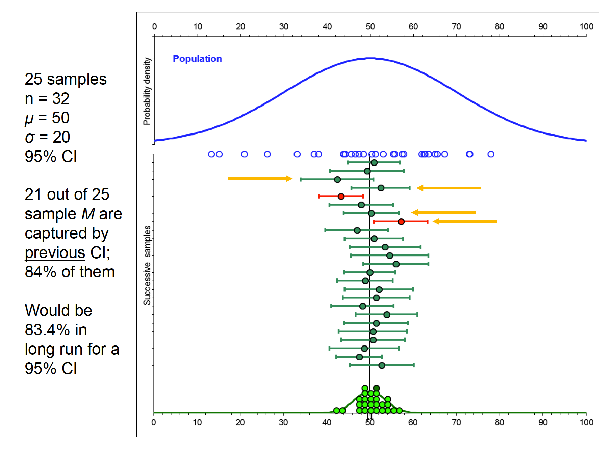

<!--chapter:end:06-powereffect.Rmd-->

# Correlation and Regression

1.
Statistical correlation simply refers to the notion that two variables are related to one another—when one varies, the other varies in a predictable manner. There are typically two ways to understand the nature of a correlation: visually and numerically.
2.
There are multiple ways to understand and, therefore, calculate the Pearson correlation coefficient.
3.
Relying on Pearson’s rto describe a relationship assumes that certain conditions have been met.
4.
Other factors may impact how one interprets the linear correlation.
5.
Testing the “significance” of the correlation coefficient.
6.
There is a correlation coefficient to deal with ordinal variables, or those measured by ranks.

The variables are represented in the abstract as Xand Y.
b.Scatterplotsare figures that represent a pairof scores for each individual, one score for each measured variable. The pattern of the scatter indicates the nature of the relationship.


The statistical representation of the correlation was developed by Karl Pearson and is called the Pearson product-moment correlation coefficient, or r.

i. r varies from -1 to 1.
ii. The strength, or magnitude, of the relationship increases as
distance from 0 increases.
iii.The sign of the correlation represents the direction, or slopeof
the relationship.


A graduate student samples 50 college professors in social sciences at the same university who have been there for at least 10 years. She measures them on a number of characteristics: average quality of their instruction, average quality of their courses, number of publications, and number of citations by other authors. Is there a relationship between the number of publications and number of citations?


## Calculating Person C


One method is to examine the cross-products, which represent the
multiplication of Xand Y, usually on a standard scores. The result is
the standard score formula:


Note these formulas (e.g., z-score) use population characteristics
This approach is very tedious, and does not make sense unless you
already have the z-scores calculated for some reason.


The deviation score formulais a computational formula that relies on
using deviations from respective means:


There is a raw score, computational formula that bypasses the need to
calculate deviations from each mean:


Finally, we can use the covarianceto compute the correlation.

Covariance is the average sum of the cross-products of deviations:


Dividing this number by the cross-product of the unbiased sample
standard deviations produces:


### Assumptions

a. The scores are pairs—the same set of individuals needs to contribute both scores.
b.Because the mean and variance are used to compute r, the variables need to be measured on an interval or ratio scale.
c.Xand Yare normally distributed.
d.The observations were randomly sampled.
e.The relationship between the variables is linear, rather than curvilinear. Values of rare uninterpretable (and are underestimates) for curvilinear relationships.

If the rangeon one or both variables is restricted(i.e., the group is very homogeneous on Xand/or Y), then the value of rtends to become smaller.
Theoretically, the correlation can get bigger with range restriction, although this is VERY rare with moderate-to-large sample sizes.


The sample size will not affect the value of r(except when N= 2), but will affect its accuracyin terms of statistical significance.
-when N= 2, rALWAYS equals ±1.0
c.The coefficient of determinationrepresents the amount of variance in Ythat can be associated with the variance in X.


Conceptual 


Finally, a measured correlation says nothing about whether Xand Yare causally linked, only that there is an association. There are three generic possible reasons for the association.


Testing the “significance” of the correlation coefficient.
a.Is the correlation different from 0?


Or look up critical values in A5 and compare with r 48df .05 alpha of .273


There is a correlation coefficient to deal with ordinal variables, or those
measured by ranks, called Spearman rho.


d= the difference between paired ranks, rather than paired scores.


<!--chapter:end:07-correlation.Rmd-->

# Regression

1.
Regression essentially involves creating a mathematical function that best describes the functional relationship between variables Xand Y. It is used in a two-step process: estimating the function for a full data set, and then applying it to a partial data set in which X, but not Y, is known (i.e., prediction).
2.
There are different ways to compute the components of the regression line.
3.
We can also identify aspects of the regression line that give us an idea about the accuracy of prediction.
4.
We can test the significance of the regression coefficient (the slope) under the null hypothesis that the slope = 0. This is analogous to the null hypothesis test that the correlation = 0.

Xis referred to as the predictorvariable and Yis referred to as the criterionvariable.

The slope-intercept form of the line is (SLOPE OF LINE see slides)
i.The predictedscore on Yis
ii.bis the slopeof the line
iii.ais the Y-interceptof the line; that is, where the line intercepts the Yaxis when X= 0
ˆYbXa

We fit the “best” line to the data set by using the least squaresprinciple—minimizing the summed, squared distance from each data point to the line.
i. Error (e) is represented by the distance from each Y-point to the line.


When we have found the lowest possible total squared error, we
have identified the best-fitting line.


To find a predicted score for a data point, we simply substitute the Xvalue into the prediction equation.


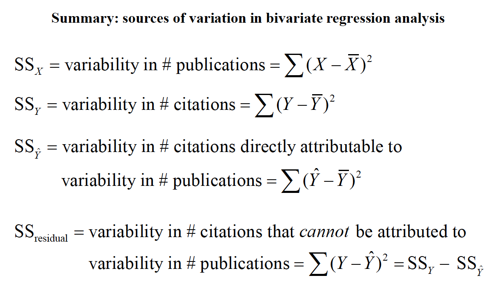

We can also identify aspects of the regression line that give us an idea about the accuracy of prediction.
a.
The error in prediction (e) is associated with its own distribution. The varianceof this distribution (i.e., the ‘variance of the estimate’) is


The standard deviation of this distribution is also called the standard error of the estimate

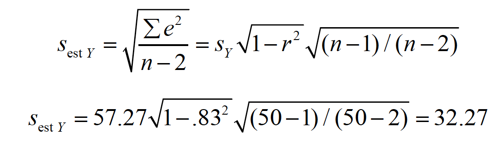


We can also identify aspects of the regression line that give us an idea about the accuracy of prediction

We can understand the standard error of the estimate in terms of the conditional distributionof Yfor each value of X. Each
conditional distribution is assumed to have the same variance—homoscedasticity—and to have a normaldistribution.


Because of these assumptions, we can make statements about the probability of predicted scores defined by the regression line

What’s the probability of Y
around Yhat at anyscore of X?

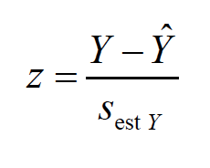


Because of these assumptions, we can make statements about intervals around true values of Yestimated by the regression line (prediction intervals)


We can test the significance of the regression coefficient (the slope) under the null hypothesis that the slope = 0.

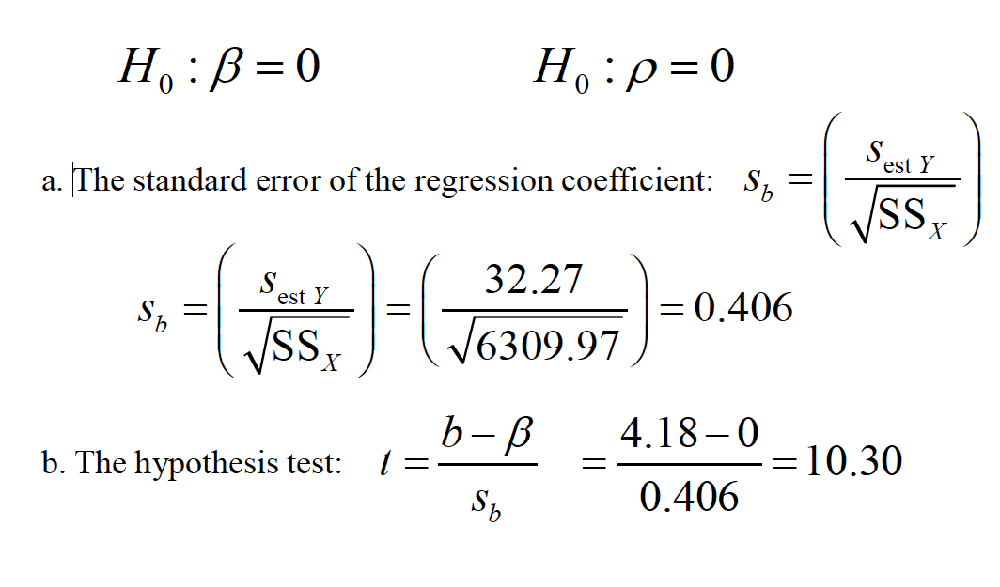


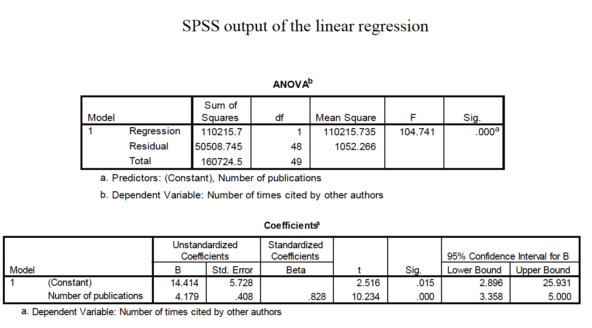


PUT THE R OUTPUT HERE

<!--chapter:end:072-Regression.Rmd-->

# Matched T Test

## Theory

When both sample means were produced by the same participants, we conduct what is known as a dependent-samplestest. This is a test of the average difference between the scores in one condition and the scores in another condition—thus, the unit of measurement is a difference score.

$\bar{D}=\Sigma D /n$
$D= X_{i1} - X_{i2}$

The mean of this sampling distribution is $\delta$= 0.
The shape of this sampling distribution is approximately normal.
The standard error of the sampling distribution of mean difference scores is

$s_{\bar{D}} = \frac{s_D}{\sqrt{n}}$

$s_d = \sqrt{\frac{\Sigma{(D-\bar{D})^2}}{n-1}}$

The test statistic is 

$t = \frac{\bar{D}-\delta}{s_{\bar{D}}}$
$s_\bar{D} =\frac{s_D}{\sqrt{n}}$

The effect size is calculated 

$d =\frac{\bar{D}}{S_D}$

$S_d = \sqrt{\frac{\Sigma{(D-\bar{D})^2}}{n-1}}$

You are investigating whether the older or younger male in a
pair of brothers tends to be more extroverted. So you test where each one
falls on an introversion-extroversion scale. The results are as follows:

```{r}
# Dep
younger <- c(10,11,18,12, 15)
older <- c(18,17,19,16,15)
dep <- data.frame(younger, older)
```

Step one: State the null and alternative hypotheses

$H_o : \delta = \mu_1 - \mu_2 = 0$
$H_a : \delta = \mu_1 - \mu_2 != 0$
  

Step two: Set the criterion for rejecting H0. Alpha is usually set to .05, but could be other values depending on the research context. Make sure you’ve considered directionality!

Step three: Select the sample and collect your data.

Step four: Locate the region of rejection and critical values.

$t_{cv,dv=4, \alpha=.05}= +/- 2.77$

Step five: Compute the appropriate statistic. We were never
given $\sigma$or $\sigma^2$, so we use the t test.


$s_D=3.55$
$s_\bar{D} =\frac{s_D}{\sqrt{n}}= \frac{3.35}{\sqrt{5}}$

$t = \frac{\bar{D}-\delta}{s_\bar{D}} = \frac{-3.8-0}{1.50}= -2.53$

Step six: Decide whether to reject H0. Is -2.53 more extreme than the critical value?

$t_{cv,dv=4, \alpha=.05}= +/- 2.77$


“The average extroversion value for the younger male siblings
(M= 13.2) did not differ significantly from the extroversion value
for the older siblings (M= 17.0), t(4) = 2.53, p> .05.”

Effect size computation

$d = \frac{\bar{D}}{s_D}= \frac{-3.8}{3.35} = -1.13$

Small: = 0.25Medium: = 0.50Large: = 1.0

“The average extroversion value for the younger male siblings
(M= 13.2) did not differ significantly from the extroversion value
for the older siblings (M= 17.0), t(4) = 2.53, p> .05, Cohen’s d=
1.13.”

So, why does the effect size calculation disagree with the result
of the hypothesis test?


Template file

<!--chapter:end:08-matchedTTest.Rmd-->

# One Way ANOVA

In cases where the number of groups in a study (K) is more than two, we cannot use the ttest for the hypothesis test because there is an associated cost.
2.
The Analysis of Variance (ANOVA), or Ftest, controls the experimentwiseType I error rate while simultaneously allowing a test of the equality of multiple population means.
3.
Every given score in a data set differs somewhat from the overall, or grand, mean of the data set. But this distance from the grand mean can be partitioned into the distance from the score to its group mean and the distance from that group mean to the grand mean.
4.
There are several assumptions that should be met when using ANOVA.
5.
The steps of the hypothesis test for ANOVA
6.
Effect size and power for the ANOVA

Performing multiple ttests across multiple groups in a single study increases the likelihood of at least one Type I error occurring across the “family” of comparisons
b. Experimentwise(familywise) Type I errorrate = 1 –(1 –α)c, where
c= number of independent ttests to be conducted
For example, if I wanted to conduct a test for eachpairwise
comparison in a 3-group study, my experimentwiseerror rate would
be 1 –(1 -.05)3= .142
For 4 conditions, it would be 6 tests and 1 –(1 -.05)6= .265
(1)max possible comparisons with groups

The one-way ANOVAis used to analyze data generated by the manipulation of one independent variable with at least 2 levels. Each group, or condition, created by the manipulation is called a level.
b. The null hypothesis—H0:
c.The alternative hypothesis—Ha: , for some pair of groups iand k

The concept behind the ANOVA is that we use two estimates of the population variance associated with the null hypothesis
i. One estimate is the within-groups variation ( ): the influence on variance due to error (chance factors like individual differences), which is presumed to be the same within each group ( )
ii. The other estimate is the between-groupsvariation ( ): the influence on variance due to the independent variable or treatment
( ), plus error due to the random process of group assignment ( )

iii. The test statistic involves created a ratio of the between-groups to the within-group variation:

Every given score in a data set differs somewhat from the overall, or grand, mean of the data set. But this distance from the grand mean can be partitioned into the distance from the score to its group mean and the distance from that group mean to the grand mean.

Obtaining estimates of variance in our data is the trick in the ANOVA.
a.
An individual score in an ANOVA model is comprised of 3 components. The linear model is , where μis the grand mean, αkis the effect of belonging to group k, and eikis random error.
b.
The distance from a score to its group mean essentially reflects error only, whereas the distance from a group mean to the grand mean reflects the effect of the treatment + error


Obtaining estimates of variance in our data is the trick in the ANOVA.
c.
The total variation in a data set, then, can be split into that due to within-group variation + between-group variation. In terms of sums of squares:
d.
These SS estimates must be divided by their respective dfto obtain the estimates of the average variability within-groups and the average variability between-groups.


F STATISTIC FROMULA

If there is no treatment effect due to the independent variable (i.e., the null
hypothesis is true), then we expect this ratio to be roughly equal to 1.

However, if there is a treatment effect due to the independent variable (i.e.,
the null hypothesis is false), then we expect this ratio to be > 1.


### Assumptions of ANOVA

a. To be representative of the populations from which they were drawn, the observations in our samples must be random and independent.
b. The population distributions from which our samples were drawn are normal, which implies that our dependent variable is normally distributed.
c.The variances of our population distributions are equal (homogeneity of variance).
d.Generally speaking, the ANOVA is robust to minor violations of the normality and variance assumptions, except for cases in which heterogeneity is coupled with unequal sample sizes

### Practice

Scenario: Does the ethnicity of a defendant affect the likelihood that he is judged guilty? People were given transcripts of a trial and asked to judge the likelihood that a defendant was guilty, on a 0 –10 scale. The transcript was identical, but across 3 conditions, the reported ethnicity of the defendant varied. The results were as follows (study based on Stephen, 1975):

```{r}
white <- c(6,7,3,2,3,5,0)
black <- c(10,9,4,10,10,3)
hispanic <- c(6,10,5,5,10,2) 
```


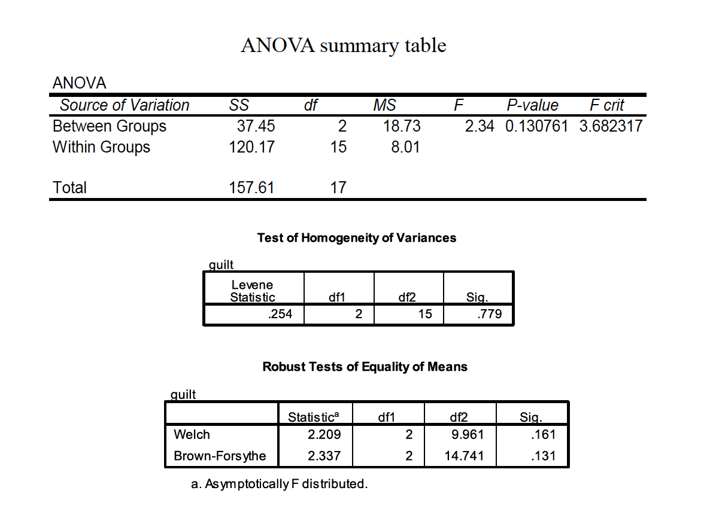

Step six: Interpret (was null rejected?).
We do NOT reject the null, because the Fvalue did not exceed the Fcv
“The ethnicity of the defendant did not significantly affect the
average guilt rating given by mock jurors, F(2, 15) = 2.34, p> .05.”

## Effect Size Measures

An effect size measure, f, is used to represent the population SD between
groups from the grand mean, versus population SD within a group


We can then use the noncentrality parameter for the Fdistribution,
related highly to phi, to estimate power

$\phi = f * \sqrt{n}$
$n = \frac\{\phi}{f}^2$

Consult Table A.10 for values of phi, based on number of
groups (K) and the likely dfw(although this has a modest influence)

$n = \frac\{\phi}{f}^2$

What if we desired .80 power? How many subjects?

In Table A.10, with k= 3 and dfw= 16, phi = 2.0


This type of measure is comparable to R2in regression
Interpretation: roughly 28% of the variance in the DV (i.e., guilt
ratings) can be attributed to the IV (i.e., the race of the defendant).
But it is upwardly biased—it overpredictsthe population eta-squared


Interpretation: roughly 13% of the variance in the DV (i.e., guilt
ratings) can be attributed to the IV (i.e., the race of the defendant).

Cohen (1977) recommends the following convention:
≈ .01 is “small”
≈ .06 is “medium”
≥.15 is “large”

Look for “adjusted R squared” notation in the SPSS ANOVA output
from the Univariatemethod of performing the ANOVA

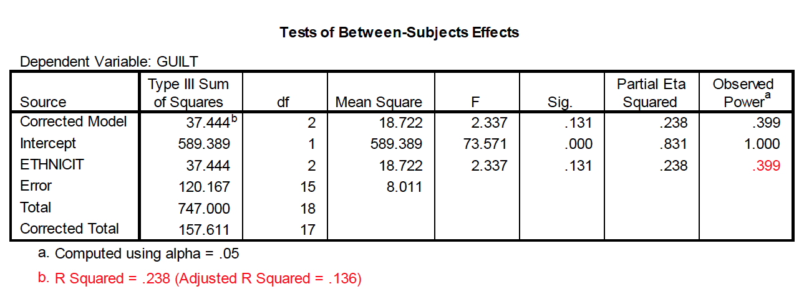


<!--chapter:end:09-oneWayAnova.Rmd-->

# Multiple Comparisons 

In past lectures we have discussed the problem with the familywise (or
what your text calls “experimentwise”) Type I error rate.

There are different methods for holding the familywise error rate at no
more than .05. This methodology is most commonly used in post hoc tests
designed to test specific contrasts among conditions following a significant
ANOVA.

In addition to comparisons done post hoc, others can be done a priori,
commonly known as planned comparisons. Because such comparisons are
usually done with a particular theoretical outcome in mind, they are not as
conservative as post hoc comparisons.

a. Familywise Type I error rate = , where j = number of
independent t tests to be conducted.
b. When comparisons are not independent, the familywise rate can be
approximated by the formula .
c. The comparisonwise error rate is the Type I error rate per comparison.
d. Comparisons are orthogonal if the outcome of one test is not
redundant with the outcome of another. There are (k – 1) orthogonal
comparisons in a data set, which will be discussed in more detail.

There are different methods for holding the familywise error rate at no
more than .05. This methodology is most commonly used in post hoc tests
designed to test specific contrasts among conditions following a significant
ANOVA.

The simplest, and most powerful test, is called the Fisher Least Significant
Difference test (LSD). It is sometimes called the “protected t” test, and the
formula is:


You then use the df from the overall error term for finding the critical value
of t. This test should be used only following a significant F test, and for no
more than 3 groups. If homogeneity of variance is not tenable, then use the
individual variances from the groups being tested, as the case for a
traditional separate variances t test with df = N - 2.

How does the Fisher LSD protect against Type I error inflation with only 3 groups?

Complete null is true

$H_0 : \mu_1 = \mu_2 = \mu_3$

In this case, if the overall
F is significant, you have
already committed a Type I
error and any more of them
don’t contribute further to
αFW (i.e., you are just going
to commit the ‘same’ error
in a particular pairwise
comparison.
This is the case no matter
how many groups are in the
experiment.

Partial null is true

$H_0 : \mu_1 = \mu_2 != \mu_3$

With 3 groups, if the overall
F is significant, it was not
a Type I error; there is only
one real chance of a Type I
error—that being when the
partial null is true. Here
αFW was never in danger of
being more than .05.
But with more than 3 groups,
and when more than one partial
null is true, you have the chance
of committing multiple errors.

Another common method is to use the studentized range (Q)
sampling distribution as the source of critical values for minimum
differences needed to declare population means significantly
different.

The Tukey method computes the minimum difference needed
for any pair of means to be significantly different. We use alpha,
the number of means being compared (r), and the df associated
with MSW to find a critical Q value.


With this method, you are protecting yourself against the most
extreme possible Type I error (i.e., between the largest and smallest
means), and therefore all other comparisons are likewise protected.

Scenario: A researcher gives a test of creativity to four groups of children.
The age difference between each group is 2 years (range 4-10 years). Do the
children demonstrate significantly different levels of creativity?


The Student Newman-Keuls method is similar to the Tukey,
except that the critical value is determined by the number of
steps separating each pair of means (r): range = i – k + 1


Problem: we do lose some control over αEW, as it actually goes over
.05


The Tukey/Kramer method is used when sample sizes are unequal.
We calculate the harmonic mean of the sample sizes to achieve
the appropriate number in the denominator:


The Ryan (or REGWQ) test is a modification of the SNK to
achieve increased power but also keeps αEW no greater than .05.
It is preferred over Tukey to get better power and over SNK to
keep αEW ≤ .05. This means it uses fractional values of alpha
that are not easy to tabulate—but SPSS and other packages
offer it as an option so it’s easy to use.


Another conservative method, the Scheffeaccent test, uses the F distribution,
but can also be used to test complex comparisons involving combined
groups, called linear contrasts.


The critical value of F sets the experimentwise error rate against all
possible linear contrasts, not just pairwise contrasts.


In addition to comparisons done post hoc, others can be done a priori,
commonly known as planned comparisons. Because such comparisons are
usually done with a particular theoretical outcome in mind, they are
typically not as conservative as post hoc comparisons.

The linear contrast described earlier is generally used to complete planned
comparisons. There are two primary differences as compared to the post
hoc version of the test.
If multiple contrasts are to be done, then it’s best if they are orthogonal, or
independent. There are K – 1 orthogonal comparisons available in any one
set of contrasts. Most (e.g., your text author) argue that you can keep each
contrast at α = .05 when the set is orthogonal.


The linear contrast method described earlier is also used to complete
planned comparisons. There are two primary differences as compared to
the post hoc Scheffé test.
Because of the orthogonality principle, the critical value for each
comparison allows for more power (i.e., it is more liberal than the post hoc
version Scheffé developed):

$F_{cv}=F_{1,N-K}$


A very conservative, but simple, method is to figure the
comparisonwise error rate is to divide the familywise error rate
by the number of comparisons one wishes to make. This is known
as the Bonferroni test or the Dunn test.

$\alpha_{pc}= \alpha_{EW}/J$

For example, with 3 comparisons, α = .05/3 = .0167.
You don’t set the modified alpha based on all possible comparisons,
just based on the number you wish to conduct.

## Trend analysis 

A statistical procedure called trend analysis can be done to examine the
functional relationship between a quantitative IV and the DV (e.g., linear,
quadratic, cubic).

The same linear contrast comparison method is used as with regular
contrasts, and the trend contrast coefficients are a special set of orthogonal
comparisons based on K.


A statistical procedure called trend analysis can be done to examine the
functional relationship between a quantitative IV and the DV (e.g., linear,
quadratic, cubic).
Trend analysis works only when the IV is a quantitative variable (e.g., drug
dosage).
More than one trend may be significant, and therefore inspecting a graph of
the means in tandem with the analysis is highly recommended.


<!--chapter:end:10-multipleComparisons.Rmd-->

# Factorial Anova

Hypothesis Testing with Multiple Samples: The Factorial ANOVA
1.In cases where multiple IVs are crossed with one another in the same design, the factorial ANOVAis used to partition the variance.
2.There are multiple null hypotheses tested simultaneously in a factorial ANOVA, making the design and analysis somewhat more complicated than one-factor designs.
3.The assumptions in the factorial ANOVA are the same as in the one-way ANOVA.
4.Other considerations in factorial ANOVA

Such designs incorporate multiple IVs to examine the simultaneous effect these variables have on behavior—this adds efficiency to the design.
a.Incorporating more than one IV allows researchers to control for the impact of a second variable by explicitly including it in the design. Controlling for a second factor allows for a reduction in the error term of the ANOVA.
b.The unique benefit of the factorial design is the investigation of interactions—the possibility that the combined influence of multiple factors influences behavior in a way unpredictable from knowing the influence of individual variables in isolation

2.There are multiple null hypotheses tested simultaneously in a factorial ANOVA, making the design and analysis somewhat more complicated than one-factor designs.
a.Factorial designs are typically represented in arrays with rows for the levels of one IV and columns as levels of the other IV. Each combination of levels from IV 1 and IV 2 is called a cell, or condition.
Scenario: A researcher is interested in the role of “drive” level and certain drugs on learning in monkeys. The monkeys are given 20 “oddity” problems in which they are given 3 objects, one of which is new, and they are reinforced for picking the novel item. One IV is “drive” level, either 1 hour of food deprivation or 24 hours of food deprivation before the oddity task is undertaken. The other IV is drug condition, with 3 levels. One is a placebo, and the other two compare two different drugs believed to affect motivation.

There are multiple null hypotheses tested simultaneously in a factorial ANOVA, making the design and analysis somewhat more complicated than one-factor designs.
a.Factorial designs are typically represented in arrays with rows for the levels of one IV and columns as levels of the other IV. Each combination of levels from IV 1 and IV 2 is called a cell, or condition.
i. Main effects refer to the influence of any one IV regardlessof the
other IV(s) in the design.

Simple effects (or simple main effects) refer to the effect of one IV
at a particular level of another IV (e.g., the effect of columns at
row 1).

Interaction effects refer to the combined influence of the IVs.
Interactions can be defined many ways, but one useful generic
definition is that an interaction occurs when the simple effect of
one IV is inconsistent, or not the same, at each level of another IV

An interaction is present when the simple (main) effects of one IV are not
the same at all levels of another IV
An interaction is present when the main effect of an IV is not representative
of the individual simple (main) effects of that IV
An interaction is present when the effect of one IV is conditionally related
to the levels of the other IV
An interaction is present when one IV does not have a constant effect at all
levels of another IV


In designs with two IVs, the variance between conditions is
partitioned into 3 components: the overall influence of IV 1 ( ), the
overall influence of IV 2 ( ), and the combined influence of IVs 1
and 2 ( ). The fourth component is the variance within conditions,
or within cells, ( ).


“A two-way between-subjects ANOVA generated a significant interaction
between drug condition and level of food deprivation, F(2, 18) = 3.93,
p < .05. The main effect of food deprivation, F(1, 18) = 1.31, p > .05, was
not significant. The main effect of drug condition was just short of
conventional significance, F(2, 18) = 3.06, p = .07.”

## Assumptions of ANOVA

The samples are independent, random samples from the populations.
b.The scores on the DV are normally distributed in the population.
c.The population variances in all cells (conditions) of the factorial design are equal—homogeneity of variance.

An appropriate measure of variance explained (or association) is
omega squared


Multiple comparisons for main effects (i.e., marginal means) can be
accomplished with the standard methods, such as the Tukey method:


Multiple comparisons for main effects (i.e., marginal means) can be accomplished with the standard methods, such as the Tukeymethod.

Simple effect (or simple main effect) comparisons are essentially a series of one-factor ANOVAs to help illuminate the nature of an interaction, but using the overall MSWas the error term.


n prime is SUM of the n from each individual
cell in the comparison (marginal n)


Simple comparisons involve individual comparisons of cells within a simple main effect. In this case, standard post hoc tests (e.g., Tukey) could be used. Again, the overall MSWis used as the error term in these comparisons.


“A two-way between-subjects ANOVA generated a significant interaction
between drug condition and level of food deprivation, F(2, 18) = 3.93,
p< .05. The main effect of food deprivation, F(1, 18) = 1.31, p> .05, was
not significant. The main effect of drug condition was just shy of
conventional significance,F(2, 18) = 3.06, p= .07. To reveal the nature of
the interaction, simple main effects were conducted on drug condition at each
level of food deprivation, with a Bonferroni adjustment for multiple comparisons
applied. At 1 hour of food deprivation, the effect of drug was significant,
F(2, 18) = 6.76, p< .05, whereas the effect of drug was not significant at 24
hours of food deprivation, F(2, 18) = 0.22, p> .05. A Tukey test among drug
conditions at 1 hour of food deprivation revealed that the placebo and drug 2
differed significantly, whereas the other two pairwise comparisons were not
significant.”

## Power and Sample Size Estimatoin


### Three Way Factorial 


Example research scenario: A researcher tests driving ability based on three
factors:
Experience of driver (inexperienced vs. experienced)
Road class (class 1, class 2, or dirt)
Time of day (daytime vs. nighttime)
2 × 3 × 2 factorial design
DV is the number of steering corrections made during a 1-mile section of
roadway


<!--chapter:end:11-factorialANOVA.Rmd-->

# Repeated Measures ANOVA:

1. Repeated measures designs are those in which subjects are tested in each level of the independent variable.
2.The conceptual difference is that repeated measures designs allow for the separate estimation of the influence of individual differences from participant to participant, whereas between subject designs do not.
3.The repeated measures design is more economical and contains
more statistical power as compared to its counterpart.
4.The assumptions of the repeated measures ANOVA
5.Power and effect size

The linear model includes two more components, the source of an individual’s performance across the entire study and how an individual interacts with the treatment levels:


This ability to isolate the source of individual differences allows us to further reduce the error variance (i.e., the denominator of the F ratio).

$F = \frac{MR_{RM}}{MS_{sub x RM}}$

Variability due to subjects is taken into account, but then ignored
in the computation of F.


A consumer psychologist is interested in the effect of label information on the
perceived quality of wine. Six individuals are asked to rate 3 different wines
a scale of 1 to 20, with higher scores being a better quality. The wines were
labeled as French, Italian, or American, but the wine was identical across the
conditions. The results are shown below:


## Assumptions of RMANOVA

1.
Sample randomly selected from the population
2.
The DV is normally distributed in the population
3. Sphericity: the variances of difference scores from all possible pairs
of conditions are equal


If sphericityis violated, there are several avenues to correct for it that involve
applying a correction for the Epsilon value (ε)
In SPSS, you’ll see the following in the within-subject ANOVA output:
Lower bound correction—this is a change to the critical Fvalue from
df= K–1, (n–1)(K–1) to df= 1, n–1. This severelyincreases the
critical Fvalue to 6.61 in our case.
Huynh & Feldtand Geisser-Greenhouse are corrections to the dfbased
on the degree of violation to sphericity, and create more modest
corrections to the critical Fvalue. The non-corrected dfare multiplied
by the epsilon values for each respective procedure.

If none of the Fs is significant, don’t worry about these corrections—fail to
reject the null.
If all of the Fs are significant, then reject the null.
If one/some of the “corrected” Fs is significant but others are not, then most
advocate the Huynh & Feldtcorrection (it’s not as conservative as the lower
bound).
Field text advocates averaging the G-G and H&F estimates—for a rule of
thumb, average the significance values of these estimates

## Effect Size

An effect size measure, f, is used to represent the population SD between
groups from the grand mean, versus population SD within a group


<!--chapter:end:12-rmanova.Rmd-->

# Factorial Designs with Repeated Measures 

1. The partitioning of variance when all factors are repeated measures
includes multiple subject × treatment interactions.
2. A full computational example of a mixed design with one repeated
measures factor and one between-subjects factor.
3. The assumptions of designs with repeated measures

In cases where both (or more) factors are repeated measures, each main effect and interaction is generated as usual, but each error term consists of some type of interaction with subjects.


In cases where at least one factors us repeated measures and at least one other is between subjects, we have a mixed design. The sources of variation in a two-way mixed design are below:


A memory psychologist is interested in how false memories are affected by
changes in context. Three groups of people were asked to learn lists of
words connected to a missing theme. For example, the words BED, REST,
PILLOW, BLANKET, NIGHT, & SLUMBERare all related to SLEEP. Group 1 studied
many lists like these, with only the first two items for each list (e.g., only BED
and REST). Group 2 studied the same lists, but including the first 4 items per
list. Group 3 studied the same lists, but including all 6 items in each. Each list
had a very distinctive font, as I used above.
Each group then got a memory test. Included on this memory test were the
“missing” theme items, such as SLEEP. Sometimes the theme items were
in the same font as their list mates (e.g., SLEEP). Other times, these items were
presented in a different font (e.g., SLEEP). There were 4 items in each of these
test conditions. The data presented on the next slide represent how many, out
of 4, of these missing theme items were called “old” on the memory test. These
are, therefore, false memories. The question is whether the factors of list length
and font style at test affect how many of these occur.


In cases where at least one factors us repeated measures and at least one other is between subjects, we have a mixed design. The sources of variation in a two-way mixed design are below:


## Assumptions of Mixed ANOVA

1.
Sample randomly selected from the population
2.
The DV is normally distributed in the population
3. The variances of difference scores from all possible pairs of conditions
are equal and the covariances(or correlations) between pairs of
conditions are equal (sphericityor circularity).
4.These covariance structures, or matrices, are equal across the between-
subject groups in the study (i.e., for each list length condition).

### Equal Variance 

-- Run Leven's Test and Box's 

Yuck! We don’t have equal variances for
the ‘same font’ scores among our conditions.
Nor do we have equal covariance structures
across our 3 list length conditions (Box’s test).

Basically, then, we shouldn’tuse a pooled error
term for any post-hoc comparisons. One plan could be to run two separate
one-way ANOVAs across condition to assess simple main effects, and
checking the Welch’s and Brown-Forsythe ANOVA options for each.
We should apply a Bonferronicorrection for any of these post-hoc comparisons.

### Simple Main Effects

Even with a Bonferronicorrection (.05/2), there are group differences
for same font condition, but not for the different font condition.
We could then perform a Tukeytest for the pairwisedifferences for the same
font condition (i.e., simple comparison).


<!--chapter:end:13-factorialDesignRM.Rmd-->

# Multiple Regression 

1.
Multiple regression (and multiple correlation) refers the process of fitting a linear combination of multiple Xvariables to predict scores on Y.
2.
There are different ways to compute the components of the regression line.
3.
In multiple regression, we have to the multiple correlation coefficient(R) and its associated coefficient of determination (R2).
4.
We can test the significance of the individual regression coefficients under the null hypothesis that each is equal to 0.

Scenario: A researcher is interested in predicting the number of substance abuse relapses in a five year period following entrance into substance abuse treatment. She measured the following data for 120 women upon entry into the treatment program:

Depression
Propensity for substance abuse
Daily life stress
Amount of social support from close others
Perceived social support from close others

* CREATE CORRELATION TABLE

The slope-intercept form of the equation is

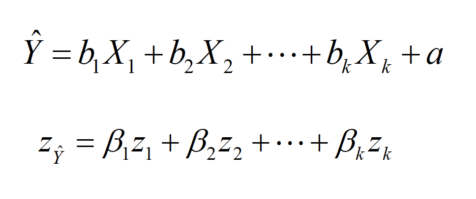

We fit the best “hyperplane” to the data set by using the least squaresprinciple.


There are different ways to compute the components of the regression plane.

Predicting number of relapses (Y) from substance abuse propensity (X1) and daily life stress (X2)

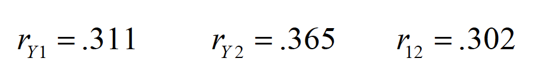

Standardized coefficients (Beta weights) for two predictors


R OUTPUT OF REGRESSION

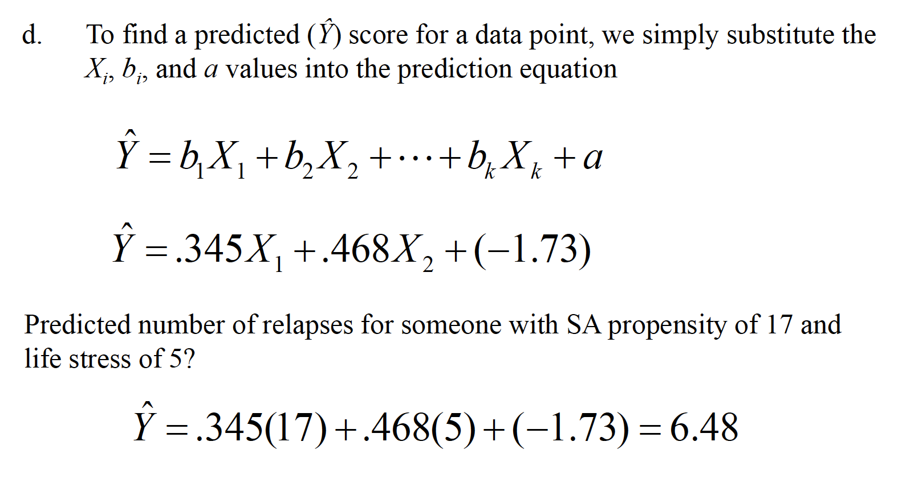


In multiple regression, we have to the multiple correlation coefficient(R) and its associated coefficient of determination (R2).

Multiple Ris a correlation coefficient that represents the entire linear combination of predictors, rather than the simple correlation of a given Xvariable with Y.


Multiple Rranges from 0 to 1 (i.e., cannot be negative).
Multiple Ralso represents the correlation between each Yscore and its
associated Ŷ score.
Multiple R2is the amount of variance in Yshared by the linear combinationof predictors.

R2  = .42^2 = .176

Multiple R2can overestimate the true amount of shared variance when there are numerous predictors and a small number of observations, so an adjustment for this problem has been identified:


Testing for significance.


## Conceptual Representation

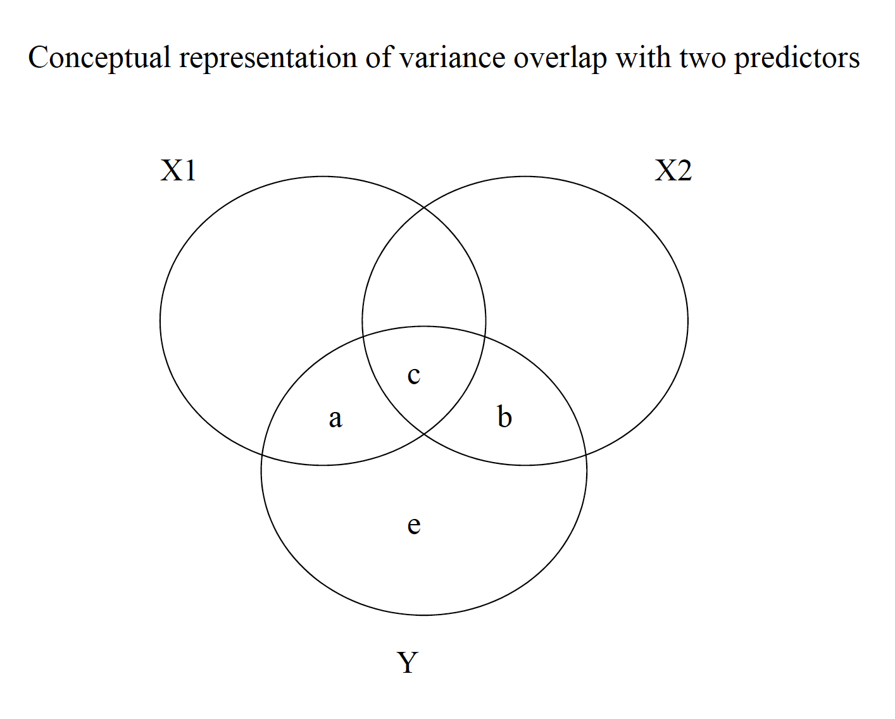


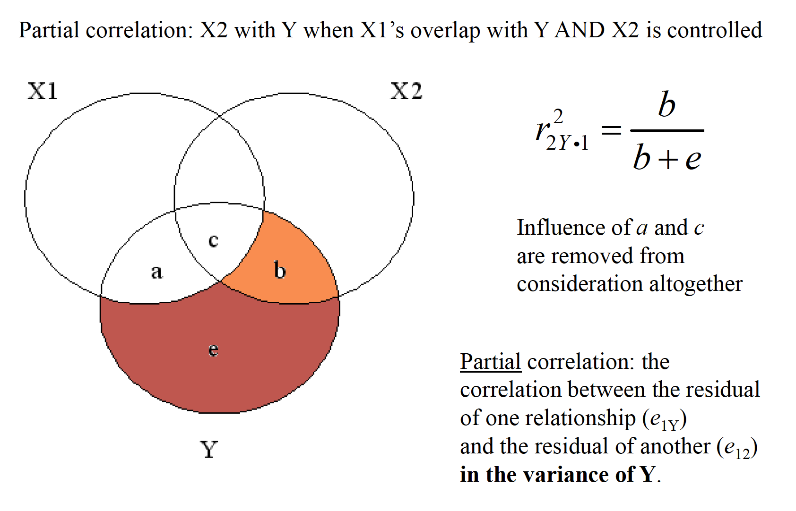

### Second Part 

1.
Regression diagnostics involve identifying potential outlying observations to help refine the prediction equation.
2.
Constructing an efficient and valid regression equation requires a consideration of many factors.
3.
Various selection methods are available for finding the “best” regression model, but each has its own drawbacks.

Distanceor discrepancyrefers to the error in prediction in the criterion variable.
-could be random error, could be incorrectly recorded, couldbe an
unusual case that is justified in being thrown out
-a ttest on the residuals can be requested, called the Studentized
residual, with (N-P-1) degrees of freedom
-keep in mind that a ttest is being done for each observation, so
a Bonferronicorrection for multiple comparisons is probably a
good idea
ˆYYe−=

b.Leverage(often denoted hi) helps to identify outliers based on the predictor variables X1, X2, and so on.
-possible values of leverage range from 1/N to 1.0, with a mean of
[(P+1)/N]
-some recommend carefully inspecting observations with leverage
values of [3(P+1)/N] or greater

Influencecombines distance and leverage for a given observation to ascertain whether that observation markedly changes the regression surface (i.e., the equation).
-most common measure is Cook’s D
-reflects the change in a regression coefficient if the offending
observation were taken out and the regression re-computed
-values over 1.0 are highly unusual and merit scrutiny
-a more conservative rule of thumb is if Cook’s D > [4/(N –k –1)]


Mahabanolisdistance measures the uniqueness of a given observation based on its value and the mean values for all other cases of the predictors in the model


a.
Tolerancerefers to the degree to which one predictor can itself be predicted by the remaining predictors in the model
-if the multiple correlation from all other predictors here is RX, then
tolerance is the leftover unexplained variance, or
-it tells us the degree of overlap among predictors—lower values of
tolerance represent potential problems (lower than .20 or so is a flag)
-we want the multiple correlation among predictors to be
rather low, and therefore tolerance to rather high

b.
Variance inflation factor(VIF) is the reciprocal of tolerance and represents how much the standard error of a given predictor coefficient is made larger because of high correlations with other predictors
-we want low standard errors for coefficients, and therefore low VIF
values (values over 10 or so might cause concern).
-if eliminating a predictor variable with high VIF and low tolerance
helps to generate a more stable model (i.e., low sampling error), then
it may be a good idea to do so

Various selection methods are available for finding the “best” regression model, but each has its own drawbacks.
a.
The all subsetsmethod essentially requires fitting all possible combinations of predictor variables to see which provides the best R2or that minimizes MSres
-one problem with this technique is that it could capitalize on chance
-your particular sample may have data points that are not
representative of the population
b.
Backward eliminationinvolves putting all predictors into the model and then removing those that contribute the least to the model
-this is done iteratively until we are left with the model that only
includes influential predictors

c.
Stepwiseregression is the opposite of backward elimination, where we add the most influential predictor, then the next most, and so on.
-at each step in the process, before adding a new variable, we
determine whether any current predictors should be removed on the
basis that they no longer make a contribution
-selection stops when remaining predictors will not make a
contribution
-forward selectionprocedures can be used so that previously added
predictors are not removed at any future step
d.
Hierarchical regression is a method used to force the entry of variables in a particular order

overall, the stepwise method is likely the best, although these
methods should be used primarily when trying to create the best
prediction, rather than trying to test theory

EXAMPLE OF STEPWISE REGRESSION IN R

CAN YOU GET THIS DATASET FROM JH

<!--chapter:end:14-multipleRegression.Rmd-->

# Chi-Square

1.
There is a chi-square distribution and an hypothesis test commonly called the “chi-square” test. This test was developed by Karl Pearson.
2.
The one-way chi-square is commonly called a “goodness-of-fit” test.
3.
The two-way chi-square is called a test of independence (or association) and relies on the use of contingency tables.
4.
Like other statistical tests, the assumptions of chi-square need to be considered.

-The distribution varies as a function of the df, and actually changes shape
noticeably as the df increase; the distribution is skewed positively except
for very large df
-The chi-square distribution is an approximation to the multinomial
distribution (multinomial = more than 2 variables)
-The chi-square test was developed to ascertain the discrepancy between
observedfrequencies of multinomial categories and the expected
frequencies from those categories


The one-way chi-square is commonly called a “goodness-of-fit” test.

Like other statistical tests, the chi-square test compares the outcome of a
formula to what would be expected by some null hypothesis
-With one factor and many categories in that factor, the test is often called
a “goodness-of-fit” test. In other words, do the observed frequencies “fit”
the expectation?


-How one determines what is ‘expected’ depends on the scenario—often
this is determined by some expectation of a random observation

Tolman, Ritchie, and Kalish (1946) performed one of the most famous experiments in
animal learning. Rats were first taught how to run down a particular alley to reach a
goal box (rewarded by food). After training, the original alley was blocked halfway
down and other alleys were provided as choices. The data below are a simplification of
the full set of choices (see figure below for full set). There were 32 rats used, and each
was tested in the new maze after learning the original route. If rats were choosing alleys
at random, then an equal number would choose each of the 4 (8 rats each).


With df = 3, we look up the chi-square critical value in Table A.14, with α= .05
That critical value is 7.81. Thus, the rats are choosing alleys nonrandomly.
Note that this is an omnibus test like the ANOVA; it only detects a discrepancy.
You could perform similar chi-square tests on smaller portions of the categories,
or perform a binomial test for a single category (e.g., is 15 out of 32 different from
what would be expected by chance—25%)?

The two-way chi-square is called a test of independence (or association).

With two variables, one sets up a contingency table to see if the
frequencies of one factor are contingent (i.e., depend) on the other
Scenario: Another famous experiment by Darley and Latané (1968). Subjects participate in a discussion over intercom with an experimenter. Subjects thought that either 0, 1, or 4 others were also in the conversation. Partway through, the experimenter feigned illness and asked for help. The table shows how many subjects in each group sought out the experimenter.


Like other statistical tests, the assumptions of chi-square need to be considered.
a. The categories are mutually exclusive and exhaustive
-no observation can be in more than one category
-every possible category must be measured
-sometimes researchers fail to consider ‘nonoccurrences’
or ‘no’ responses as a separate category
b. The observations must be independent
-only one response per subject!
c. Normality
-small expected frequencies (< 5) often create a problem for normality


<!--chapter:end:15-chisquare.Rmd-->

# Non-Parametric Data 

Template file

<!--chapter:end:16-nonParametric.Rmd-->

# Advanced Data Cleaning

Template file

<!--chapter:end:17-advancedDataCleaning.Rmd-->

# Advanced Multiple Regression

##Introduction to Multiple Regression

With multiple regression you are using multiple dependent varibles to predict one DV.
When we interpret these
Univariate regression we have r.
Multiple regression we have R, the multivariate regression coeffecient.
This R^2 takes in multiple independant variables.
We use multiple regression to test relationship between DV and two or more IVs.
We can look at that relationship multiple different ways.
We want to know how well this set of DVs predict our IV.
More often we look at contribution of individual predictors.
How important is X2 in predicting Y.  
What is seffect of IV when controlling for effect of others IV. 
What is effect of gender on income we get after we control for educational background.

With multiple regression, we can also compare sets of IVs to look at DV.
Based on a number of things (ideally theory), we have one model that predicts others.
Finally parameter estimation, the Bs are samples of paramters in population.
We can estimate the actual value of these weights in population.
There are a lot of really intersting questions we can answer with multiple regression.

There is peril and limitations!
Number one, with correlation you can't say anything about causation.
Another limiation of multiple regression is how many variables do you put in equation?
If you have soemthing like census data, you can use tons of IVs.
We we select IVs theoretically, ideally we have some DV, we choose IVs to predict it.
We run prescreening to see if IVs are good predictors.
We want IVs that are correlated with the DV.
The IV's co-vary with the DV.
In a perfect world we want no correlation between the IVs.
Ideally, but never happens.
When we choose IVs to put in equation, important to to decide.
Multiple regression is very sensitive to what we do as researchers.
The ORDER which we put things in has interesting and counterintuitive results.
In some rare cases, this can make cherubs or unicorns.
What they are is statistical quirks from things we added to the model at some point.

##Basics of Multiple Regression

Tests we are going to run have assumptions.
First thing we want to do is prescreen data for normality, linearity, outliers.
After we run it we check residual plots.
The first thing we need to check that you can't check with outliers is appropriate Ns.
We need enough to run a good test, but we don't want too many.
Textbooks suggests where N > 50 + 8m where m is number of variables.
That rule is for general prediction.
Is it a good model, just interested in model.
This is only one rule of thumb, for general regression.
For specific predictors and beta weights.
N > 104 + m.
So if we want to see if type of shoe is a good predictor of kicking and spitting.
This is to check for specific predictors in the model.
If we're interested in type of shoe, we don't want to go a lot more above this.
If your N is too high, you will get a significant result.
Regression is really sensitive to sample size.
Total model becomes significant if you make it too big, same with beta weights.
At that point we're more interested in effect size, aka the coefficient.

If you have a huge dataset, want to validate.
Aka take a sample, test. 
If you get census data, everything is going to be significant.
The more IVs we have, the blacker the box, the harder it is to understand the equation.
Student suggests to keep sample at less than 5% of population.

Next assumption of multivariate regression is outliers.
Outliers can be very harmful, very important and most important in multiple regression.
Effects solution to general model, can have strong effect on estimated coefficents.
We always check for and be mindful of outliers.
After we run regression, want to check with residuals.

Sometimes residuals are a bit misleading (supposedly from text).

Want to always check for multicollinearity.
Correlations above .9 can be very dangerous.
Can check for singularity with correlation matricies, but normally that's a logical thing.
We want to check tolerance (0-1) and variance inflation factor.
You want tolerance to be higher.
If VIF is over 10 you are in trouble.

Finally, check for normality, linerity, and homoscedacity of residuals.
We check these univariatly, are they normal, do we have to transform?
We can't prescreen check, but we can check most of these with residual plot. 
Non linearity of residuals looks like an inverted U, or maybe exponential. 
We are looking at overal pattern of bivariate pattern.
All non-linearity does is weaken your results.
If ou have an inverse U, you are going to have weaker effect.
What is important about this is theoretical.
If you are running a linear result, but if we want to describe the world more accureatly then you want to use the right type of relationship.
Normality is a bit more serious of an assumpiton.
If we violate normality, it has importatn type I error implications.
If you have messed up residuals, increases type II error.

##Types of Multiple Regression
###Standard Multiple Regression
We are interested in a full set of IVs to predict at DV.
We put all of them in at the same time.
All of the predictors at tested at the same time.
Equation is built with all variables in at the same time.

###Sequential Multiple Regression
Most people call it the third type.
But in sequential, we enter IVs in steps.
So if we are interested in gender, age gap and want to control for educaiton level.
First do educaiton level and income.
Then we add gender.
Our solution will tell us how good is predictor variable after our first one.
In this case we are interested in how much the R^2 changes.
Often we will put in sets of IVs.
Normally we control for demographics first.
Things like age, gender, race, SES.
Then we add in sets of IVs.
What is important about squential regression is that order that IVs are put in is by the researcher, guided by either theory or the question we want to answer.

###Statistical or Stepwise Multiple Regression
Basic gist of this is we put in all IVs, the let computer figure out what to add in what order to give us the best equation.
This is essentially machine learning.
Put in as much data as possible to predict.
We have a few types
*Forward Selection-mix them all up to find strongest
*Backward Deletion - all IVs in at once, use tolerance to see if taking IVs out will take out ones that don't matter
*Stepwise Regression- does a bit of both
Some people have a problem of this because it's hard to generlize these models.
These capitalize on random error, these methods are purely statistical.
Only calculated based on idea of how thingsin one dataset predict things in this dataset.
Any random corelation between is going to have magnified influence in the proceedures.

Anytimes that you do a stitistical or stepwise regression you need to use validation.
If we are only interested in predicting, don't care what predicts.
We always want to cross validate.
We could either get new sample.
If it's a big dataset, 50/50.
If not can split 80/20.
Almost always, your predicition will be worse on second dataset.
This is because the models are overfit.
They capitalize on every correlation, even if it's random.

This is problem with machine learning.
Huge amount of data.
With a machine learning, you run into start up problem.
With cognitive models, you have a starting assumption.
Most of the people in this class, we are working on theory.
Every so often you can use a tool to help narrow it down.

If we have situation where all IVs don't correlate with each other but do with DV, our analysis is simple.
We R^2 which is proportion of IVs accoutned for by DV.
We also have beta weights that tell us relationhip between unit increase in IV and DV.
If IV and DV are correlated, we have problem with interpretation.
This is because IV will share variance with DV it is predicting.
IV has to have some relationhip with DV to be helpful in regression equation.

These help explain difference between partial and semipartial coeffecients.
In standard multiple regression, we have a correlation between IV and DV.
When we get to our analysis this is zero order correlation.
Bivariate rlationiop between IV and the DV.
Zero order correlation shows us as if other circles were not there.
In multivariate regression, we have all IVs in at once.
We get partial and semi-partial correlation.
In SPSS the call semi-partial part correlation.
It tells us the unique amount of variance accounted for in the DV by th DV.
Partial correlation tells us unique correlation that's acounted for if we took it out.
Semi-partial correlation tells us (more important in pscyhology as mesure of influence), it give us the same portion of unique variance but out of the DV without any of the other items.

LOOK AT HICKS CHAPTER NOTES TO UNDERSTAND PART VS SEMIPARTIAL CORRELATIONS!

##Interpretation of Results

Our initial output on SPSS is confusing as hell.

###Model Summary
First output we get is model summary.
We get R, R^2, and R^2 adjusted.
These are global indicators of fit.
How strong is realtionhip between set of IVs and DVs.
They include all the IVs in our model and the DV all at once.
Both of these measures in multiple reegression are inflated.
Usually we look at R^2 adjusted to look at strength of model.
If we are doing stepwise regression, we also get change in R^2.

###ANOVA
The next section of analysis is called ANOVA.
ANOVA is significance test for that statistic.
It gives us an F statistic and p value.
Th F statistics tests for linear relationship between set of IVs and DV.

###Coefficients
Usually most interesting part of output.
It gives us our bs, or multivariate regresion coeffients.
It gives us our betas, our standardized regression coeffiecnts.
Usually we report betas in multiple regression because IVs are on different scales.
Makes it easier to look at effect sizes.
Each of these will have t-test with a p value.
Holding all other IVs constatnt is estimated weight of constant when contorl for others.
Is that unique variance significant.
That coeffecient also tells us our zero order bivariate correlations.
It also gives up the partial and the part correlations.


## OLD MEDIATION MODERATION

##Introductory Ramble

Do work that's important and changes the world.
Ger?
"Moving goal posts: training for life"

##Multiple Regression
If you do serious mediation analysis, you have to read at least two full books.
You could read a book for every paragraph in Tabachnink and Fidel.
With multiple regression, want to predict DV based on two or more IVs.
Because coefficients are often on different scales, we often use beta weights.
We use real constants when it comes to real life stuff.

###SPSS Notes

Model summary is global summary.
R^2 is amount of variance explained by whole model.
We use adjusted R^2, always use that.

ANOVA table has regression, residual, and total.
Everything that is used to calculated our F test.
Mostly just interested in F and p value.
This is looking for significant linear relationships between all of IVs and DV.
The null hypothesis is that there is no relationship between the two.
Also have to look at change statistics, need to look if changed or not.
Does the addition of a new IV in step II significantly improve our prediction?

For each model, there is a significance test for each coefficient.
Each test is looking at significant relationship with IV and DV with other IVs held constant. 

Zero sum correlation is each IV and the DV.
Other IVs considered is where we get into partial and semi partial correlations.
Partial correlations are unique variance given all the IVs that one IV accounts for.
One IV by itself with no overlap by other IVs.
The semi partial correlation is the variance that is accounted for by the other IVs.
Semi partial is variance that isn't already accounted for by something else.
Semi partial tells us if IV addition in last step increases the predictability of our model.

##Surpressor Variables

Variables in MR equation that are beneficial because of their effect on other IVs, but not the DV.
They improve the equation, but not because they predict DV, because they have a quirky effect on other IVs.
The way they work is by suppressing irrelevant variance that would normally decrease other IV's ability to predict.
Suppressor variables will improve R^2, even if it doesn't relate to the DV.
How you find a suppressor variable is find variable with high correlation with DV.
Hallmarks of suppressor variable is correlation between DV IV correlation and now beta weight.
If there is high positive relationship with DV and negative correlation (or VV).
If the signs change, that is indicator of suppressor variable.
Tabachnik and Fidel outline three types.
1. Classical Suppression - correlates with one other IV but not DV
2. Cooperative/Reciprocal Suppression - suppressor correlates with DV, neg with an IV
3.Negative/Net Suppression - Sign of correlation and coefficient are opposite.

There are no rules in identifying a suppressor variable.
Look at model with and without IVs, see how it improves.
You can put it in the model, but identify it as a suppressor.
You want it because it improves your predictability, but have to report it! 

##Moderation and Mediation 

Moderation and Mediation, all in mediation.
Suggested reading.

###Moderation

Moderation is another word for interaction in multiple regression. 
The effect of on IV on a DV changes on a third variable.
We have IV that predicts a DV, but that depends on IV.
Example is that SES can predict smoking, but if you change stress, smoking changes.
Classic iteration, the chart would flip.

We create new iV for or interaction which is product of moderators. 
So in this case we would have Y= SES + Smoking + SES * Smoking
We usually put in interactions last.
If the coefficient for B_3 is relationship, we have interaction
B_3 is amount of change in slope of regression of Y on X when Z changes by 1 unit. (Z is x 2)
When we have simple interaction, we need to figure out what that means.
We get old school and just create graphs to find that out.
To interpret and communicate a significant interaction, you plot regression at different increments.

##Centering

Centering can sometimes be helpful.
When you put in an interaction, you have a "weird ass combination" of things already in our model.
If you have a moderator, you have to center your variables.
Centering variables does two things.
1. Makes interpretation easier
2. Purported to reduce multicollinearity without affecting other statistics or measures.

Centering is not normalizing.
We are subtracting one variable from it's mean.
This creates a variable that becomes a difference score.
This is a new variable.
Nothing about the ordinality, distance between points, variability stays the same.
But now the mean is zero. 
If you think multicollinearity, then you want to center all you IVs.
Centering is only done on continuous variables.
You want to center all three of them.
Want to run the analysis uncentered before running it centered.

This increases interpreability you're just dealing with more standardized without zero point.
Dirty secret that Tab and Fidel allude to (books on moderation and suppression), this does salivate multicollinearity. 
Centering most of the time in simple interactions doesn't really help.
That will probably help later in class.
Centering all in moderation.

##Mediation

Mediation is first step towards structural equation modelling.
Correlation does not cause causation is kind of sort of true.
If there is a good theory and good correlations, could argue for causation.

In mediation we have hypothetical causal sequence of three or more variables.
We have IV1, IV2, and DV.
In mediation we say that IV1 predicts something in IV2, which predicts the DV.
We can have full mediation, we have IV1 predicts DV.
Then when you put it all in model, IV1 loses it relationship to DV.
If you put in IV2 theoretically you think IV1 causes IV2, put it all in IV1 and DV goes away.
Then you have full mediation.
Need to have a temporal element?

Example is that we have relationship between parenting and externalizing behavior.
But maybe causally, bad parenting causes other things like self esteem.
It's then self esteem that leads to externalizing behaviors.
If we put SE in the measure, and the relationship between parenting and DV go away, it's that parenting that leads to self esteem.
When it's all in model, let's say we still see relationship between parenting and DV, it's partial mediation.
You list coefficient with and coefficient without.
Test that for significance.
This is common in social and cognitive psychology.
Aiken and west have great work on mediation.
Chris Preacher has books on mediation.

There are a few ways to test for significance. 

Golden Rules for Mediation, confirmed if
1. There is significant relationship between IV1 and DV
2. Significant relationship between IV1 and IV2.
3. IV2 predicts DV, when controlling for IV1.
4. The relationship between IV1 and IV2 is reduced when IV2 is in equation.
If it's reduced to 0, it's perfect mediation.
Can't have mediation without common sense.
This is first step in proving causation with correlation. 
Need logic and theory! 

Mark is DV.
We have 2 IVs, comp is IV 1, score on compulsory paper
CERTIF is midterm exam
We are using those to predict
We're gonna do everything!

<!--chapter:end:18-advancedMultipleRegression.Rmd-->

# Logistic Regression

Template file

<!--chapter:end:19-logisticRegression.Rmd-->

# Mediation and Moderation

Template file

<!--chapter:end:20-mediationModeration.Rmd-->

# ANCOVA

## Theory 

### Reducing Noise

Just like the ANOVA (Analysis of Variance), the ANCOVA (Analysis of Covariance) is used to analyze experiments by calculating an F ratio for more than 2 groups. 
As with any F calculation, differences in the dependent variable are caused by two things:

1. The independent variable (signal, systematic variation)
2. Error (noise, unsysematic variation)

The F statistic captures this 

$$ F = \frac{Variation\ Due\ to\ IV}{Variation\ Due\ to\ Error} $$

When there is small variation within groups and large variation between groups, we get a large F.

CHART HERE

When there is large variatin within groups and small variation between groups, we get a small F.

The idea with the ANCOVA is that you can reduce your error term (the denominator from above) by choosing a covariate (CV) that is related to the DV and will soak up some random variation in your F test to give you a clearer picture of what is going on. 
Usually this means controlling for some sort of variable.
The classic example is if you wanted to give some kids a test of some mental ability in a between subjects design but you don't want their age to skew your results.
You might have had a control condition, an intervention, and some sort of alternate intervention.
Typically you would run an ANOVA on the three groups, but since you know age has been accounted for and you want to remove that effect from the model, you enter age as a covariate in this calculation.
Outside of this there are **three** major applications for ANCOVA.

1. Increase test sensitivity by using the CV(s) to account for more of the error variance
2. Adjust DV scores to what they would be if everyone scored the same on the CV(s)
3. Adjustment of a DV for other DVs taken as CVs

Note that use of a CV can adjust DV scores and show a larger effect or the CV can even eliminate the effect.
Looking at this another way:

1. Reduces random error by increasing the size of F
2. Reduces systematic error by adjusting for differences in means
3. May increase differences by soaking up error

It's a **good** idea to use ANCOVA when you are removing variance in the DV related to covariate, but not related to the grouping variable.
This decreases the error term and increases power. 

It'sa **bad** idea to use ANCOVA when groups differ on their mean level of the covariate. 
Usually here the covariate and the grouping variable are not independent.
An example of this might be when "controlling" for anxiety when studying people with and without depression.
Clearly people with depression will have higher levels of anxiety than their controls by nature of having depression!

### Assumptions of ANOVA

1. All ANOVA assumptions apply (errors are RIND)
  * Random
  * Independent
  * Normally distributed
2. The Covariate z is unrelated to x, and that z is related to, and in a sense, acts as a suppressor of y
3. The covariate has a **linear** relationship with the dependent variable 
4. Variance of groups are equal. 
5. Correlation between y and z is equal for all levels of x (Homogeneity of Regression) 

You test for homogeneity of regression slopes by including a covariate by group interaction.
If it's significant, you violated an assumption and can't to ANCOVA!

CHART

CHART

### Best Practice

Things you should control for:
1. Broad Descriptors (Age, Social Class)
2. General Ability (intellgience, memory, speed of movement)
3. Personality measures (extraversion, neuroticism)
4. Things you think are relevant 
5. Pick CVs that are correlated with DV
  * Height good for basketball
  * Height poor for test of math skills
6. CV should not be influenced by treatment

## Practice 

In order to get our hands dirty with ANCOVA we're going to look at a dataset where a bunch of sheep were slaughtered.
We have three types of sheep (ewe, wether, ram) and a measure of fatness and weight.

Let's first run an ANOVA to see if fatness differs between animal type.

```{r}
library(data.table)
deadsheep <- fread("datasets/deadsheep.csv")
deadsheep[, Animal := as.factor(animal)]
sheep.model.1 <- aov(fatness ~ Animal, data=deadsheep)
summary(sheep.model.1)
```

Looking at the output, we note that There was no significant effect of fatness on levels of animal, $$F(2,30)=3.165, p > .05$$.

Now since we know that the whole weight of the animal might be confounding our answer (it's related to the DV of fatness, but not nessecarily related to the type of sheep), let's run an ANCOVA with carcass weight as a covariate and see if that changes our answer.

Before we run the ANCOVA, we need to first check that our IV is not significantly related to our CV.
We do this by running an ANOVA predicting weigth by animal.

```{r}
#Test IND of IV and CV
ind.sheep <- aov(weight ~ Animal, data=deadsheep) ## Check CV for IV indep, want non-sig
summary(ind.sheep) # p=.104
```

Here we get$$ F(2,30) = 2.44, p> .05$$ and can move forward. 
Let's now run our ANCOVA.
Note that R's default is Type I Sum of Squares, we need to load the ```car``` package to give us the correct sum of squares.
For further reading on this, check out the Andy Field book on this.

```{r}
sheepANCOVA <- aov(fatness ~ Animal + weight, data=deadsheep)
library(car)
Anova(sheepANCOVA, type="III")
```

We can then report

The covariate, weight, was not significantly related to the the fatness of the animal, $$F(1, 29) =,p=.0565 $$ and that there was a significant effect of the animal after controlling for weight of the animal, $$F(2,28) = 37.62, p < .05.$$.

Let's now check on our marginal means.
These are our group means after we have controlled for our covariate.
For this we need the ```effects``` package.

```{r}
library(effects)
mean.sheep <- effect("Animal", sheepANCOVA, se=TRUE)
summary(mean.sheep)
```

We can then note the estimated marginal means here (18.9 for Ewe, 10.53 for Ram, and 14.83 for Wether) are mean values for fatness once the CV of weight has been controlled for. 

Lastly, let's test the homogenaity of the regression slopes assumption (though we should have done this first!).
We do this by running the model with an interaction term included.

```{r}
hoRS.sheep <- aov(fatness ~ weight + Animal + animal:weight, data=deadsheep)
Anova(hoRS.sheep, type="III")
```
The interaction term is not significant, thus no violation.
We can also plot this to see it.
All regression lines should be pointing in the same direction when we plot the groups separately.

```{r}
library(ggplot2)
ggplot(deadsheep, aes(x = weight, y = fatness, color = Animal)) + 
  geom_point() + 
  geom_smooth(method = "lm") + 
  labs(title = "Homogeneity of Regression Slopes", x = "Weight", y = "Fatness")

```

If one of these lines would be pointed downwards, we would have an interaction.


<!--chapter:end:21-ancova.Rmd-->

# MANOVA


<!--chapter:end:22-manovoa.Rmd-->

# Repeated Measures ANOVA

Profile analysis is the repeated measures extension of MANOVA where a set of DVs are commensurate (on the same scale).

The common use is where a set of DVs represent the same DV measured at multiple time points

used in this way it is the multivariate alternative to repeated measures or mixed ANOVA

The choice often depends on the number of subjects, power and whether the assumptions associated with within subjects ANOVA can be met (e.g. sphericity)


The less common use is to compare groups on multiple DVs that are commensurate (e.g. subscales of the same inventory)

Current stat packages can be used to perform more complex analyses where there are multiple factorial between subjects effects

Questions asked by profile analysis 

There is one major question asked by profile analysis; Do groups have similar profiles on a set of DVs? profile -- sets of scores.
profile is really a line, differences scores get put into vectors, then analyze if line is equal to zero or not (see last quote).

Segments – difference scores (or other linear combinations) between adjacent DV scores that are used in two of the major tests of profile analysis

### Null Hypothesis 

Parallelism (Interaction) (multivariate) – Parallel Profiles

Are the profiles for the two groups the same?
This is a test for the interaction in repeated measures ANOVA
This is usually the main test of interest in profile analysis
An interaction occurs when the profiles are not parallel


Equal Levels (Between Subjects) (univariate) 

On average does one group score higher than the other
Averaging across DVs are the groups different
This would be the between-groups main effect in mixed ANOVA


Flatness (Within Subjects) (multivariate) – 

This is equivalent to the within subjects main effect in repeated measures ANOVA
In profile analysis terms this is a test for the flatness of the profiles
“Do all DVs elicit the same average response?”


If any of the hypotheses tested by profile analysis are significant, they can be followed by contrasts.
Contrasts (on the main effects, with no interaction)
Simple effects
Simple contrasts
Interaction contrasts (done when the interaction and both main effects are significant)

Interpretation

Usually done through plots of the actual profiles
If the flatness hypothesis is rejected than you would plot the average DV scores averaged across groups


If equal levels hypothesis is rejected than you would plot the groups scores averaged across DVs

And if the parallel profiles hypothesis is rejected you would plot the mean of each group on each DV

### Strength of association
Calculated in the same way
i.e. Eta squared and Partial Eta squared

### Limitation

Data must be on the same scale

This means that any alterations done to one variables need to be applied to the rest
This is why it is used often with repeated measures since it is the same variable multiple times

Data can be converted to Z-scores first and profile analysis can be applied 
Done by using the pooled within-subjects standard deviation to standardize all scores
Factor scores can also be used (more later)
Dangerous since it is based on sample estimates of population standard deviation

Causality is limited to manipulated group variables
Generalizability is limited to population used

Assumptions should be tested on combined DVs but often difficult so screening on original DVs is used

Sample size needs to be large enough; more subjects in the smallest cell than number of DVs
This affects power and the test for homogeneity of covariance matrices
Data can be imputed

Power is also determined on whether the univariate assumptions were met or not; profile analysis has more power than univariate tests adjusted for sphericity violations

Multivariate normality
If there are more subjects in the smallest cell than number of DVs and relatively equal n than PA is robust violations of multivariate normality
If very small samples and unequal n than look at the DVs to see if any are particularly skewed

All DVs should be checked for univariate and multivariate outliers

Homogeneity of Variance-Covariance matrices

If you have equal n than skip it
If there are unequal n across cells interpret Box’s M at alpha equals .001.

Linearity
It is assumed that the DVs are linearly related to one another
inspection of bivariate plots of the DVs is used to assess this
If symmetric DVs (normal) and large sample this can also be ignored

### Doubly Repeated MANOVA

Doubly manova is a generalization of MANOVA and Profile analysis taken together in one set of data

The basic design is multiple DVs taken at multiple time points, but the multiple DVs do not have to be commensurate.

For example, students at different schools (private vs. public) are measured on basic math, reading, athleticism and IQ in grades 7 through 12.


This can be treated as a between-within (groups by time) singly multivariate design but the time effect has to meet the sphericity assumption

Sphericity can be circumvented by using both the DVs and Time in a multivariate design.

Called Doubly MANOVA because linear combinations of DVs (at each time) are linearly combined across time.

Within subjects and interaction effects are doubly multivariate while the between groups effects is singly multivariate.

This can be performed using the repeated measures ANOVA function in SPSS (now with two within subjects IVs) and just interpreting the multivariate tests

### Post Tests

EQUAL LEVELS

If the equal levels or flatness hypotheses are rejected and there are more than levels you need to break down the effect to see where the differences lie.

For a significant equal levels test simply use the compute function in SPSS to create averages over all of the DVs.

Use this new variable as a DV in a univariate ANOVA where you can use post hoc tests or implement planned comparisons using syntax.


FLATNESS

If the multivariate test for flatness is rejected than you turn to interpreting comparisons in a univariate within subjects ANOVA.

You can rerun the analysis removing the between subjects variables and implement post hoc tests on the within subjects variable or use syntax to use planned comparisons.

### Testing interactions - Simple Effects, Simple Comparisons and Interaction Contrasts


Whenever the parallelism hypothesis is rejected you need to pull apart the data to try and pinpoint what parts of the profile are causing the interaction

Parallelism and Flatness significant, equal levels not significant

Simple effects would be used to compare the groups while holding each of the DVs constant

Parallelism and Flatness significant, equal levels not significant
This is the same as doing a separate ANOVA between groups for each DV 
A Scheffe adjustment is recommended if doing this post hoc
Fs=(k – 1)F(k – 1), k(n – 1)
K is number of groups and n is number of subjects

Parallelism and Flatness significant, equal levels not significant
If any simple effect is significant than it should be followed by simple contrasts that can be implemented through syntax if planned or by post hoc adjustment

Parallelism and Equal levels significant, flatness not significant
This happens “rarely because if parallelism and levels are significant, flatness is nonsignificant only if profiles for different groups are mirror images that cancel each other out”.

Parallelism and Equal levels significant, flatness not significant
This is done by doing a series of one-way within subjects ANOVAs for each group separately.

Parallelism and Equal levels significant, flatness not significant
A Scheffe adjustment is recommended if doing this post hoc
Fs=(p – 1)F(p – 1), k(p – 1)(n – 1)
P is number of repeated measures, n is number of subjects
If any are significant, follow up with simple contrasts on the within subjects variable.

If all effects are significant

Perform interaction contrasts by separating the data into smaller two by two interactions


If all effects are significant

This can be done by using the select cases function in SPSS, selecting two groups and doing a mixed ANOVA with just two of the DVs; this will break down the interaction into smaller interactions that are easier to interpret.

It can also be done by averaging over groups (form comparisons on the BG variable) and averaging over DVs (form comparisons on the WG variable) and taking the interaction between them.

## Practice 


<!--chapter:end:23-rmmanovoa.Rmd-->

# Factor Analysis

## Theory

###Introduction

Factor analysis is used to uncover the latent structure of a set of variables.
It reduces attribute space from a larger number of variables to a smaller number of factors and as such is a "non-dependent" procedure, meaning there is no outcome variable with this statistical procedure.

We get all sorts of scores on all these things, too many for regression, so we run a factor analysis. 
Question then is are there some existing variables that we are measuring with all DVs, not directly, to capture one underlying construct. 
FA uses matrix algebra to analyze the correlation between variables. 
We run FA, throw everything into R and see if we get any really big factors. 
Then end goal is that these three things will eventually explain most of the variance.

There are a lot of terms associated with factor analysis. 

Reduces attribute space from large to small factors.
It’s a non-dependent procedure. 
It does not assume a DV is specified.

### Factor Analysis Purposes

There are a variety of reasons you might want to do a factor analysis... 

* Reduce large number of variables to a small number of factors for modeling purposes
* Useful when large number of variables precludes modeling all the measures individually
* Establish that multiple tests measure the same factor
* Gives justification for administering fewer tests
* To validate a scale or index
* Done by demonstrating things that load on same factor
* Drop items which cross-load on more than one factor
* Select a subset of variables from larger set based on which original variables have the highest correlations with the principal component factors
* To create a set of factors to be treated as uncorrelated variables as one approach to handling multicollinearity in such procedures as multiple regression
* Identify clusters of cases/or outliers
* Cluster analysis happens with individuals
* To determine network groups, Q-Mode Factor


### Types of Analysis

There are two main types of factor analysis **Exploratory Factor Analysis** or **EFA** and **Confirmatory Factor Analysis** or **CFA**.
With Exploratory Factor Analysis, you are using theories to build some models.
Often you will use a technique called *Principal Compenent Analysis* or *PCA*  to do this.
These two are not the same thing!
The Andy Field book provides a brief description about the differences between the two, and some articles like Dombrowski, 2017 will go into detail about differences between using PCA or Factor Analysis based on if a latent variable is thought to be present.
With **CFA** you are testing a theory.

#### Factors and Components

These are dimensions (or latent variables) identified with clusters of variables, as computed using factor analysis,
Technically speaking, factors (as from Principal Factor Analysis PFA) represents the common variance of variables, excluding unique variance.
This is a correlation focused approach seeking to reproduce the inter correlation among the variables. 
Components (as from PCA) reflect both common and unique variance of the variables Maybe be seen as variance focused approach seeking to reproduce both the total variable variance whit all components and to reproduce the correlations.

PCA is far more common than PFA. 
It is common to sue “factors” interchangeable with “components” PCA is used when research purpose is data reduction, reduce data set.

Factor Analysis is generally used when the research purpose is to identify latent variables which contribute to the common variance of the set of measured variables, excluding variable specific (unique) variance

Factor Analysis  looks at how variance is shared amongst items.

### PCA

Principal Components Analysis (PCA) is most common form of FA that seeks linear combinations of variable such that the maximum variance is extracted from the variables. 
It then removes this variance and seeks a second linear combination which explains the maximum proportion of the remaining variance. 
This is called the principal axis method and results in orthogonal uncorrelated factors.

???????Canonical factor analysis (what the hell is that?) also called d Rao’s canonical factor is different method  few comping the same model as PCA. Looks for highest Caloocan correlation?????

#### Common factor analysis

Principal factor analysis (PFA) or principal axis factor (PAF), common Is form of FA which seeks the least number of factors which can account for the common variance (correlation) of a set of variables Again is different from PCA which seeks the set of factor switch can account for all the common and unique (specific plus error) variance in a set of variables For the geeks: PFA.

#### PCA vs Common Factor Analysis

For most data sets PCA and common factor analysis lead to same thing (Paper!)

PCA is preferred for purpose of data reduction. 
FA is preferred when the research purpose is detecting data structure or causal modeling. 
FA is also used in SEM.

Other Extration Methods

##### Image Factoring

based on correlation matrix of predicted variables rather than actual variables, where each variable is predicted from the others using multiple regression

##### Maximum Likelihood factoring 

* Based on a linear combination of variables to form factors, where the parameter estimates are those most likely to have resulted in the observed correlation matrix, using MLE methods and assuming multivariate normality 
* Correlations are weighted by each variable’s uniqueness 
* Generates a chi-square goodness-of-fit test

##### Alpha factoring 

* Based on maximizing the reliability of factors, assuming variables are randomly sampled from a universe of variables 
* All other methods assume cases to be sampled and variables fixed

##### Unweighted lead squares factoring 

* Based on minimizing sum of squares …

##### Generalized least squares factoring 

* Based on minimizing the sum of squared differences between observed and estimated correlation matrices, not counting the diagonal. 
* Based on adjusting ULS by weighting the correlations inversely according to their uniqueness (more unique variables are weighted less) 
* GLS also generates a chi-square goodness-of-fit test

#### Factor Loadings

Analogous to Pearson’s $R$, the squared factor loading is the percent of variance in that indicator variable explained by the factor. 
Also called component loading in PCA. 
If it’s high we call it an indicator variable, as long as it’s not highly correlated with other variables. 
To get the percent of variance in all variables accounted for by each factor, add the sum of the squared factor loading for that factor (column ) and divide by the number of variables. 
The number of variables equals the sum of their variance as the variance of standard variable is 1. 
This is the same as dividing the factor’s eigen value by the number of variables.

#### Communality or $h^2$

This is the squared multiple correlation for the variable as dependent using the factors as predictors.
The commonality measures the percent of variance in a given variable expand by all the factors JOINTLY and may be interpreted as the RELLIABILITY OF THE INDICATOR.

##### Low Communality

When an indicator variable has a low communality, the factor model is not working well for that indicator and possibly it should be removed from the model. 
Low communalities communalities across the set of variables indicates the variables are little related to each other However communalities must be interpreted in relation to the interpretability of the factors.

If item has LOW commonality, might want to think about removing that variable. Related in relation to interpreitablity of the factors.

A commonality of .75 seems high but is meaningless unless the factor on which the variable is loaded in interpretable, though it usually will be. A commonality of .25 seems low but may be meaningful if the item is contributing to a well-defined factor.

What is critical is not the coefficient per se, but rather the extent to which the item plays a role in the interpretation of the factor, though often this role is greater when communally is high.

##### Suprrious solutions

If the commonality exceeds 1, there is a supruious solution, which reflect too small a sample or the researcher has too many or two few factors. 
If it looks too good, it probably is. 
Every model we come up with in psychology is underspecified.

#### Eigenvalues

These are byproduct of of matrix transformations. 
Eigenvalue for given factor measure the variance in all the variable which is accounted for by that factor. 
Really what we are doing here is looking at correlations in a lot of different ways. 
The ration of eigen values = ration of explanatory importance of vectors with respect to the variables.

The sum of eigen values of one factor over the sum of ALL the eigen values is the explanatory ability of that factor.

If a factor ha a low eigen value then it is contribution little to the explanation of variance in the variables and maybe be ignored as reduction with more important factors.

The eigenvalue is not the % of variance explained! 
It is a measure of amount of variance in relation to total variance. Since variables are standardized to have mean of 0 and variance of 1, total variance is equal to the number of variables.

Criterial for determing the number of factors.
There are no rules, just some pointers.

##### Selecting Eigen Values

The most important pointer for determining the number of factors is comprehensibility which is not mathematical criterion, these factors have to make sense. You have to be able to explain them at some point to another human being. In most FA you will find that once you get to beyond 2-3-4 factors, it’s hard to think what each of those factors represent. Often you use one or more of the methods below to determine an appropriate range of solutions to investigate.

##### Kaiser Criterion

A commons rule of thumb for dropping the least important factor from the analysis in the KI rule Drop all components with eigenvalues under 1.0.
This may overestimate or underestimate the true number of factors. 
Considerable simulation study evinced suggest it usually overestimates the true number of factors No recommended when used as the sole cut off criterion for estimated the number of factors.

##### Scree Plots

The Cattell scree test plots the components as the X axis and the corresponding eigenvalues as the Y axis. 
As you move to the right, the eigenvalues drop. 
When the drop ceases and the curve make an below toward less steep decolien, Cattells scree test says to drop all further comments AFTER the one starting the elbow. 
This rule is sometimes criticized for begin amenable to research-controlled fudging. 
That is as picking the elbow as picking the “elbow” can be subjective because the curve has multiple elbows or is a smooth curve, the researcher may be tempted to set the cut-off at the number of factors desired by his or her research agenda. 
The scree criterion may result in fewer or more factor than the Kaiser criterion.

Find the elbow and delete everything AFTER it.

##### Parallel Analysis

New one, often recommended as best method to asses the true number of factors. 
Selects factors that are greater than random. 
The actual data are factor analyzed, and separately one does a factor analysis of a matrix of random numbers representing the same number of cases and variables For both actual an d random solutions, the number of factors on the x axis and cumulative eigenvalues on the y axis is plotted. 
When the two lines intersect determines the number of factors to be extracted.

##### Variance Explained Criteria
Some researcher just just rule to keep enough factors to account for 90% of variation When the researchers goal emphasis parsimony (explaining with as few factor as possible) the criterion could be as low as 50%.

##### Joliffee Criterion

Delete all components with eigen values under .7.
May restful in twice as many factors as the Kaiser criterion. 
A less used, liberal rule of them.

##### Mean Eigen Value
Use factors whose eigen values are at or above the mean. This strict rule may result in too few factors.

##### Precautions
Before dropping a factor below one’s cut-off. 
Check it’s correlation with the DV. 
A very small factor can have a large correlation with DV, in which it should not be dropped Problem. 
You have to know what your DV is. 
As a rule of thumb, factors should have at least three high, interpretable loadings. 
Fewwer may suggest that he research has asked for too may factors. 
Want at least three items that that load on each factor.

### Rotatation

Serves to make the output more understandable and is usually needed to facilitate the interpretation of factors. 
If you multiply a matrix by sign and cosines, it rotates it in space and what it does is minimize small correlations and maximizes big ones. 
Rotation retains all the information, but then just changes it. 
You are just rotation the matrix of factor loadings.

Normally you do rotation after.

The sum of the eigen values is not affected by rotation. 
Rotation will alter the eigenvalues (and percent of variance explained) of particular factors and will change the factor loadings. 
Since alternative rotations may explain the same variance. 
This is a problem often cited as a drawback factor. 
You can get different meanings based on different rotations!

If factor analysis is used, you might want to look for different rotations method to see which lead to the most interpretable factor structure. 
Realistically, you will often get very similar solutions (at least relatively).

No rotation is the default in SPSS. 
The original, unrotated principal components solution maximizes the sum of squared factor loadings, efficiently creating a set of factors which explain as much of the variance in the original variables as possible.
The amount explained is reflected in the sum of the eigenvalues of all factors.
However,unrotated solutions are hard to interpret because variables tend to load on multiple factors. Big problem with not rotating is that variables load on multiple factors.

#### Varimax Rotation

An orthogonal rotation of the factor axes to maximize the variance of the squared loadings of a factor (column) on all the variables (rows) in a factor matrix Has the effect of of differentiating the original variables by extracted factor. 
Each factor will tend to have either large or small loadings of any particular variable. 
A varimax solution yields results which make it as easy as possible to identify each variable with a single factor. 
This is the most common rotation option.

Orthogonality assumes that the latent variables are not related to one another, they are independent.

#### Quartimax Rotation

An orhtogonal alternative which minimizes the number of factors needed to explain each variable. 
This type of rotation generates a general factor on which most variables are loaded to a high or medium degree. 
Such a factor structure is usually not helpful to the research purpose. 
Maximizes loading on one most important factor.

#### Equimax Rotation

A compromise between equimax and quartimax.

#### Direct Oblmin

The standard method when you want a non-orthogonal (oblique) solution. 
As such, factors are allowed to be correlated This is will result in higher eigen values but diminishes interpretation of the factors.

#### Promax Rotation

An alternative non-orthogonal (oblique) rotation method which is computationally faster than than the direct oblimn method ad therefore is sometimes used for very large datasets.

#### Oblique Rotation

In oblique rotation you get both a patter matrix and a structure matrix. 
The structure matrix is simply the factor loading matrix as in orthogonal rotation. 
The pattern matrix, in contrast, contains coefficient which just represents unique contributions. 
The more factors, the lower the pattern coefficient as a rule since there will be more common contributes to variance explained. For oblique rotation, research looks at both the structure and patter coefficient when attributing a label to a factor.

### Assumptions

Interval data is assumed. 
Kim and Mueller (1978 b 74-75) note that ordinal data may be used if it is though that the assignment of ordinal categories other that do not seriously distort the underlying metric scaling.


### Problems wiht Catheorica Variables

Note that categorical variables with similar splits will necessarily tend to correlate with each other, regardless of their content (see Gorsuch, 1983).
This is particularly apt to occur when dichotomies are used.
The correlation will reflect similarity of “difficulty” for items in a testing context, hence such correlated variables are called difficulty factors.
The researcher should examine the factor loadings of categorical variables with care to assess whether common loading reflects a difficulty factor or substantive correlation. 
Improper use of dichotomies can result in too many factors.

##### Problems with Dichotomous Data

Dichotomous data tend to yield many factors (by the usual Kaiser criterion), and many variables loaded on these factors (by the usual .40 cutoff), even for randomly generated data.

#### Valid Imputation of Factor Labels

Factor analysis is notorious for the subjective involved in imputing factor labels from factor loading.

##### No selection bias/proper specification
The exclusion of relevant variables and inclusion of irrelevant variable in correlation matrix being factored will affect, often substantially, the factors which are uncovered.

##### No Outliers
Outlive can impact correlations heavily distorting results. 
The better your correlations, but better your factor analysis.

##### Linearity
Same as other tests

##### Multivariate nomrality

Ideally also MVN.

##### Homoscedacity
Since factors are linear function of measured variables, homscedascity of the relationship is assumed. Not considered a critical assumption of factor analysis.

### Running It 

1. Select and measures variables
2. Prepare the correlation matrix
3. Extract factors
4. Determine Number of Factors
5. Rotate factors
6. Interpret results
7. Selecting and Measuring Variables
8 Sample size: T&F recommends at least 300. Number of variables to include, at least 3 measures per factor, preferable 4 or more.

#### Breezin'

Factor Extraction

Extraction is the process by which factors are determined from a larger set of variables. 
Are multiple factor extraction methods PCA is the most common extraction method. 
The goal is to extract factors that explain as much variance as possible with s few factors as possible– parsimony!

Determien Number of Factors
Kaisers? Scree? A priori?

Factor Rotation
Rotation is sued to improve interpret ability Orthogonal rotation == Factors are ind == Varimax

Oblique Rotation
Factors are allowed to correlate Promax is recommended by Russel (2002)

Interpretation
Interpret from rotation solution Naming Components, Ideally want variable to load >.40 on one factor and <.3 on all other factors. Generally exclude variable that load <.3 when interpreting a factor. Print option in SPSS to help interpretation: do not print loading < .30. order variable according to loading starting with Factor I.

If one item loads highly on 2, either new rotation or throw it out.

[FIND AND LINK THESE CITATIONS]
Further Readings…
Kim, Jae-On and Charles W. Mueller (1978a). Introduction to factor analysis: What it is and how to do it. Thousand Oaks, CA: Sage Publications, Quantitative Applications in the Social Sciences Series, No. 13.
Kim, Jae-On and Charles W. Mueller (1978b). Factor Analysis: Statistical methods and practical issues. Thousand Oaks, CA: Sage Publications, Quantitative Applications in the Social Sciences Series, No. 14.
Kline, Rex B. (1998). Principles and practice of structural equation modeling. NY: Guilford Press. Covers confirmatory factor analysis using SEM techniques. See esp. Ch. 7.
Lance, Charles E, Marcus M. Butts, and Lawrence C. Michels (2006). The sources of four commonly reported cutoff criteria: What did they really say? Organizational Research Methods 9(2): 202-220. Discusses Kaiser and other criteria for selecting number of factors.

## Practice

### Data Preparation 

Load in data, clean it.

```{r}
require(psych)
require(MASS)
require(GPArotation)
library(data.table)
fa7111data <- fread("datasets/sexRoles.csv")
fa7111matrix <- as.matrix(fa7111data)
```

Initial Assumptions Tests

```{r}
KMO(fa7111matrix)
cortest.bartlett(fa7111matrix,n=369)
```

### Analysis I

Look at all factor model 

```{r}
allFactor7111 <- fa(fa7111matrix,nfactors=45,rotate="none")
plot(allFactor7111$values)
```

Do a 2 factor analysis with rotation

```{r}
twoFactor7111 <- fa(fa7111matrix,nfactors=2,rotate="varimax")
twoFactor7111$loadings
```

### Analysis I

Using the criterion that items should load at least .4 on one factor and less than .3 on another factor, the following items were sorted out of the initial factor analysis.
Taken together, these items seem to load on a factor that I would deem as patriarchal. 

* 3   reliant   0.452  0.123 A
* 4   defbel    0.433  0.198 A
* 7   indpt     0.521        A
* 10  assert    0.605        A
* 11  strpers   0.657        A
* 12  forceful  0.650 -0.118 A
* 23  leaderab  0.764        A
* 25  risk      0.439  0.167 A
* 26  decide    0.540  0.120 A
* 27  selfsuff  0.509  0.141 A
* 29  dominant  0.671 -0.236 A
* 31  stand     0.605  0.179 A
* 38  leadact   0.761        A
* 40  individ   0.444        A
* 42  lovchil          0.326 A
* 43  compete   0.451        A
* 44  ambitiou  0.412  0.142 A

And the following items loaded on the second factor and given the high loadings of certain items, I think that this factor could be deemed as matriarchal. 

* 5   yielding -0.136  0.336 B
* 6   cheerful  0.147  0.373 B
* 13  affect    0.171  0.556 B
* 15  loyal     0.146  0.419 B
* 17  feminine  0.108  0.325 B
* 18  sympathy         0.526 B
* 20  sensitiv  0.129  0.426 B
* 21  undstand         0.611 B
* 22  compass   0.106  0.628 B
* 24  soothe           0.581 B
* 32  happy     0.113  0.433 B 
* 33  softspok -0.236  0.334 B
* 34  warm             0.720 B
* 35  truthful  0.106  0.316 B
* 36  tender           0.711 B
* 45  gentle           0.702 B

#### Interpretation

Interpret the meaning of the two factors (make up a story one or two paragraphs long based on which variable load heaviest on which factors). In other words, does factor one seem to capture some underlying characteristic of the variables, and does factor two seem to capture some different underlying characteristic of the variables. To make your task easier, I have listed the variable labels and the items to which they refer below.

I think the two characteristics here exemplify two qualities that pertain to gender roles that people are assumed to take in the public discourse.
On one hand, the first factor has tons of items that seem like they would describe individuals that exemplify traditional patriarchal values (ala Butler, hooks).
People who are able to identify with those types of values seem to benefit from societies that are based around power structures where it's advantageous to be able to be on top of the competition in a very alpha-male-ish kind of way. 
That is not to say these qualities are intrinsically good or bad, but they seem to be the types of values that are valued by more conservative, traditional cultures and seen as strong desirable characteristics.

The second factor seems to load more on things that you would ascribe to matriarchal culture. 
Here you have a lot of the words that would traditionally be associated with motherhood.
While this again is not claiming any sort of value judgment, or making a is/ought fallacy, I think most people would agree (especially in older generations) that the words in the second factor tend to be more associated with values that women in society are expected to adhere to and when they step outside of those bounds, are looked on as abnormal. 


###Analysis II

Since I used the suggested criterion of factors loading above .4 on one factor an less than .3 on the other, I decided to remove items that did not adhere to those loadings.

#####Instructions

Delete these variables from the analysis, and re-run the factor analysis (eigenvalues over 2.0).  What effects did this have on your results (for example, look at variance explained among other things)?

```{r}
#Removal of Items
removed_fa7111data <- fa7111data[,c(3,4,7,10,11,12,23,25,27,29,31,38,40,42,43,44,5,6,13,15,17,18,20,21,22,24,32,33,34,35,36,45)]
str(removed_fa7111data)
removed_fa7111matrix <- as.matrix(removed_fa7111data)
#View(removed_fa7111matrix)
removed_all <- fa(removed_fa7111matrix, nfactors = 32, rotate="none")
plot(removed_all$values) # Run Two factor model
removed_all_2 <- fa(removed_fa7111matrix, nfactors = 2, rotate = "varimax")
removed_all_2$loadings
```

After removing the items that did not load on to the big variables, the amount of variance explained went up, as did the individual factor loadings. 

#####Instructions

Re-run the factor analysis one more time, this time, set eigenvalues to be over 1.0. What effects did this have on your results (for example, how many factors are there now compared to your 2nd and 3rd runs, also look at variance explained among other things)?

```{r}
#removed_all <- fa(removed_fa7111matrix, nfactors = 32, rotate="none")
plot(removed_all$values) # Run Two factor model
removed_all_2.1 <- fa(removed_fa7111matrix, nfactors = 5, rotate = "varimax")
removed_all_2.1$loadings
```

Now that we have five factors, the amount of total variance explained goes down and the factors as they are do not seem to make much sense. 
The earlier interpretation of the data seemed to be much clearer. 

<!--chapter:end:24-factoranalysis.Rmd-->

# Mixed Effects Models

Template file

<!--chapter:end:25-mixedEffectsModels.Rmd-->

# Latent Variable Modeling -- Path, SEM, CFA

Material in this chapter is directly lifted from [Latent Variable Modeling Using R](https://books.google.com/books/about/Latent_Variable_Modeling_Using_R.html?id=7hmLAwAAQBAJ&printsec=frontcover&source=kp_read_button#v=onepage&q&f=false).

## Path Analysis 

### Background 

#### Basic Representation


A **path** model is a graphic representation of what we are trying to model.
In a path model, there are two types of variables 

* Exogenous : without direct cause AKA IVs
* Endogenous: with direct cause AKA DVs

In the figure below, the Xs are exogenous and the Ys are endogenous 


If a an arrow has a single head, it means it is causing a relationship.
If there is a double headed arrow, it means that the relationship is a correlation and there is some sort of covariance. 

All important relationships are assumed to be present in a path model.
If you do not show the relationship, it is assumed not to exist. 

Our predicted value, or endogenous variable, or Y, always has an error term with it.
Just like you would imagine with any other type of model. 

Note that your error terms with the predicted or endogenous variables are never connected to bi-directional arrows. 
Their error terms on the other hand, can be!
This is important because sometimes your error terms will share a certain amount of co-variation.
This is indicated by having the double arrow on either side of the errors.
The author shows that in a figure like the one below.


As seen above, we use the coefficient *c* to talk bout the relationship between two variables (in this case, X and Y) after removing the effect of W. 

What we are doing now as we depart from things like regression analysis, is look at things beyond **manifest** variables (things you can see like height or age and get a good number on) and move towards looking at **latent** variables. 
We can't directly observe latent variables, but we assume for them to be there.

You will sometimes seen path diagrams displayed differently, but as far as this book is concerned, all relationships will be made explicit in the path diagram. 

#### Tracing Rules 

Sewall **Wright** was a genetecist who came up with the rules on how to derive our values for path analysis.
**What we are doing is estimating the coovariance between two variables by summing the appropriate connecting paths**.
If you have a basic model (no means ELABORATE HERE LATER WHEN YOU GET IT!), there are only a few rules 

* Trace all paths between two variables (or a variable back to itself), multiplying all the coeffecients along a given path
* You can start by going backwards along a single (directional!) arrow head, but once you start going forward along these arrows you can no longer go backwards. 
* No loops! You can not go through the same variable once for a given path.
* At maximum, there can be one double sided arrow in a path.
* After tracing all paths for a given relationship, sum all the paths

The basic idea with these rules is that you need to look at each variable and try to get from your exogenous (IV) to your endogenous (DV) every way you can, without breaking the rules. 
So to get from your first X1 to Y, you can either go 

* Directly there via **a**
* Jump over via **e**, then through X3 to C to Y1
* Jump over via **d**, then through **b**
* This results in saying from $X1$ to $Y$, notated 0_1Y = **a** + **ec** + **db**
* You then do this for the other exogenous variables

Note that we also have to consider the covariance of Y with itself. 
Since we can go backwards on a one directional arrow, we can go back to X1 via **a**, but then have to go back (Why?!) and the same for **z**, our residual.
Then if we add all three up, we get the amount of our endogenous variable's variance explained by in X1, X2, X3 (the $R^2$) and **z** is what is left over.
IS THIS KIND OF LIKE A SUM OF SQUARES TOTAL VARIANCE?!

### Getting Numeric 

So now we know how these things work, what we then want to do is see what happens when we look at putting numbers inside of them.
* Step 1: Look at the correlations (double headed arrows) that we know from our correlation matrix
* Step 2: Do clever algebra knowing you have three values and three related equations to derive your missing values. SO FUCKING COOL!
* Step 3: Now you know all the path values, you just need to figure out the residual.
* Step 4: See the book for the exact math of it

#### Path Coeffecients 

So the values with the double arrow heads we know are correlation coeffecients. 
But those are not the same as single arrow heads!
These single headed arrow values are standardized partial regression coeffecients or **path coeffecients**.
Note the two important parts of this definitions: standardized and partial.
Standardized means it refers to values on *z* scores.
Partial means they are values for after the effects of other variables have been controlled for. 

Note that this is *just like regression standard vs unstandardized* in that you can convert standardized to non.
The same benefits apply (intra model comparision vs interpretability).

### Doing It in R 

To do path modeling in R, this book will use the ```lavaan``` package.
Note lavaan means ''LAtenent VAriable ANalysis''.
To make a latent variable model in R, you need to specify two things

* Specify the path model 
* Analyze!

Take a second and look at the given R syntax and the path model that it is showing.
The author walks us through this...

Note the top line is the model definition and you have to put it as a string see the ' !
We then put C and D as outcomes with their associated paths.


```{r}
 library(lavaan)
 example.model <- '
 C ~ y*B + w*A
 D ~ z*C + x*A
 #Optional Label of Residual Variance
 C~~C_Resid*C
 #Optional Label of Residual Variance
 D~~D_Resid*D
 ' 
```
Once you set this model, then you can do either a cfa() or sem() call to the model.

Below is a cheat sheet for lavaan's syntax:


#### More Syntax

You can enter either the raw data, or the covariance matrix in R with lavaan.

* Raw data = data argument
* Covariance Matrix = sample.cov, with this you also get option for input a mean vector with sample.mean()

```
example.fit <- sem(example.model, data=example.data)
example.fit <- sem(example.model, sample.cov = example.cov, sample.nobs =500)
```

The default option with lavaan is normal-theory maximum likelihood. 

Once you designate a model using either the syntax 


Then you just (like everything in R) need to call the summary function on it. 
With the summary() function you get 

* Note if parameter estimations converged
* Sample Size
* Estimator
* fit statistic with df and p value
* Unstandardized parameter values 
* The parameter estimates' standard error
* The ratio of parameter estimates and their standard errors (Wald statistic) 
* P value for Wald statistic 

You can change the arguments if you want to get other types of values for the model.

### An Example In R 
```{r}
#--------------------------------------------------
## Make Data
regression.cor <- lav_matrix_lower2full(c(1,.2,1,.24,.3,1,.7,.8,.3,1))
colnames(regression.cor) <- row.names(regression.cor) <- c("X1","X2","X3","Y")
regression.cor

## Specifiy Path Model 
regression.model <- '
#Structural Model for Y
Y ~ a*X1 + b*X2 + c*X3
#Label Residual Variance for Y 
Y ~~ z*Y
'

## Estimate Parameters with sem() and n = 1000

regression.fit <- sem(regression.model, sample.cov = regression.cor, sample.nobs = 1000)
summary(regression.fit, rsquare=TRUE)
#--------------------------------------------------
```

### Indirect Effects 

The examples above are concerned with one variables direct effect on another.
An an indirect effect is an effect a variable has on another variable when going through one other variable.

Here we have an example of an indirect effect.
The figure show that years in school directly affects salary as shown with the direct arrow path ''a''.
The model also supposes that cognitive ability can indirectly affect salary, but cognitive ability is affected by number of years in school.
The indirect influence is a compound effect.
You can use the tracing rules to see that it's possible to go via ''b'' and ''c'' to get to salary.

#### Example with Indirect Effects

The data to estimate this model are given here with the parameter values and the covariances.


All of this data is put together and analyzed in the code below.


```{r}
# Indirect Model 

# Make Data
beaujean.cov <- lav_matrix_lower2full(c(648.07,30.05,8.64,140.18,25.57,233.21))
colnames(beaujean.cov) <- row.names(beaujean.cov) <- c("salary","school","iq")
beaujean.cov
# Specifiy Path Model 

beaujean.model <- '
salary ~ a*school + c*iq
school ~ b*iq
ind:= b*c
'

# Estimate Parameters 

beaujean.fit <- sem(beaujean.model, sample.cov = beaujean.cov, sample.nobs = 300)

summary(beaujean.fit)

## Reporting results
library(xtable)
xtable(parameterEstimates(regression.fit, standardized = TRUE)[,c(1:3,5:6,12)], caption="Example Table Using \\texttt{xtable()} Function.")
```
## Basic Latent Variable Models , SEM
 
### Background

The big umbrella term for the statistical models that use a **structural model** and a **latent variable** model are **structural equation models**'' or **SEM**s.

Reiterating for my own sake, we have two main parts
* The Structural Model: Regression-like relationship between variables
* The Latent Variable Model: Creates the latent variable structure

If there is latent variable model is analyzed without a structural model it is often called **Confirmatory Factor Analysis** or **CFA**.
If you don't even have a hypothesized latent variable structure, then you have **Exploratory Factor Analysis**''' or **EFA**.
Note that when we say factor in factor analysis, that is synonymous with the idea of latent variable.
The way in which all of the variables relate to one another can be seen in the chart below.


### Latent Variable Models


There are two types of latent variables 
* Reflective: Thought to cause other variables to covary 
* Formative: Are result of other variables' covariation (like regression)

This book/wiki will focus primarily on reflective (variables cause others to covary).
The point of using a reflective model is to understand the structure that caused the manifest variables to act like they do.
These manifest variables that have an effect on the latent variables are also called **indicator variables**.
The idea behind the whole thing is that there is a variable latent (badumch) driving the way that each indicator variable acts.

In the chapter before we had a latent variable, but it was the error term.
In the whole mess of numbers the LV was an unobserved value that had a significant amount of influence one of the observed variables. 
But since it was an error term, it was technically measured differently than how we normally go about measuring LVs.

The big idea behind LVM is that behind the one big thing you are measuring, there are a few small LVs that you can observe at an individual level. 
First have a peek at the idea behind **g**, or intelligence.  
We see the big thing *g* at the top of it, and five MV (manifest variables) or indicator variables. 
Based on how the indicator variables interact, we can have an idea of what is going on with *g*.


**So the idea with LV modeling is that a way to identify or confirm the number of LVs that are producing the manifest variables to act the way they are*.**

One measure of influence that the latent variable has on the manifest variables is the **factor loading**.
You can think of these factor loadings like regression or path coefficients.
There is another term called **structure coefficient**''.
A structure coefficient is the **correlation** between the model's MV and the LV.
Now if you only have one LV,  like the figure above, these are the same things.
If you have more than one LV, these are different (unless somehow all your values are not correlated with each other).

If you look above again at the figure all *a*, *b*,*c*, *d*, and *e* are factor loadings.
They show the relationship between the LV and the MV.

Now being super clever again, you can get something kind of like an $R^2$ value for for each MV using the path rules described in the previous chapter. 
That R^2-y value is the **communality** of the variable.
The opposite of communality is uniqueness.
**Uniqueness** is the amount of of variance in the MV not accounted for by the LV.

A good example to demonstrate this is by looking at the Information manifest variable above.
Since you are intersted in that variable, you can go up the path to *g* via *a*, then since you can't go anywhere else (no double headed arrows), then you can slide back down *a*, follow the rules that you have to multiple your paths, and then that value of *a* x *a* is the amount of variance in *g* explained in information.

#### Identification of Latent Variable Models

LV modeling questions come down to one big question:
> Is there enough **non-redundant** information in the data to be able to estimate the required parameters **uniquely**?

This is not a problem with regression models because the number of parameters to estimate exactly equals the amount of non-redundant information. 
If that is confusing (it was to me the first time), then just think that the amount of non-redundant information in the data as the number of non-redudant variances/covariances in the dataset. 

We run into a bit of a problem with LVM because models can be 
1. Just identified
2. Underidentified: more parameter to estimate than non-redudant information, creates error messages with lavaan
3.  Overidentified: More MVs than you need to get at the LVs that are there, does create model fit 

Degrees of freedom in LVM are the number of non-redundant pieces of information in the data subtract the amount of parameters to estimate. 

The following is a list of rules of thumbs to get you to a good model, since hitting it right on the head is really hard.

##### Number of Indicator Variables 

The big goal is to have at least 4 indicator variables for each latent variable in the model, hoping desperately that none of their error variance covary.

Even if you don't have that, you can hope for at least 4 conditions as long as you get **one** of these.

1. At least 3 indicator variables with no error covariance
2. The LV has at least 2 indicators with non-covarying error variances and the indicator's variables' loadings are set equal to each other
3. The LV has one indicator, the directional paths are set to one, and the error variance is fixed to some value
  * The fixed value is either 0.0 meaning indicator variables has perfect reliability OR 
  * Something about reliability and variances <--- DON'T GET THIS!!

##### Latent Variable Scales

Since LVs are not observable, they are measured an abstract scale.
Because of this, the numbers we use to measure things is constrained by setting one of the parameter estimates.
Normally we set one of these parameter values one of three ways 
1. Standardized Latent Variable: Put LV's variance to 1, if you then standardize indicator variables, interpret all like regression
2. Marker Variable: Single Factor loading for each LV constrained to arbitrary value , the one that is set to 1 is the **marker variable**
3. Effects Coding: Estimates all loadings, constrains number of loadings for given LV to 1 

##### Other Conditions

1. If you have more than one LV in model... for each PAIR of the LVs 
  * Each LV needs one indicator variable that has no error co-variance with other LVs (solely responsible for variance in LV?)
  * Covariance of Pairs of LVs is constrained to a specific value
2.For every indicator variable, there is at least one other indicator variable (same or different LV) to whom the error variances DO NOT covary.

##### Empirical Underidentification 

You get underidentificaiton if one of the parameters is not equal to 0. 
If the error is greater than 0 you have too much information with too little of parameters.
Now if one of the errors equals 0, then what happens is that the model then requires estimating  two separate LVs.


==Doing it With One Latent Variable in R==

Data: 


```{r}
library(lavaan)
#convert vector of correlations into matrix
wisc4.cor <- lav_matrix_lower2full(c(1,.72,1,.64,.63,1,.51,.48,.37,1,.37,.38,.38,.38,1))
colnames(wisc4.cor) <- rownames(wisc4.cor) <- c(
  "Information",
  "Similarities",
  "Word.Reasoning",
  "Matrix.Reasoning",
  "Picture.Concepts")
#Enter SDs 
wisc4.sd <- c(3.01, 3.03,2.99,2.89,2.98)
names(wisc4.sd) <- c(
  "Information",
  "Similarities",
  "Word.Reasoning",
  "Matrix.Reasoning",
  "Picture.Concepts") 
## Make correlations CVs via info from SD
wisc4.cov <- cor2cov(wisc4.cor,wisc4.sd)
#Designate Model 
wisc4.model <- '
g =~ a*Information + b*Similarities + c*Word.Reasoning + d*Matrix.Reasoning + e*Picture.Concepts
'
wisc4.fit <- cfa(model = wisc4.model,sample.cov = wisc4.cov,sample.nobs = 550, std.lv=FALSE)
# First two above are model and data 
# Second says how big is your sample size
# Standard with lavaan is use first LV as indicator, which is redundant with std.lv=FALSE
# If you put it as TRUE it scales ''g'' by standardizing it, estimate all loadings w SD of LV = 1
summary(wisc4.fit, standardized=TRUE)
# If you put standardized=TRUE it gives BOTH standardized and unstandardized values
# Estimate column is the raw scores with marker variable to scale LV 
# NOTE THERE ARE TWO TYPES OF STANDARDIZED SCORES
# 1. Std.lv Standardizes LV, but leaves MV in RAW
# 2. Std.all Standardizes both LV and MV!!
parameterEstimates(wisc4.fit, standardized = TRUE, ci =FALSE)
```

Note above that we define the LV of *g* using all five subsets of the WISC subtests. 
Now we estimate the parameters with the ```cfa()``` function, as seen above.


Note the top part  of the summary output lets you know if you put your model in correctly.


Note that lavaan does not produce communality estimates. 
Though you can calculate them using the trace rules. 
You could figure out communality for the Information variable 

$$ a x 1 x a = a^2 = 0.86^2 = 0.74$$

Thus uniqueness is 

$$ 1- a^2 = 1 - 0.86^2 = 0.26$$

In addition to communality, you can use tracing rules and standardized parameter estimates to calculated the correlations implied by the model's parameter estimates which you can then compare to the actual correlations you used in the original model. 
For example you could look at the relationship between Information and Similarities. 
If you go way up to Figure 3.3 you can see the only way you can get from one to the other is going through ''*a*' to ''*b*'', so you multiply your ''*ab*'' loadings $(0.86)(0.84) = 0.72$.
This number almost exactly matches our correlation from the raw data! 

You can then use the ```fitted()``` function in lavaan to to get all the model implied-covariances. 
Taken from the book...

```{r}
#Model-Implied Covariances 
fitted(wisc4.fit)

#Transform Model Implied Covarianes to correlations
wisc4Fit.cov <- fitted(wisc4.fit)$cov
wisc4Fit.cor <- cov2cor(wisc4.cov)

#Original Correlations 
wisc4.cor

#Residual Correlations 
residuals(wisc4.fit, type = "cor")
fitMeasures(wisc4.fit)
modificationIndices(wisc4.fit) #see how to improve!   
```

#### Alternative Latent Variable Scaling

So before we fit our model with lavaan's default marker variable method.
We can also do it with the standardized LV and the effects-coding method of LV scaling.

See the code below on how to do this!
```{r}
# Marker Variable 
wisc4.model.Std <- '
g =~ NA*Information + a*Information + b*Similarities + c*Word.Reasoning + d*Matrix.Reasoning + e*Picture.Concepts

# constrain LV Variance to 1 
g~~1*g
'
wisc4.fit.Std <- cfa(wisc4.model.Std, sample.cov = wisc4.cov, sample.nobs = 550)

# AND 

wisc4.model.effects <- '
g =~ NA*Information + a*Information + b*Similarities + c*Word.Reasoning + d*Matrix.Reasoning + e*Picture.Concepts

#Constrain Loadings Sums To One 
a + b + c + d + e == 5
' 
wisc4.fit.effects <- cfa(wisc4.model.effects,sample.cov = wisc4.cov, sample.nobs = 550)
```

### Doing it With Two Latent Variables in R 


Let's say we wanted to split our theorized *g* into two different LVs representing Verbal Comprehension and Fluid Reasoning. 

```{r}
wisc4.model2 <- '
V =~ a*Information + b*Similarities + c*Word.Reasoning
F =~ d*Matrix.Reasoning + e*Picture.Concepts
V~~f*F
'

wisc4.fit2 <- cfa(wisc4.model2,sample.cov = wisc4.cov, sample.nobs = 550)
```

Data R Code is Modeling :


### Doing SEM in R

SEM = LVM + Path Analysis.
Here we think Fluid Reasoning has a direct influence on Verbal Comprehension LV.

To use ```sem()``` in R, we need to use both LV operators (=~) and regression operators ( ~).
```{r}
##SEM 
wisc4.SEM.model <- '
#Define Latent Variables, just like above!
V =~ a*Information + b*Similarities + c*Word.Reasoning
F =~ d*Matrix.Reasoning + e*Picture.Concepts
# Define Structural Relations
V~k*F
' 

wisc4.SEM.fit <- sem(wisc4.SEM.model, sample.cov = wisc4.cov, sample.nobs = 550)
summary(wisc4.SEM.fit, standardized=TRUE)
```

Note that in the output we have both a latent and a regression section.
If you look at the picture below of what we are modeling, note that Verbal Comprehension in Endogenous (aka not measureable directly!), it's reported variance is the error variance! 
AKA the variance not explained by Fluid Reasoning.


### Reporting Results 

Should include 

1. A theoretical and empirical justification for the hypothesized model
2. Complete descriptions of how LVMs were specified 
3. Description of Sample
4. Type of Data used with descriptive stats
5. Tests of Assumptions 
6. How Missing data was handled 
7. Software used 
8. Measured and criteria used to fit model 
9. Alteration made to the model 

Tables should have 
* Parameter estimates
* Standard Errors
* Standardized versions of the final model 
* Other significant models that were fit 
* Path Model

<!--chapter:end:26-latentVariableCFA.Rmd-->

# This is a template file 

Template file

<!--chapter:end:88-template.Rmd-->

`r if (knitr:::is_html_output()) '
# References {-}
'`

<!--chapter:end:99-references.Rmd-->

